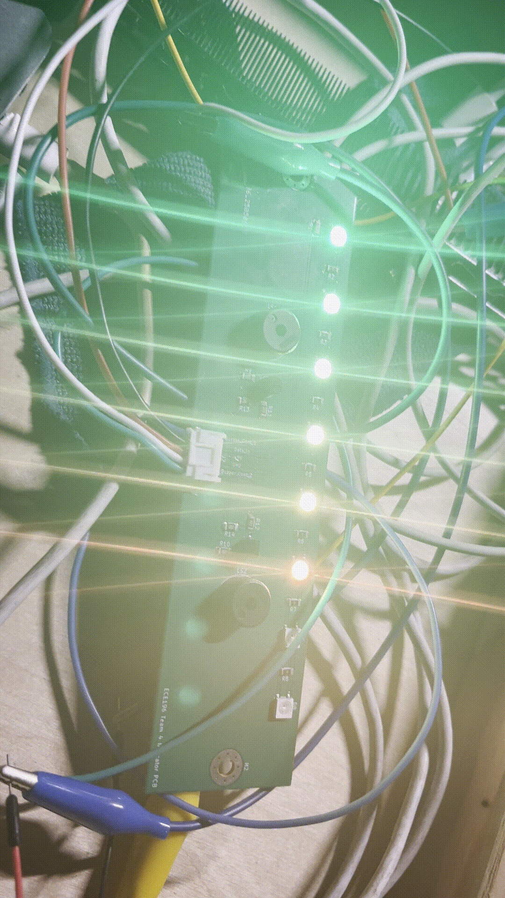

## Introduction

This tutorial walks you through interfacing an addressable NeoPixel LED array (WS2812B) with the Envision ESP32 development board or any other Arduino-compatible microcontroller. You’ll learn how to wire the components, install the required software libraries, and write Arduino-compatible code to create dynamic lighting effects. By the end, you’ll understand how to control individual LEDs, adjust brightness and color, and design simple animations.

## Learning Objectives

- Understand the basics of NeoPixel (WS2812B) control protocols  
- Install and configure the Arduino IDE for ESP32 development  
- Wire an ESP32 dev board to a NeoPixel LED strip correctly  
- Use the Adafruit NeoPixel library to set colors and animations  
- Develop and upload sample sketches that produce static and dynamic lighting effects  

## Background Information

NeoPixels (manufactured by Adafruit) are RGB LEDs with built-in drivers, daisy-chainable over a single data line. They require precise timing and a 5 V supply (some strips accept 3.3 V at low brightness). Compared to parallel RGB modules, NeoPixels simplify wiring but demand careful timing—handled here by the Adafruit NeoPixel library.

## Getting Started

Before diving in, ensure you have the correct software and hardware.

### Required Downloads and Installations

- **Arduino IDE**  
  Download the latest Arduino IDE from https://www.arduino.cc/en/software and install it for your OS.  
- **ESP32 Board Support**  
  1. Open **File > Preferences**, add  
     `https://raw.githubusercontent.com/espressif/arduino-esp32/gh-pages/package_esp32_index.json`  
     to **Additional Boards Manager URLs**.  
  2. Go to **Tools > Board > Boards Manager**, search for “esp32” and install **esp32 by Espressif Systems**.  
- **Adafruit NeoPixel Library**  
  In the IDE, navigate to **Sketch > Include Library > Manage Libraries**, search for “NeoPixel” and install **Adafruit NeoPixel**.

### Required Components

| Component                         | Quantity |
|-----------------------------------|----------|
| ESP32 Dev Board                   | 1        |
| NeoPixel LED Array                | 1        |
| 5 V Power Supply (2 A min)        | 1        |
| Male-to-female jumper wires       | 3–5      |
| Breadboard (optional)             | 1        |

### Required Tools and Equipment

- Computer with USB port  
- Micro-USB or USB-C cable (depending on ESP32)  
- Optional: multimeter to verify voltage  

## Part 01: Setting Up the Development Environment

### Introduction

First, we’ll configure the Arduino IDE to compile and upload code to the ESP32.

### Objective

- Add ESP32 board support to Arduino IDE  
- Verify successful communication with the ESP32  

### Instructional

1. **Preferences:**  
   - Open **File > Preferences**.  
   - Paste  
     `https://raw.githubusercontent.com/espressif/arduino-esp32/gh-pages/package_esp32_index.json`  
     into **Additional Boards Manager URLs**.  
2. **Boards Manager:**  
   - Go to **Tools > Board > Boards Manager**, search **esp32**, and click **Install**.  
3. **Select Board & Port:**  
   - **Tools > Board > ESP32 Dev Module**.  
   - **Tools > Port** → choose the COM port (Windows) or `/dev/ttyUSBx` (macOS/Linux).  
4. **Upload Example:**  
   - Open **File > Examples > WiFi > WiFiScan**, click **Upload**, then open the Serial Monitor to confirm output.

## Part 02: Wiring the NeoPixel Array

### Introduction

Proper wiring ensures data integrity and prevents damage to LEDs or the ESP32.

### Objective

- Connect power, ground, and data lines between the ESP32 and NeoPixels.  
- Add level shifting if needed for data line.  

### Instructional

1. **Power:**  
   - Connect ESP32 5 V (Vin) to NeoPixel 5 V.  
   - Connect all grounds together (ESP32 GND → NeoPixel GND → Power Supply GND).  
2. **Data:**  
   - Connect ESP32 GPIO pin (e.g., D5) to NeoPixel DIN.  
   - If using a level shifter (e.g., 74HCT125), route the data line through the shifter input.  
3. **Verify:**  
   - Double-check connections with a multimeter before powering on.

## Part 03: Writing Your First Sketch

### Introduction

We’ll write a sketch that lights up each LED in solid red, then cycles through colors.

### Objective

- Initialize the NeoPixel library.  
- Set individual pixel colors.  
- Create a simple color-cycling loop.  
### Video

<video width="640" controls> <source src="ABMedia/tutorial-part2.mov" type="video/mov"> Your browser does not support the video tag. </video>

### Instructional

```cpp
#include <Adafruit_NeoPixel.h>

#define PIN        5      // Data pin
#define NUMPIXELS  8      // Number of LEDs

Adafruit_NeoPixel strip(NUMPIXELS, PIN, NEO_GRB + NEO_KHZ800);

void setup() {
  strip.begin();
  strip.show(); // Initialize all pixels to 'off'
}

void loop() {
  // Static red
  for (int i = 0; i < NUMPIXELS; i++) {
    strip.setPixelColor(i, strip.Color(255, 0, 0));
  }
  strip.show();
  delay(1000);

  // Color cycle
  for (uint16_t hue = 0; hue < 65536; hue += 256) {
    for (int i = 0; i < NUMPIXELS; i++) {
      strip.setPixelColor(i, strip.gamma32(strip.ColorHSV(hue)));
    }
    strip.show();
    delay(20);
  }
}
```
## Example: Progress Meter with Color Gradient

### Introduction

This example turns the NeoPixel strip into a horizontal progress meter. As the progress value increases, LEDs light up in a smooth gradient from green (0%) through yellow (50%) to red (100%).

### Video
<video width="640" controls> <source src="ABMedia/tutorial-part2.mov" type="video/mov"> Your browser does not support the video tag. </video>

### Sketch

```cpp
#include <Adafruit_NeoPixel.h>

#define PIN         5
#define NUMPIXELS   8  // Number of LEDs in your strip

Adafruit_NeoPixel strip(NUMPIXELS, PIN, NEO_GRB + NEO_KHZ800);

uint8_t progress = 0;  // 0–100%

// Interpolate a color between green and red for a given LED index
uint32_t getLedColor(uint8_t ledIndex) {
  float fraction = float(ledIndex) / float(NUMPIXELS - 1);  // 0.0 → 1.0
  uint8_t r = uint8_t(fraction * 255);            // ramps 0 → 255
  uint8_t g = uint8_t((1.0 - fraction) * 255);    // ramps 255 → 0
  return strip.Color(r, g, 0);
}

void setup() {
  strip.begin();
  strip.show();  // all LEDs off
}

void loop() {
  //wait at the end of progress bar
  if(progress==100){
    delay(1000);
  }
  // Simulate progress increase
  progress = (progress + 1) % 101;  // wraps 0 → 100

  // Determine how many LEDs to light
  uint8_t ledsToLight = map(progress, 0, 100, 0, NUMPIXELS);

  // Update each LED
  for (uint8_t i = 0; i < NUMPIXELS; i++) {
    if (i < ledsToLight) {
      strip.setPixelColor(i, getLedColor(i));
    } else {
      strip.setPixelColor(i, 0);  // off
    }
  }
  strip.show();

  // Adjust this delay for faster or slower progress sweep
  delay(100);
}
