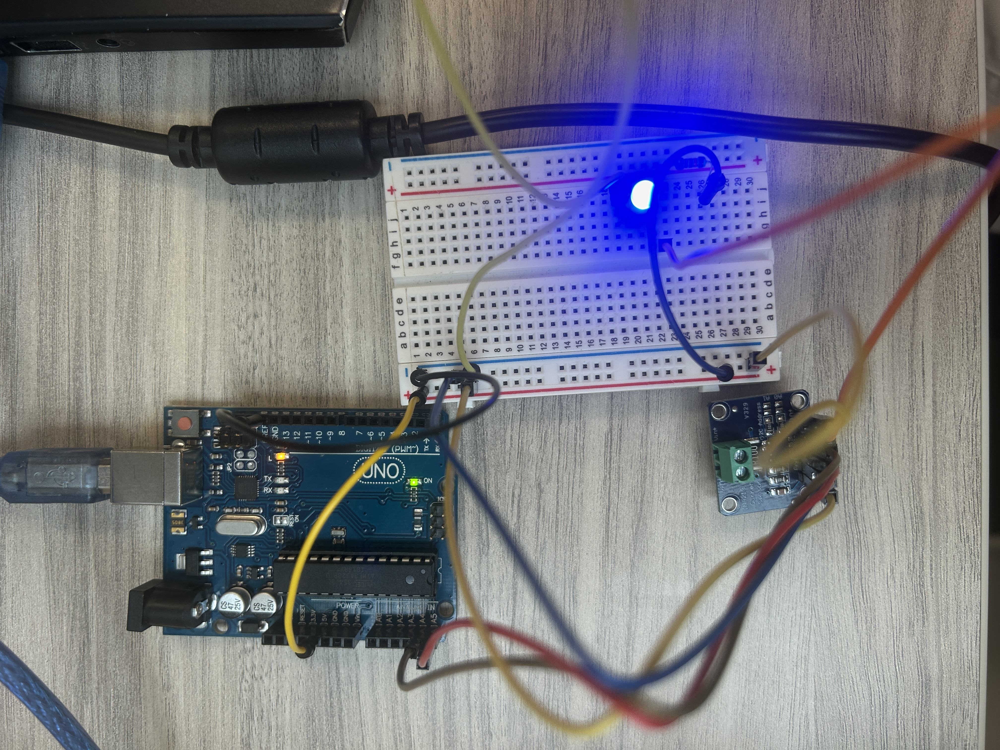
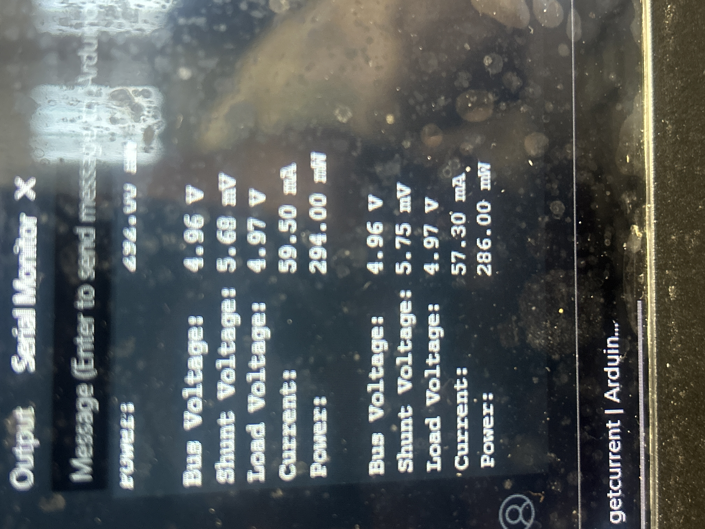
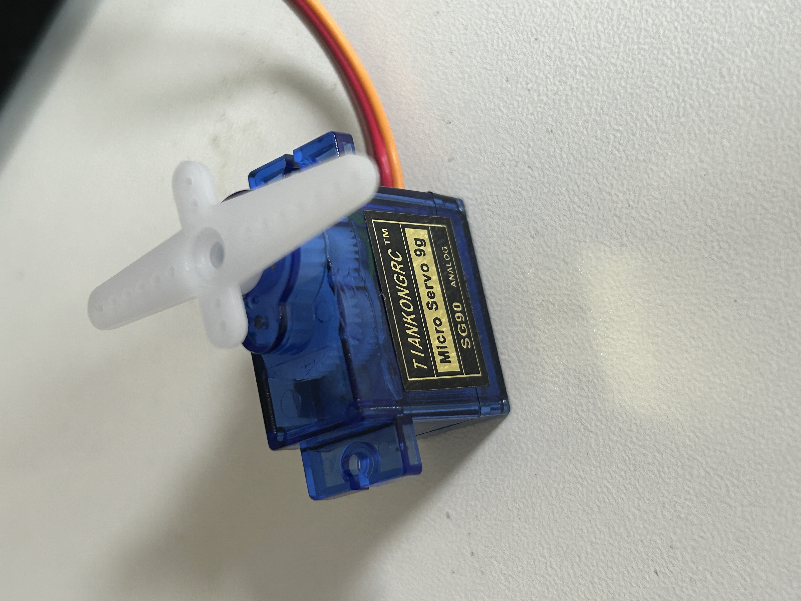
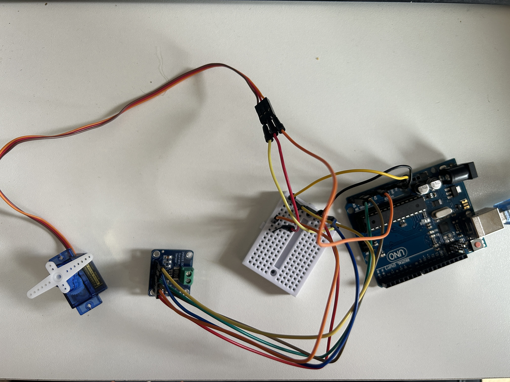

<<<<<<< HEAD
Hello! In this tutorial, we will be using the Adafruit INA219, a current and voltage sensor that is useful for calculating power and detailing information about your circuit. This guide will be a simple step-by-step guide on integratting the INA219 into your next project!

For now, we will start simple by simply measuring the current and voltage across an LED in an LED circuit (don't forget the resistor).

## Materials You Will Need

- Adafruit INA219
- ESP32 Devboard (or similiar counterpart, like an Arduino)
- USB-C cable
- Arduino IDE
- Breadboard (optional, but very convenient)
- An LED (color is up to you)
- A resistor (I will be using 10k Ω)
- Wires (minimum amount):
    - 6 Female-to-male wires
    - At least 3 breadboard jumper wires


## Wiring
Here is a picture of everything put together.



Below is a step-by-step guide to wiring the circuit:
1. Lay out your parts, making sure you have all the materials needed.
2. Wire your circuit, but keep in mind the following:
    - Whether 5V or 3.3V, the INA219 can use both. Of course, be aware of how this might affect your project if you use the 3.3V pin
    - SDA/SDL are signal pins. For the ESP32, you can put it in any of the GPIOs (general pin input/outputs), but for Arduino, it is much more specific. For example, on an Arduino UNO, you HAVE to put the SCL in A4 and SDA in A5.
    - VCC -> same pin as 5V 
    - GND -> GND pin
    - The most confusing part: Vin+ and Vin-. PLEASE note that these are NOT the same as VCC and GND. This is where the INA219 will be measuring... put your Vin- at the anode (postive leg) of the LED, and the Vin+ pin into your same pin as VCC. If done correctly, your LED will light up. If done incorrectly, you won't be able to receive information. If you put them in reverese, you are expected to get negative voltage.

Great, you now wired your circuit. Let's move on to the software aspect of this tutorial.

## Software
Using Arduino C, we will be able to read the current and voltage. Again, it is crucial if your LED light is on, as this means current is running through the circuit. Do not move on until you know your circuit has current running.

1. Open your Arduino IDE
2. Make sure you have the IDA219 by Adafruit library installed.
3. With the library installed, go to File -> Examples -> Adafruit INA219 -> get_current.ino.
4. Upload the code.
    NOTE: It's possible the default baud rate is very high. Change it to your usual baud rate (I presume 9600).
    Additionally, make sure your CDC is enabled for the ESP32, as it isn't automactially available. This is required to read data.
    Arduino doesn't need to do this.

Now, watch your circuit read data. :)



Very good! At this point, the tutorial for using the INA219 is over. It is that simple. 

However, we can make things more interesting, by analyzing how current changes with a motor servo...

## Use With A Motor Servo
It is great that we can see current and voltage. However, how about we apply this to something useful, like analyzing how the current/voltage changes in a motor?

We will use a typical servo monitor, I will be using the 9g Tiankongrc servo motor. You can also use a TowerPro servo motor, just be sure it a PWM-controlled servo.



## Wiring
Now, let's wire this motor. This will be relatively straightforward compared to the INA219.

ON a typical servo motor, it has three wires with different colors. Usually, the red wire refers to a power source (typically your VCC), brown goes to GND, and orange is your signal wire. Wire them accordingly.

NOTE: _ESP32's are able to use the same data pins, but not Arduino! This is due to the fact that the ESP32 has flexible pin multiplexing (i.e a single pin can use SPI data, I2C, UART, or even PWM). Meanwhile, your typical Arduino has fixed mapping (i.e. SCk on pin 13, MISO on pin 12, etc). Be wary of this in your wiring and code!_

Okay, let's write some simple code, no example library like the INA219.

```
#include <Servo.h> // library for servo
Servo myMotor; // Create a servo object

void setup() {
  myMotor.attach(A0); // attach the servo to A0, or any other pin
}

void loop() {
  for (int angle = 0; angle <= 180;  angle++) {
    myMotor.write(angle);
    delay(15); // give time for the motor to spin
  }
}
```
Now, watch the code work it's magic! The servo should begin to spin.

How are we going to apply this with our current sensor? Merge the INA219 example code with the servo code. Wire accordingly, and make sure you understand the order of where the wires are placed.



```
#include <Servo.h>
#include <Adafruit_INA219.h>

Adafruit_INA219 ina219;
Servo myMotor;

void setup() {
  Serial.begin(9600);
  myMotor.attach(A0); // attach the servo to A0

  Serial.begin(9600);

  // Start INA219
  if (!ina219.begin()) {
    Serial.println("Failed to find INA219 chip");
    while (1) { delay(10); }
  }
}

int angle = 0;
int direction = 1;

void loop() {
  myMotor.write(angle);
  delay(2);

  float busVoltage = ina219.getBusVoltage_V();
  float current_mA = ina219.getCurrent_mA();

  angle += direction; // Change direction

  // Print to serial monitor
  Serial.print("Bus Voltage:   "); Serial.print(busVoltage); Serial.println(" V");
  Serial.print("Current:       "); Serial.print(current_mA); Serial.println(" mA");
  Serial.println("");

    if (angle >= 180 || angle <= 0) {
    direction *= -1; // Switch directions
    Serial.print(angle);
  }
}
```


With this code, you will notice that the current and voltage are being updated very quickly. It may be difficult to see it, as the information is updating too fast, but you should be able to glance that the current is indeed varying wildly, due to meeting the needs of the motor. Motors "spin" by varying the current. Interesting, isn't it?

What could we use this for? Maybe combine it with an LCD, and use it in a project that needs to move an object's pitch and yaw, allowing 

This is the end of the tutorial, I hope you learned how to use the Adafruit INA219 (and a servo motor) for your future projects!
=======
Hello! In this tutorial, we will be using the Adafruit INA219, a current and voltage sensor, useful for calculating power and detailing information in your circuit. This guide will be a simple step-by-step guide to integratting it into your next project using the ESP32 Devboard!

For now, we will start simple by simply measuring the current and voltage across an LED in an LED circuit (don't forget the resistor).

## Materials You Will Need

- Adafruit INA219
- ESP32 Devboard (or similiar counterpart, like an Arduino)
- USB C cable
- Arduino IDE
- Breadboard (optional, but very convenient)
- An LED (color is up to you)
- A resistor (I will be using 10k Ω)
- Wires (minimum amount):
    - 6 Female-to-male wires
    - At least 3 breadboard jumper wires


## Wiring
Here is a picture of everything put together.


Below is a step-by-step guide to wiring the circuit:
1. Lay out your parts, making sure you have all the materials needed.
2. Wire your circuit, but keep in mind the following:
    - Whether 5V or 3.3V, the INA219 can use both. Of course, be aware of how this might affect your project if you use the 3.3V pin
    - SDA/SDL are signal pins. For the ESP32, you can put it in any of the GPIOs (general pin input/outputs), but for Arduino, it is much more specific. For example, on an Arduino UNO, you HAVE to put the SCL in A4 and SDA in A5.
    - VCC -> same pin as 5V 
    - GND -> GND pin
    - The most confusing part: Vin+ and Vin-. PLEASE note that these are NOT the same as VCC and GND. This is where the INA219 will be measuring... put your Vin- at the anode (postive leg) of the LED, and the Vin+ pin into your same pin as VCC. If done correctly, your LED will light up. If done incorrectly, you won't be able to receive information. If you put them in reverese, you are expected to get negative voltage.

Great, you now wired your circuit. Let's move on to the software aspect of this tutorial.

## Software
Using Arduino C, we will be able to read the current and voltage. Again, it is crucial if your LED light is on, as this means current is running through the circuit. Do not move on until you know your circuit has current running.

1. Open your Arduino IDE
2. Make sure you have the IDA219 by Adafruit library installed.
3. With the library installed, go to File -> Examples -> Adafruit INA219 -> get_current.ino.
4. Upload the code.
    NOTE: It's possible the default baud rate is very high. Change it to your usual baud rate (I presume 9600).
    Additionally, make sure your CDC is enabled for the ESP32, as it isn't automactially available. This is required to read data.
    Arduino doesn't need to do this.

Now, watch your circuit read data. :)


>>>>>>> 0b332635d4413c95403bcd2156f858628f09822f
