# Smoothing Average Accelerometer Tutorial

## Introduction

Ever used an accelerometer, but the data was super **_jittery_**? Well you're in the right place.
In this tutorial, you'll learn how to hook up your accelerometer and implement a moving average filter to smooth out your data!
### Learning Objectives

- Learn how accelerometers work
- Learn about filtering techniques
- Learn how to extract meaningful signal from a moving average filter

### Background Information

The problem is that these accelerometer readings are often very noisy, especially for cheap parts that students like us have access to. The read values from each access will "jitter" significantly, even when not being moved. This presents a particular challenge when trying to extract weak signals from a relatively high noise floor, or when your other algorithms and data flows are sensitive to jitter. 

One of the best ways to reduce noise and make your accelerometer curves smoother for analysis (like step detection) is to employ a moving average filter. There's lots of different types of smoothing filters to choose from, but a good place to start is with the easiest, the Simple Moving Average Filter (SMA).

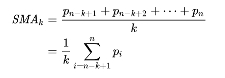

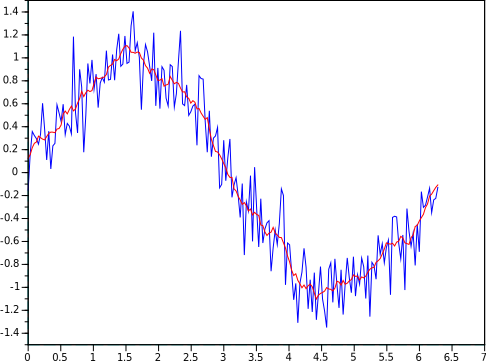

## Getting Started

First, hook up your 3-axis accelerometer to your devboard. The ADXL335 is great for those new to the world of embedded systems being all three axes have their own dedicated analog pin, so you don't have to interface with anything more complicated (like I2C or SPI). In this case, the bottom two pins are VCC and GND, and the middle three are X, Y, and Z. Leave the top pin floating

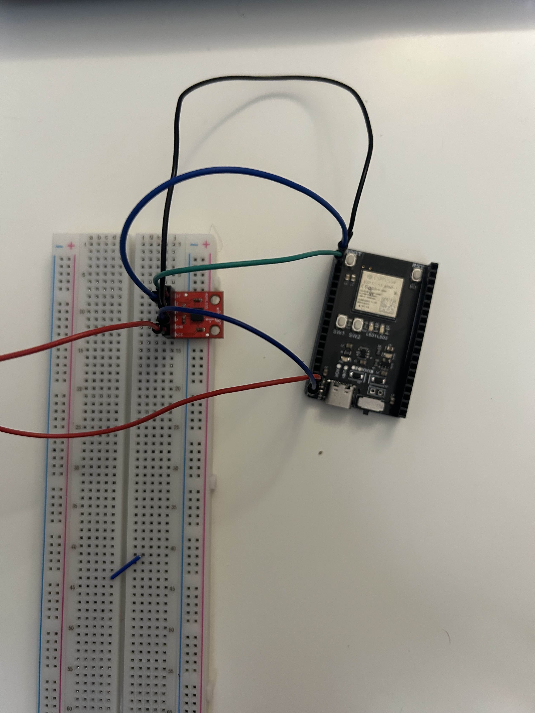

Moving to Arduino, declare your analog pins.

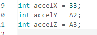

Then define your moving average window. This window keeps track of the number of samples you are averaging over at a time. There's no perfect number for how big your moving average window should be, and it's something that you can experimentally tune for results. However, a couple factors that you should keep in mind are Sampling Rate in Hz, and how much of a delayed response you want your filter to have

### Defining your window
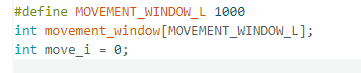

The above window takes 1000 samples, which, at a sampling rate of 100 Hz, is 10 seconds of movement to average over (which is probably very overkill for your application, but is an example of what's possible)

### Reading data and filling your window

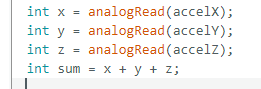

Since accelerometer data is 3 axis, you often want to reduce these three values into a single dimension. There's plenty of different tecniquest to accomplish this, each with their benefits and drawbacks, but the simplest technique is to just sum all three values into a single variable

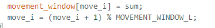

Here we actually fill the moving average window with the sum. We also have to increment the move window index, using the modulo operator to make sure we don't go out of the window's bounds.

### Computing the Rolling Average 
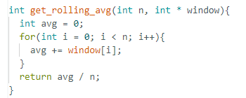

Here we've written a little subroutine to compute the rolling average (aka the SMA). Basically it takes a pointer to the window, and the window size (n), and computes the unweighted average along every element. Note: there are much more efficient routines for doing this, but this one is the most conceptually simple

### Ok now what do we do with this?
One of the easiest applications of our new and glorious rolling average filter is movement detection!

### Movement Detection
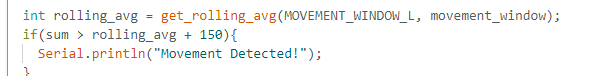

Again, there are plenty of more adavanced movement detection techniques, but a simple start is thresholding! Basically, you define a hard coded value (which you determine experimentally) and if the current accelerometer summed reading exceeds this value + the rolling average, you say that this is detected movement. This actually works quite well with the rolling average, because it eliminates random jitter and establishes a steadier value to work off of

### What about setup?
Excellent point, what do we do while the Moving Average Window isn't filled yet? This is the calibration step, that comes as a part of many sensor workflows. We too have to handle this case:
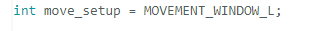 

We define a variable the size of our rolling average window, that will be decremented during the setup. When it hits zero, we know our window is full.
Until then, we won't want to check for movement.

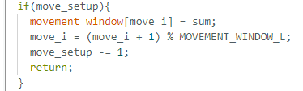

### Required Downloads and Installations
- Arduino IDE

### Required Components

List your required hardware components and the quantities here.

| Component Name  | Quanitity |
|-----------------|-----------|
| ADXL335         | 1         |
| Male-Male Wires | 5         |
| Esp32 Devboard  | 1         |
| BreadBoard      | 1         |

### Example and Inspiration

Fitness Tamagotchi! Our project team used a modified version of the above rolling average algorithm to count steps and make a fitness pet that gets stronger as you get active
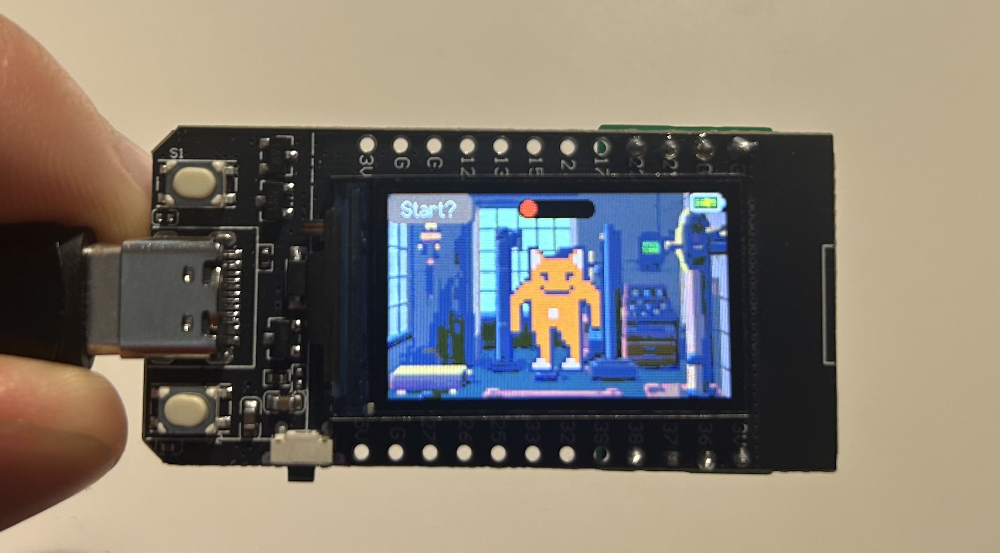

## Additional Resources

### Useful links

List any sources you used, documentation, helpful examples, similar projects etc.
https://en.wikipedia.org/wiki/Moving_average
