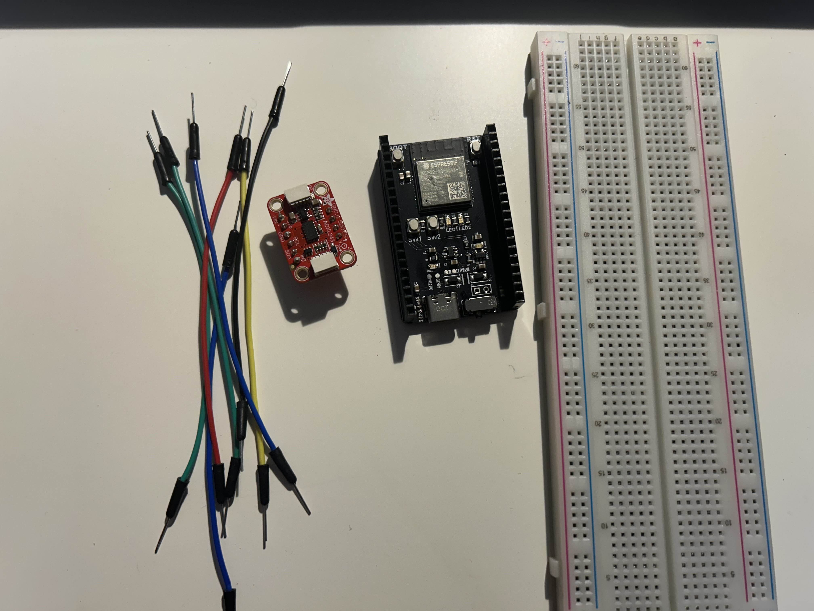

# Smoothing Average Accelerometer Tutorial

## Introduction

Ever used an accelerometer, but the data was super **_jittery_**? Well you're in the right place.
In this tutorial, you'll learn how to hook up your accelerometer and implement a moving average filter to smooth out your data!
### Learning Objectives

- Learn how accelerometers work
- Learn about filtering techniques
- Learn how to extract meaningful signal from a moving average filter

### Background Information

## Getting Started

### Required Downloads and Installations

### Required Components

List your required hardware components and the quantities here.

| Component Name  | Quanitity |
|-----------------|-----------|
| ADXL343         | 1         |
| Male-Male Wires | 5         |
| Esp32 Devboard  | 1         |

### Required Tools and Equipment

List any tools and equipment you need here.
(Ex, computer, soldering station, etc.)
- Computer
- Soldering Station (if )

## Part 01: Name

### Introduction

Briefly introduce what  you are teaching in this section.

### Objective

- List the learning objectives of this section

### Background Information

Give a brief explanation of the technical skills learned/needed
in this challenge. There is no need to go into detail as a
separation document should be prepared to explain more in depth
about the technical skills

### Components

- List the components needed in this challenge

### Instructional

Teach the contents of this section

## Example

### Introduction

Introduce the example that you are showing here.

### Example

Present the example here. Include visuals to help better understanding

### Analysis

Explain how the example used your tutorial topic. Give in-depth analysis of each part and show your understanding of the tutorial topic

## Additional Resources

### Useful links

List any sources you used, documentation, helpful examples, similar projects etc.
