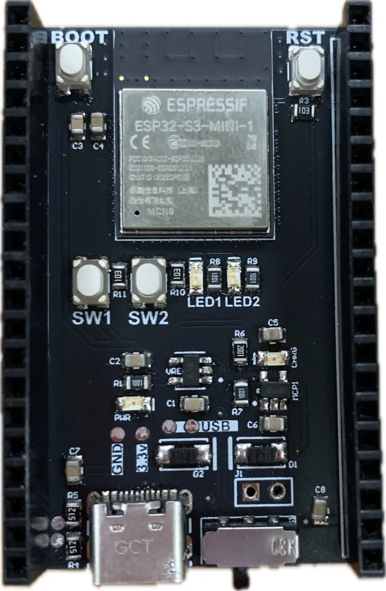

# Team 3: ESP32 OLED Web Graphics 

## Introduction

This tutorial aims to teach you about the wifi capabilities on the ESP32. This is meant to be an extension to the mini project spinning and blinking control system. The motivation behind this is because my ECE 196 final project uses a similar system to control the window cleaning robot traversal. I want readers to learn the lessons from this tutorial and to create a cool project in the process. 

### Learning Objectives

- Using an OLED Screen with the ESP32-S3 Dev board. 
- Using the WIFI capabilities on the ESP32-S3 Dev board. 

### Background Information

Describe your topic here. What does it do? Why do you use it?
Are there other similar things to use? What are the pros and cons?
Explain important concepts that are necessary to understand.
Include (and cite if needed) any visuals that will help the audience understand.

## Getting Started

For any software prerequisites, write a simple excerpt on each
technology the participant will be expecting to download and install.
Aim to demystify the technologies being used and explain any design
decisions that were taken. Walk through the installation processes
in detail. Be aware of any operating system differences.
For hardware prerequisites, list all the necessary components that
the participant will receive. A table showing component names and
quantities should suffice. Link any reference sheets or guides that
the participant may need.
The following are stylistic examples of possible prerequisites,
customize these for each workshop.

### Required Downloads and Installations

List any required downloads and installations here.
Make sure to include tutorials on how to install them.
You can either make your own tutorials or include a link to them.

### Required Components

List your required hardware components and the quantities here.

| Component Name | Quanitity |
| -------------- | --------- |
|                |           |
|                |           |

### Required Tools and Equipment

- Computer
- Components from previous section
- Optional: Enclosure Fabrication tool (3D printer, Laser Cutter, CNC Mill, etc)

## Part 01: Name

### Introduction

Briefly introduce what  you are teaching in this section.

### Objective

- List the learning objectives of this section

### Background Information

Give a brief explanation of the technical skills learned/needed
in this challenge. There is no need to go into detail as a
separation document should be prepared to explain more in depth
about the technical skills

### Components

- List the components needed in this challenge

### Instructional

Teach the contents of this section

## Example

### Introduction

Introduce the example that you are showing here.

### Example

Present the example here. Include visuals to help better understanding

### Analysis

Explain how the example used your tutorial topic. Give in-depth analysis of each part and show your understanding of the tutorial topic

## Additional Resources

### Useful links

List any sources you used, documentation, helpful examples, similar projects etc.
