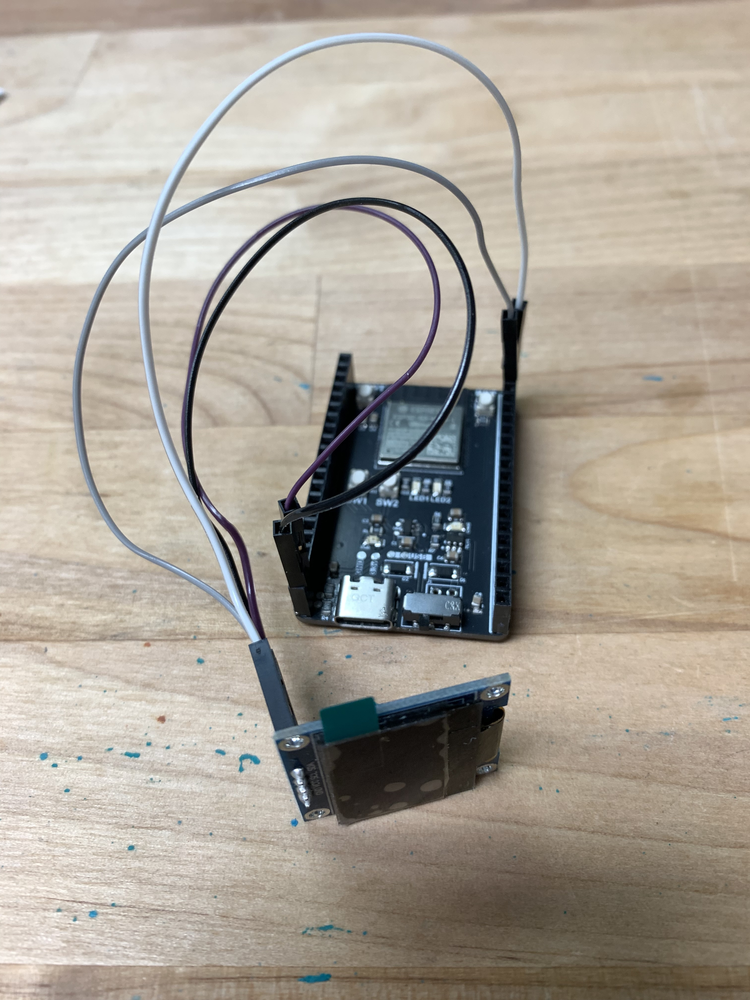

# Team 3: ESP32 OLED Web Graphics 


## Introduction

This tutorial aims to teach you about the wifi capabilities on the ESP32. This is meant to be an extension to the mini project spinning and blinking control system. The motivation behind this is because my ECE 196 final project uses a similar system to control the window cleaning robot traversal. I want readers to learn the lessons from this tutorial and to create a cool project in the process. 

### Learning Objectives

- Using an OLED Screen with the ESP32-S3 Dev board. 
- Using the WIFI capabilities on the ESP32-S3 Dev board. 

### Background Information

This tutorial will show you how to connect an OLED screen to your ESP32 Devboard. This will allow you to create a picture that you can show on the wall. You can remotely change the picture shown on the wall through wifi. Some alternatives would be an IR remote with an IR reader or bluetooth. The IR remote is not very expandable because you need to preset images. However, the IR remote is very easy to implement. Bluetooth is more expandable for future projects, but you need a specific app for compatibility with the ESP32. For this wifi implementation, you have the same expandability of the bluetooth version and the freedom to use your favorite browser at the same time. 

Include (and cite if needed) any visuals that will help the audience understand.

## Getting Started

<!-- For any software prerequisites, write a simple excerpt on each
technology the participant will be expecting to download and install.
Aim to demystify the technologies being used and explain any design
decisions that were taken. Walk through the installation processes
in detail. Be aware of any operating system differences.
For hardware prerequisites, list all the necessary components that
the participant will receive. A table showing component names and
quantities should suffice. Link any reference sheets or guides that
the participant may need.
The following are stylistic examples of possible prerequisites,
customize these for each workshop. -->

### Required Downloads and Installations
<!-- List any required downloads and installations here.
Make sure to include tutorials on how to install them.
You can either make your own tutorials or include a link to them. -->

- Arduino set up from [Lab 2](https://ece-196.github.io/docs/assignments/spinning-and-blinking/)


### Required Components

| Component Name | Quanitity |
| -------------- | --------- |
|ESP32-S3 Dev Board|1|
|USB C Cable|1|
|Adafruit SSD1306 OLED|1|
|Male to Female Jumper Wire|4|

### Required Tools and Equipment

- Computer
- Components from the previous section
- Optional: AC to DC Wall Plug Power Adapter
- Optional: Enclosure Fabrication tool (3D printer, Laser Cutter, CNC Mill, etc)

## Part 01: Set up the OLED display

### Introduction

In this section, you will learn how to connect an OLED display to your ESP32-S3 Dev Board. Next, you will learn now to use Arduino C to interface with the OLED display. 

### Objective

- Learn to wire up an OLED display to an ESP32-S3 
- Learn to code in Arduino C to create images on the OLED display

### Background Information

An Organic Light-Emitting Diode (OLED) display is a type of screen that uses organic compounds to emit light when an electric current is applied. Unlike traditional screens like Liquid Crystal Displays (LCDs), OLED displays do not use a backlight because each pixel emits its own light. So, the OLED displays create stunningly vivid pictures. 

### Components

- ESP32-S3 Dev Board
- 1 Adafruit SSD1306 OLED
- 4 Male to Female Jumper Wires

### Instructions

#### Hardware
Since the OLED display uses I2C to communicate with the ESP32-S3 Dev Board, the OLED display can be directly wired to the ESP32-S3 Dev Board. 

Using your 4 male to female jumper wires, connect the following. 
- Connect the VCC pin on the OLED to the 3.3V pin on the ESP32
- Conenct the GND pin on the OLED to the GND pin on the ESP32
- Connect the SCL pin on the OLED to the 45 pin on the ESP32
- Connect the SDA pin on the OLED to the 46 pin on the ESP32



#### Software

Install the [Adafruit_SSD1306](https://github.com/adafruit/Adafruit_SSD1306) library and [Adafruit_GFX library](https://github.com/adafruit/Adafruit-GFX-Library). 

Open your Arduino IDE and go to `Sketch > Include Library > Manage Libraries`
<br>
Then, search for all the listed libraries and install them. 

Note: If you are on the legacy version of Arduino IDE, you may need to add the [Adafruit_BusIO](https://github.com/B1Bomber/binaryKeyboard/blob/main/Libraries/Adafruit_BusIO-master.zip) library. 

There are some example code for you to refer to under `File > Examples > Adafruit SSD1306`
<br>
Connect your ESP32-S3 Dev Board to your computer with a USB C cable and try them out. 

Here is some code for you to get started with:
```
#include <Adafruit_SSD1306.h>
#include <Adafruit_GFX.h>
#include <Wire.h>
#include <SPI.h>

const int OLED_WIDTH = 128;
const int OLED_HEIGHT = 16;
const int reset = -1;

#define OLED_ADDR   0x3C

#define SCL_PIN     45
#define SDA_PIN     46

Adafruit_SSD1306 display(OLED_WIDTH, OLED_HEIGHT, &Wire, reset);

void setup(){
    Serial.begin(115200);
    Wire.begin(SDA_PIN, SCL_PIN);
    display.begin(SSD1306_SWITCHCAPVCC, OLED_ADDR);
    display.display();
    delay(10000);
    display.clearDisplay();
}

void loop(){
   
}
```

You may read the article in the Sources and Useful Links section (first link) to learn all the functions for the [Adafruit_SSD1306](https://github.com/adafruit/Adafruit_SSD1306) library to create your own pictures. 

### Sources and Useful Links

[OLED display on an ESP32](https://randomnerdtutorials.com/esp32-ssd1306-oled-display-arduino-ide/)

[My Project in a Box Repository](https://github.com/B1Bomber/binaryKeyboard)

## Part 02: Set up the web socket

### Introduction

In this section, you will learn how to set up a web socket on the ESP32-S3 Dev Board. You will be able to connect your web browser to your ESP32-S3 Dev Board. 

### Objective

- Learn to set up a web socket for your ESP32-S3 Dev Board. 

### Background Information

A web socket is a communication protocol that provides independent, simultaneous, and persistent connections between a client (your web browser in this case) and a server (your ESP32 in this case) over a single TCP connection. A web socket is preferred because there is lower latency than HTTP and is persistent, meaning the conneciton will be stable until you explicitly close the connection. 

### Components

- ESP32-S3 Dev Board

### Instructions

Create a new file in your Arduino project directory called `ESPWebController.cpp`.
<br>
In that file, set up something like the following. 
```
#include "ESPWebController.h"

#include <SPIFFS.h>

ESPWebController* ESPWebController::instance = nullptr;

ESPWebController::ESPWebController() {
    instance = this;
}

void ESPWebController::begin() {
    WiFi.softAP(WIFI_SSID, WIFI_PASSWORD);
    Serial.print("Access Point IP: ");
    Serial.println(WiFi.softAPIP());

    if (!SPIFFS.begin(true)) {
        Serial.println("An Error has occurred while mounting SPIFFS");
        return;
    }

    server.begin();
    webSocket.begin();
    webSocket.onEvent(onWebSocketEvent);
}

void ESPWebController::update() {
    webSocket.loop();

    WiFiClient client = server.available();
    if (client) {
        Serial.println("New Client.");
        handleClientRequest(client);
        client.stop();
        Serial.println("Client disconnected.");
    }
}

void ESPWebController::handleClientRequest(WiFiClient& client) {
    String request = client.readStringUntil('\r');
    client.read();

    if (request.indexOf("GET / ") >= 0) {
        File file = SPIFFS.open("/index.html", "r");
        if (!file) {
            Serial.println("Failed to open /index.html");
            client.println("HTTP/1.1 500 Internal Server Error");
            client.println("Content-type:text/plain");
            client.println("Connection: close");
            client.println();
            client.println("Failed to load index.html");
            return;
        }

        client.println("HTTP/1.1 200 OK");
        client.println("Content-type:text/html");
        client.println("Connection: close");
        client.println();

        client.write(file);

        while (file.available()) {
            client.write(file.read());
        }

        file.close();
        client.println();
    }
}

void ESPWebController::onWebSocketEvent(uint8_t num, WStype_t type, uint8_t* payload, size_t length) {
    if (type == WStype_TEXT && instance) {
        String json = (char*)payload;

        JsonDocument doc;
        deserializeJson(doc, json);
        EventType eventType = getEventTypeEnum(doc["type"]);

        switch (eventType) {
            case EventType::INIT: {
                Serial.printf("ESPWebController.cpp:(EventType::INIT) Check init\n");

                if (instance->onInit) {
                    bool initialized = instance->onInit();
                    instance->send(EventType::INIT, [&](JsonDocument& doc) {
                        doc["initialized"] = initialized;
                    });
                }
                break;
            }
            
            // add your OLED picture changing events here

            default:
                Serial.println("Received unknown event type");
                break;
        }
    }
}

void ESPWebController::send(EventType type, std::function<void(JsonDocument&)> fill) {
    JsonDocument doc;
    fill(doc);
    
    doc["type"] = toString(type);

    String output;
    serializeJson(doc, output);

    webSocket.broadcastTXT(output);
}
```
---

In the same directory, create the header file for the web controller called `ESPWebController.h`
<br>
In that file, set up something like the following. 
```
#ifndef ESPWEBCONTROLLER_H
#define ESPWEBCONTROLLER_H

#include <ArduinoJson.h>
#include <WebSocketsServer.h>
#include <WiFi.h>

#include "EventType.h"

// Fill in the blank to name your wifi access point and to set your password
inline constexpr const char* WIFI_SSID = "___";
inline constexpr const char* WIFI_PASSWORD = "___";

class ESPWebController {
   public:
    ESPWebController();
    void begin();
    void update();

    void send(EventType type, std::function<void(JsonDocument&)> fill);

    void setOnInitCallback(std::function<bool()> callback) {
        onInit = callback;
    }

    void setOnSetupCallback(std::function<void(int, int)> callback) {
        onSetup = callback;
    }

    // add functions to handle your events

   private:
    void handleClientRequest(WiFiClient& client);
    static void onWebSocketEvent(uint8_t num, WStype_t type, uint8_t* payload, size_t length);

    static ESPWebController* instance;

    WiFiServer server{80};           // Initialize with port 80
    WebSocketsServer webSocket{81};  // WebSocket on port 81

    std::function<bool()> onInit;
    std::function<void(int, int)> onSetup;
};

#endif
```
---

In the same directory, create the event file for the web controller called `EventType.cpp`
<br>
In that file, set up something like the following. 
```
#include "EventType.h"
#include <map>
#include <string>

const char* toString(EventType direction) {
    switch (direction) {

        // add your event cases for the OLED
        case EventType::INIT: return "init";
        case EventType::SETUP: return "setup";
        case EventType::INFO: return "info";
        case EventType::UNKNOWN: return "unknown";
        default: return "invalid";
    }
}

std::map<std::string, EventType> eventTypeDict = {
    {"init", EventType::INIT},
    {"setup", EventType::SETUP},
    {"info", EventType::INFO}
};

EventType getEventTypeEnum(const std::string& str) {
    auto it = eventTypeDict.find(str);
    return (it != eventTypeDict.end()) ? it->second : EventType::UNKNOWN;
}
```
---

In the same directory, create the header file for the web controller events called `EventType.h`
<br>
In that file, set up something like the following. 
```
#ifndef EVENT_TYPE_H
#define EVENT_TYPE_H

#include <string>

enum class EventType {
    // add the name of your events from the previous file here
    INIT,
    SETUP,
    INFO,
    UNKNOWN
};

const char* toString(EventType direction);
EventType getEventTypeEnum(const std::string& str);

#endif
```
---

In your main Arduino file, add the following line to integrate it with your web socket. 
<br>
`#include "ESPWebController.h"`

### Sources and Useful Links

[ECE 196 Spring 2025 Team 3 Repository](https://github.com/jasper-hyj/ece196-project-code)
