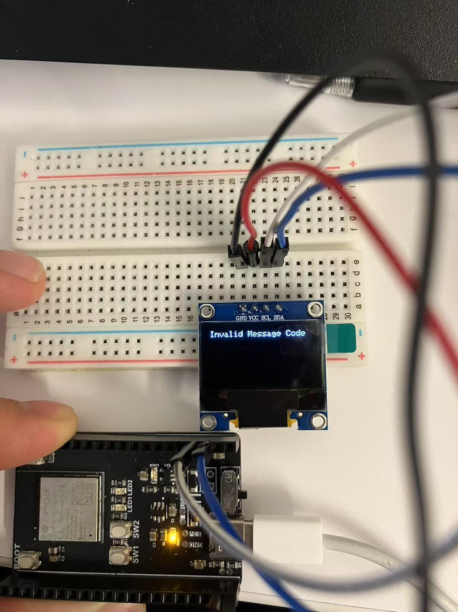
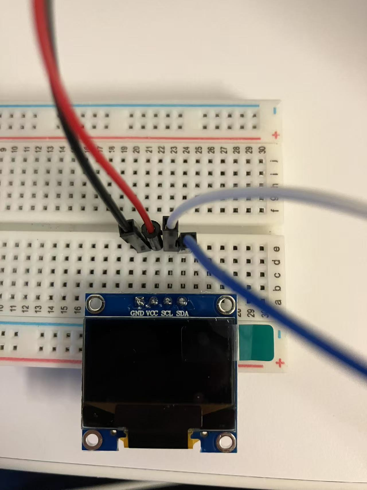
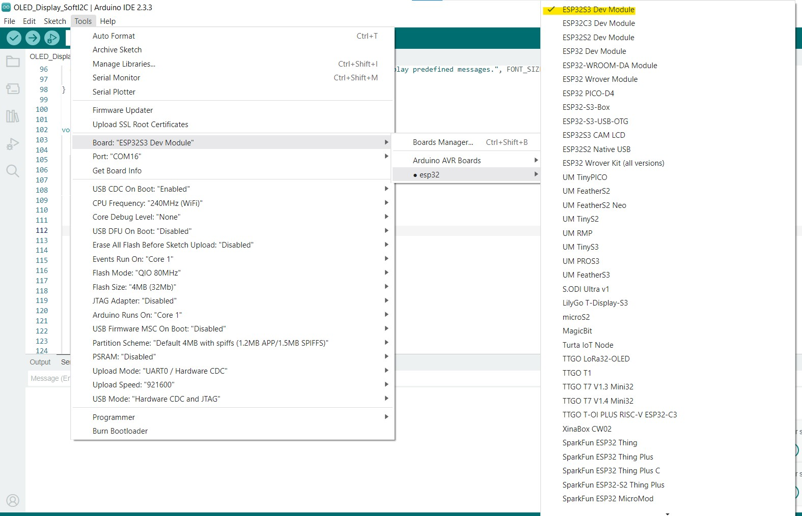
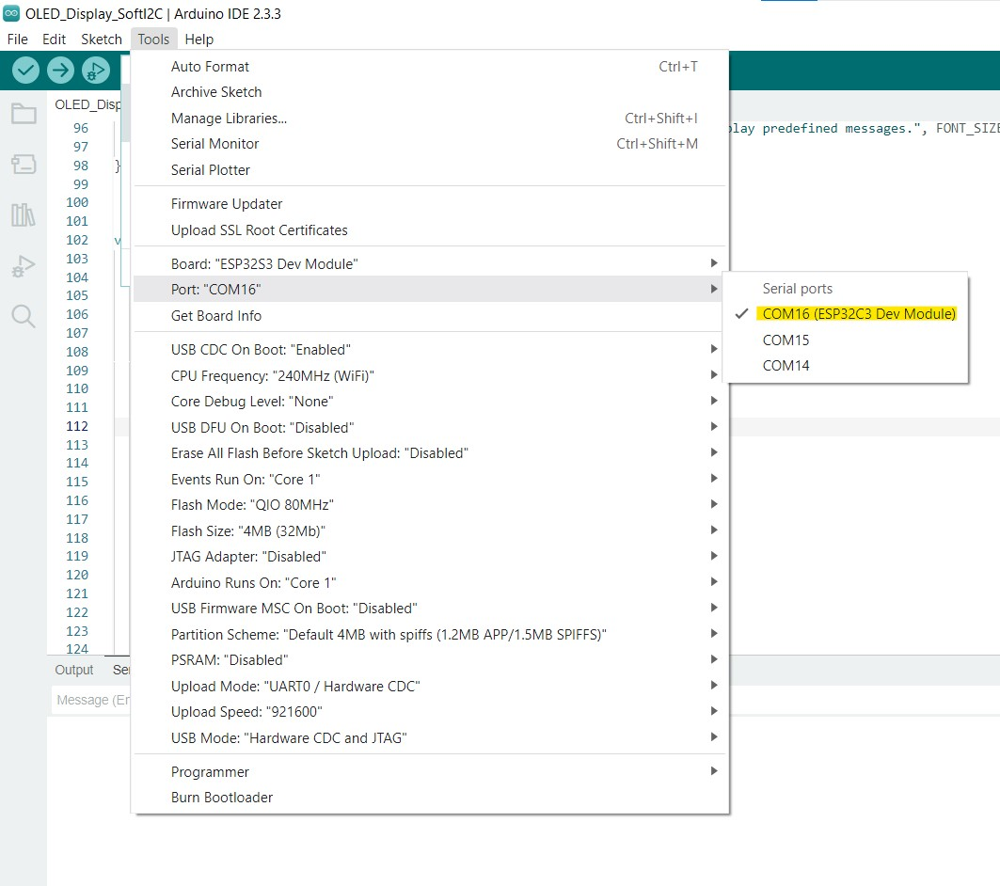

## Introduction


This tutorial aims to teach students how to display text on an SSD 1306 OLED using an ESP 32 microcontroller.


The motivation behind the tutorial is to help students with any project that requires displaying information to the outside world through a screen.


I want readers to learn how to wire the OLED circuit, how to use the I2C communication protocol, and how to write text display code through Arduino Serial input.

### Learning Objectives

Skills/concepts to be covered:
- I2C connection with external devices
- Breadboarding
- Embedded software - functions and logic


### Background Information

We will discuss how to connect your ESP Dev board to an OLED and display text in various formats through typing in the serial monitor. We use I2C as a communication protocol between the ESP and OLED. The key concepts you should understand beforehand are basic programming concepts, not necessarily using Arduino/C++.  

 OLEDs are a cheap and simple way of displaying messages to the outside world. They are power-efficient and do not require backlights to see. Using Serial input to send messages is an easy way to transmit custom messages to the OLED, which can potentially be configured with a GUI, but that is out of the scope of the tutorial.

## Getting Started

The only software prerequisites needed are the Arduino IDE (which we will write and upload our code through), the ESP 32 Board family on Arduino which allows us to program ESP32 boards with Arduino IDE, and the Adafruit SSD1306 library and the Adafruit GFX library. Other libraries like <Wire.h> should already be pre-installed on Arduino.

### Required Downloads and Installations
- Download Arduino IDE (either version works)

Link to tutorial: https://support.arduino.cc/hc/en-us/articles/360019833020-Download-and-install-Arduino-IDE
- Download the ESP 32 Board Families

Link to tutorial for old Arduino: https://randomnerdtutorials.com/installing-the-esp32-board-in-arduino-ide-windows-instructions/ 

Link to tutorial for Arduino 2.0: https://randomnerdtutorials.com/installing-esp32-arduino-ide-2-0/
- Download the Adafruit SSD1306 library and Adafruit GFX library through library manager

Link to tutorial: https://learn.adafruit.com/monochrome-oled-breakouts/arduino-library-and-examples
### Required Components

| Component Name | Quantity  |
| -------------- | --------- |
| SSD 1306       |    1      |
|ESP 32 Dev Board|    1      |
|4 Male-to Male Wires| 1     |
| Breadboard | 1|
### Required Tools and Equipment
- Computer with external USB/USB-C ports
- Programming USB-C cable.
## Part 01: Connecting the ESP Dev Board and OLED

### Introduction
This section teaches how to connect components on a breadboard, specifically the OLED and ESP 32.

### Objective

The objective of this section is to learn how to use a breadboard and connect external breakouts to an ESP Dev Board.

### Background Information

You need to be able to use a breadboard and jumper wires. We will connect the ESP Dev Board to the OLED using jumper wires.

### Components

List the components needed in this challenge

- 4 Male to Male wires

- ESP Dev Board

- SSD 1306 OLED

- Breadboard

### Instructional

Connect the OLED screen to the breadboard on 4 consecutive rows. 

Put a red wire in the row where VCC is, black where GND is. For SCL and SDA, any other colored wires will suffice.


Connect the other end of the VCC jumper to the 3.3 female header socket on the Dev Board. Do the same for the GND wire with either of the GND sockets on the Dev Board. 

For SCL and SDA, most GPIO pin sockets should work, but I would suggest avoiding GPIO 1-4 and RX, TX, as these may have a strapping function. If needed, consult the ESP 32 S3 datasheet linked at the bottom of the tutorial.

## Example

### Introduction
In this example, I connected the SCL pin to GPIO 26, and the SDA pin to GPIO 21. I also connected GND to GND and 3.3V to VCC - this should be consistent across all implementations.

### Example

### Analysis

The tutorial uses GPIO 20, and GPIO 21, but the majority of GPIO pins on the ESP 32 should work. I2C protocol is a two-wire serial communication protocol, which is why we have two GPIO pins for communication. 

It supports multiple devices on the same bus but for our purposes one device will suffice. The SDA line is the Serial Data Line, and the SCL line is the serial clock line. 


## Part 02: Programming the Dev Board and OLED

### Introduction

This section teaches the reader how to connect to the OLED through the ESP Dev board and display custom messages. It is only programming in this section.

### Objective

The objective of this section is to learn how to connect the dev board to the OLED using software I2C, and how to display text on the OLED in various ways.

### Background Information

You need to be able to write basic C++ code. We will go into writing functions, defining constants, and using if statements and case statements.

### Components
- USB-C programming cable
- Computer

### Instructional
Plug in your ESP Dev board and select ESP32S3 Dev Module in board managers.



Then go to COM Port and make sure you're connected to the COM port that only appears when the board is plugged in.



Now on to the code. Include these three libraries at the top of a new sketch.

```cpp
#include <Wire.h> 
#include <Adafruit_GFX.h> 
#include <Adafruit_SSD1306.h> 
```

We now need to define some constants and initialize the I2C bus. Replace the values for ```SDA_PIN``` and ```SCL_PIN``` with the GPIO pins you picked from Part 1.

For ```FONT_SIZE``` any integer >= 1 will do, but too big a size may exceed the limits of the display. For ``` MESSAGE_COLOR```, choose between ```SSD1306_WHITE``` and ```SSD1306_BLACK```.
```cpp
#define SCREEN_WIDTH 128 // OLED display width, in pixels
#define SCREEN_HEIGHT 64 // OLED display height, in pixels
#define SDA_PIN 21
#define SCL_PIN 26
#define MESSAGE_COLOR SSD1306_WHITE
#define FONT_SIZE 1
#define OLED_RESET     -1 // Reset pin # (or -1 if sharing Arduino reset pin)
#define SCREEN_ADDRESS 0x3C // Depending on the model of your SSD1306, this value may be 0x3D instead
TwoWire I2C_one = TwoWire(0); // creates a TwoWire object to pass into the instance of the OLED class
Adafruit_SSD1306 display(SCREEN_WIDTH, SCREEN_HEIGHT, &I2C_one, OLED_RESET); // instantiates an OLED object
```
Let's now instantiate an array of messages we would like to display on the screen. Feel free to change the messages in the array and the length to meet your needs.
```cpp
#define NUM_OF_MESSAGES 8 // define number of messages in the array
String messageArr[NUM_OF_MESSAGES] = {
  "OK",               // All good: I’m safe and proceeding as planned
  "WAIT",             // Hold position: I’ll catch up in a moment
  "GO_ON",            // Don’t wait for me: Continue without me
  "RETREAT",          // Turn back: Something’s wrong with the route
  "INJURED",          // I’m hurt: Medical help needed
  "NEED_SUPPLIES",    // Low on water/food: Resupply required
  "AT_MEETING_PT",    // I’m at the agreed rendezvous point
  "SOS"              // Life-and-death emergency: IMMEDIATE ASSISTANCE
};
```

The setup function runs once when the ESP is powered on. We are starting up Serial and the I2C connection between the ESP and OLED. The while loop runs infinitely until the connection is established. 
```cpp
void setup() {
  Serial.begin(921600);
  I2C_one.begin(SDA_PIN, SCL_PIN);
  Serial.println("Starting");
  //SSD1306_SWITCHCAPVCC = generate display voltage from 3.3V internally
  while(!display.begin(SSD1306_SWITCHCAPVCC, SCREEN_ADDRESS)) {
    Serial.println(F("SSD1306 allocation failed"));
    delay(10); // Don't proceed, loop forever
  }
  // Show initial display buffer contents on the screen --
  // the library initializes this with an Adafruit splash screen.
  display.display();
  delay(2000); // Pause for 2 seconds
  // // Clear the buffer
  display.clearDisplay();
  displayMessage("Please type into serial to display a message. Type 0 - 7 to display predefined messages.", FONT_SIZE, MESSAGE_COLOR);
}
```
- ``` display()``` function prints the Adafruit logo from which the library is sourced.
- ``` clearDisplay()``` functions clears the display buffer so a new message can be displayed.

Now let's move on to displaying our own messages. 


```cpp
void displayMessage(String message, int text_size, int color){
  Serial.println("Displaying message");
  display.clearDisplay();
  display.setTextSize(text_size);
  display.setTextColor(color);
  display.setCursor(0, 0);
  display.cp437(true);
  display.println(message);
  display.display();
  delay(100);
}
```
- ``` displayMessage()``` takes a string as the argument along with the text_size and color of the text. 

- ``` clearDisplay()``` clears the buffer of the OLED to display new messages. 

- ``` setCursor()``` designates the coordinates to begin displaying text. (0, 0) is the top left corner of the OLED. Feel free to change the starting position. 

- ``` display.cp437()``` sets the font type to a default font. 

- ``` display.println()``` sets the message to be displayed next. 
- ``` display.display()``` actually displays it on the screen.

Let's move on to the loop now. This allows us to print our own custom message using the serial monitor as input, or use the predefined messages from the array we created earlier. 


```cpp
void loop() {
  String incomingMessage;
  if (Serial.available() > 0) {
    incomingMessage = Serial.readString();
    //Serial.println(incomingMessage);
    if (incomingMessage[0] == '<'){
      switch (incomingMessage[1]){
        case '0':
          displayMessage(messageArr[0], FONT_SIZE, MESSAGE_COLOR);
          break;
        case '1':
          displayMessage(messageArr[1], FONT_SIZE, MESSAGE_COLOR);
          break;
        case '2':
          displayMessage(messageArr[2], FONT_SIZE, MESSAGE_COLOR);
          break;
        case '3':
          displayMessage(messageArr[3], FONT_SIZE, MESSAGE_COLOR);
          break;
        case '4':
          displayMessage(messageArr[4], FONT_SIZE, MESSAGE_COLOR);
          break;
        case '5':
          displayMessage(messageArr[5], FONT_SIZE, MESSAGE_COLOR);
          break;
        case '6':
          displayMessage(messageArr[6], FONT_SIZE, MESSAGE_COLOR);
          break;
        case '7':
          displayMessage(messageArr[7], FONT_SIZE, MESSAGE_COLOR);
          break;
        default:
          displayMessage("Invalid Message Code", FONT_SIZE, MESSAGE_COLOR);
      }
    }
    else
    {
      displayMessage(incomingMessage, FONT_SIZE, SSD1306_WHITE);
    }        
  }
  delay(1000);
}
```
- ``` Serial.available``` checks to see if there's any message being input in the serial monitor.
- ``` Serial.readString()``` reads the exact text in the serial input.

The logic checks if the first character in the input message is '<', which signifies a predefined message. If it is, then it checks if the second character is one of 0-7, and outputs the message stored at that index in messageArr.

If the first character is not '<', it outputs the custom message typed into serial input.
### Analysis
Upload the code to your ESP through Arduino IDE. You should see the Adafruit Logo pop up and then the text telling you how to display pre-defined messages. Try typing your own messages into the Serial input and see what pops up on the OLED. Now try type in the predefined messages.

To summarize, we created a function that allowed us to display our own messages on the OLED, and used it to allow users to send messages over the Serial input.

## Additional Resources

### Useful links
- SSD 1306 Datasheet - https://cdn-shop.adafruit.com/datasheets/SSD1306.pdf
- ESP 32 S3 Datasheet - https://www.espressif.com/sites/default/files/documentation/esp32-s3_datasheet_en.pdf