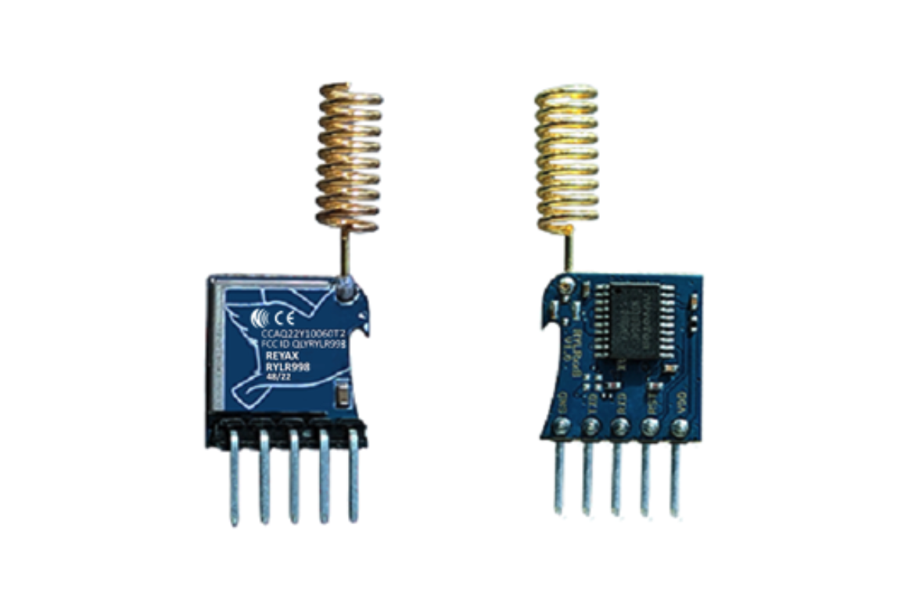

#LoRa Signal Tutorial

## Hardware
- Step 1: 

- Arduino or ESP32 board
- LoRa transceiver module
- Jumper wires

## Software
- Step 2: 
`We will insert code using backticks`

## Demo
- STEP 3: 

*we will fill the rest of our tutorial in later*
