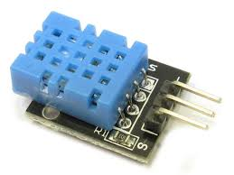

## Introduction

This tutorial will show how to read temperature and humidity data from the DHT11 using Arduino.

### Steps
- Complete the wiring on a breadboard
- Verify and compile the given example code on Arduino
- Open the serial monitor and understand the sensor data
- ***Challenge*** *(Optional)*: Display the data on an OLED display

