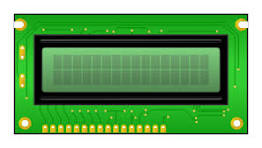

## Introduction

- I am aiming to create a LCD todolist that will just sit at my desk
  
What is the motivation behind the tutorial?
- I tend to forget a lot of the things I need to do throughout the day especially if its not in front of me.
  
What do you want readers to gain from the tutorial?
- Power. Aside from that, i hope readers can learn how to program a LCD display and be become more confident in wiring on a bread board.
  
### Learning Objectives

- Programming
- prototyping

### Background Information


Its just going to be a todo list that is displaying tasks I need to complete for the day. There are other things similar to use but this could be made with common electronic parts. Some of the most important concepts to understand is how the LCD IO works as well as how to read breadboard diagrams.

## Getting Started


### Required Downloads and Installations


Arduino IDE - The Arduino IDE is where we will be coding the logic to our todo list and uploading it to our ESP32

https://www.arduino.cc/en/software/

USB to UART driver (if not already installed) - this is required to interact between our ESP32 and our PC

https://www.silabs.com/developer-tools/usb-to-uart-bridge-vcp-drivers?tab=downloads

### Required Components

List your required hardware components and the quantities here.

| Component Name | Quanitity |
| -------------- | --------- |
|        bread board        |      1     |
|       1602A lcd         |    1       |
|          esp32s3      |       1    |
|          jumper wires       |      25     |
| B103 potentiometer|1|
| type c to type c cable| 1 |


### Required Tools and Equipment

List any tools and equipment you need here.
- need a laptop

## Part 01: 

### Introduction

We will be learning how to make our own todo list using a lcd and our esp32 board! I will break it into a few parts.


### Objective
- learn how to program the lcd display with text
- assemble complete breadboard circuit

### Background Information

All you need to complete this tutorial is some basic arduino knowledge 


### Components
- Breadboard
- 16x2 LCD
- ESP32S3
- Type C to Type C cable
  
### Instructional
Go to this website to download Arudino IDE if not installed already.


Once downloaded, open it up

Go to File>New Sketch

Copy-Paste this code into the file

``` #include <LiquidCrystal.h>
// initialize the library with the numbers of the interface pins
LiquidCrystal lcd(17, 16, 15, 14, 12, 11);
void setup() {
  // set up the LCD's number of columns and rows:
    lcd.begin(16, 2);
}
void loop() {
  lcd.setCursor(0, 0);
  lcd.print("Do ECE 196 HW 1");  // set your text
  lcd.setCursor(0, 1);
  lcd.print("Do ECE 101 lab");  
}
```
Then we want to make sure our esp32 is plugged in to our laptop using a type c to type c cable. If your laptop does not support a type c connection, you may use a regular usb connection.

We then want to make sure we select the correct board.

![insert pic of board selection menu]

once we select the correct board, we can now jump over to setting up the breadboard circuit.


we will be utilizing pins 17, 16, 15, 14, 12, and 11 of our ESP32

Follow the following circuit diagram using the jumper cables, ESP32, LCD, and potentiometer

Going back to the Arduino IDE, we can hit the Upload button.

Once the code is finish uploading, we can adjust the potentiometer to display our tasks!!

## Example

### Introduction

So here we have the LCD fully hooked up and programmed displaying 2 tasks

### Example

Present the example here. Include visuals to help better understanding


### Analysis

My example completely assembled the breadboard circuit and added custom tasks onto the LCD display. Using the code provided, I was able to program my LCD display to display two tasks from my ECE 196 and ECE 101 class. In the code this is accomplished by setting our cursor to the respective line we want to input characters on. I noticed that after turning the potentiometer between a high and low setting, the display starts to show artifacts and after a while the message would be unreadable.

## Additional Resources
https://docs.arduino.cc/software/ide/#ide-v1
https://docs.arduino.cc/programming/

### Useful links

