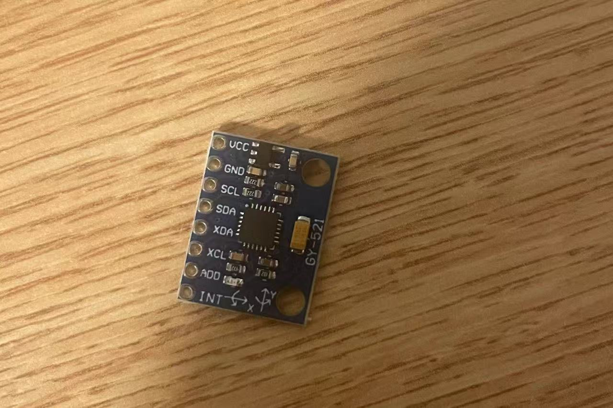
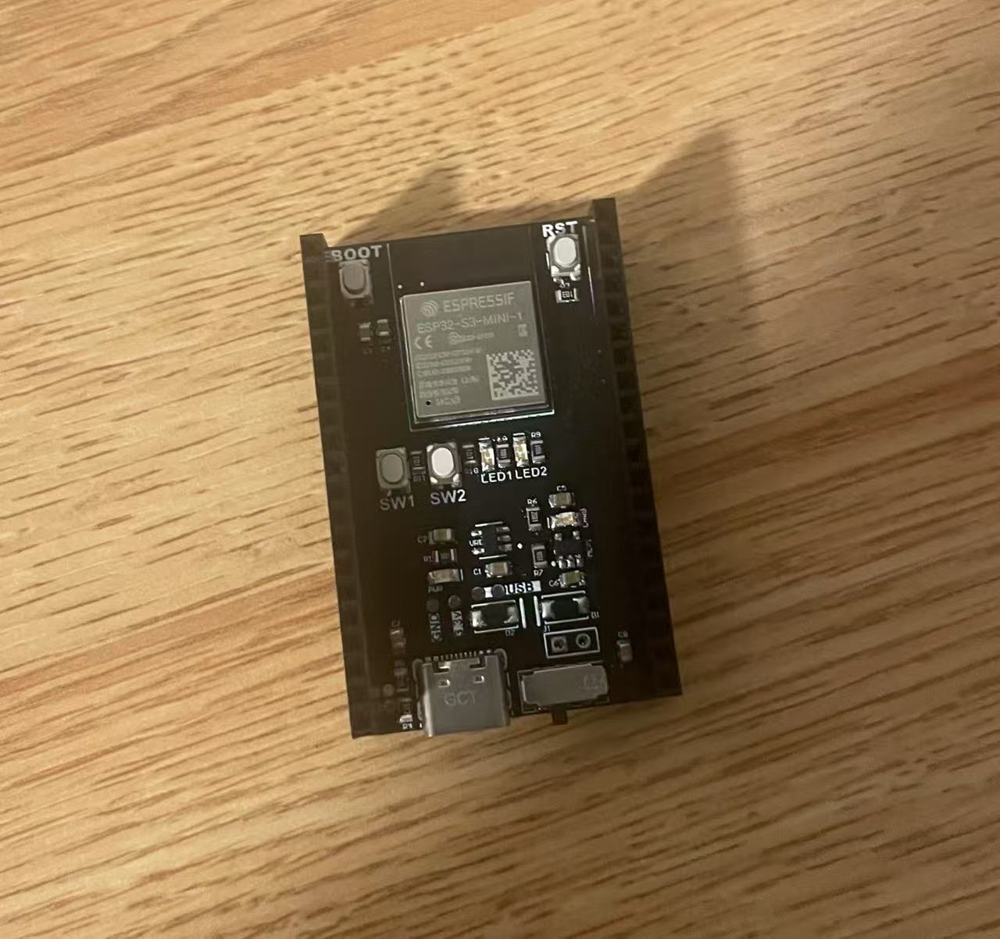
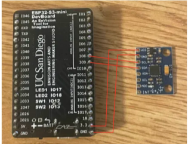

## Introduction

In this tutorial, we will discuss how to interface the **MPU6050** accelerometer with an **ESP32** development board using the C programming language. I will guide you through several steps to help you successfully read raw data from the accelerometer using the **I2C** protocol.
I will also show you the basic logic to **detect movement**.

### Learning Objectives

what will be covered in this tutorial?

- How to write embedded code in **C**
- How to use **ESP32idf** framwork
- How to read and understand **datasheets**
- How to install and use useful VScode extension - **platformIO**
- How to connect MPU6050 with ESP32 dev board through correct **pins**

### Background Information

The ESP32 is a widely used development board, and the MPU6050 accelerometer is a powerful motion detection device that can read 6-axis movement data. With these two devices, we can detect motion for a variety of projects. However, successfully communicating between the MPU6050 and the ESP32 can be a challenging task, as well as it's hard to correctly configure and utilize I2C protocol through C language. A rough outlines of this tutorial will include:

- Preparation: install useful extension
- Step1: Connect dev board with MPU6050 with wires
- Step2: talk about datasheets
- Step3: Example of Code needed to read raw data
- Step4: Example of basic logics to detect movement




## Getting Started

### Required Downloads and Installations

1. You need to first install VSCode as your coding workspace.
[VScode Download](https://code.visualstudio.com/)
2. You need to then install an extension called PlatformIO to manage your
project, I will add a useful link below as tutorial.
[PlatformIO Tutorial](https://docs.platformio.org/en/latest/tutorials/index.html)
3. You need to install The Silicon Labs CP210x USB to UART Bridge VCP Driver allows a computer to communicate with devices that use UART (Universal Asynchronous Receiver/Transmitter) through a USB connection.
[Driver Link](https://www.silabs.com/developer-tools/usb-to-uart-bridge-vcp-drivers?tab=downloads)

### Required Components

| Component Name          | Quanitity |
| wires                   |     4     |
| ESP32 s3 mini           |     1     |
| MPU6050 accelerometer   |     1     |
| Bread board             |     1     |
| USB cable               |     1     |

### Required Tools and Equipment

You need a computer and a USB cable to upload your code to your board. You also will need to have the link to MPU6050 datasheet(add link later)

## Step 01: Connect MPU6050 with ESP32 dev board

### Intro

I will be teaching how to correctly connect pins between ESP32 dev board and MPU6050 accelerometer.

### Objective

- Connect 2 devices using wires and bread board

### Background

To connect pins between ESP32 dev board and MPU6050 accelerometer, it is important to understand basic functions of pins. Since the MPU6050 communicates with ESP32 dev board through I2C protocal, which requires 2 pins specifically:

- SCL (Serial Clock Line): Carries the clock signal from the ESP32 to synchronize communication.
- SDA (Serial Data Line): Transfers data between the ESP32 and MPU6050.
Also, two power connections are needed:
- VCC: Provides power to the MPU6050.
- GND: Completes the electrical circuit with a common ground.

Incorrect pin connections may lead into damages to components or no data could successfully transmission.

### Components

- A bread board
- 4 wires
- ESP32 dev board
- MPU6050 accelerometer

### Instructional

Correct wirings:
pin 3.3V to pin VCC
pin GND to pin GND
pin IO8 to pin SCL(IO8 may be differ depending on which ESP 32 board you are using)
pin IO9 to pin SDA(same as above)

### Example



## Step 02: What are datasheets?

### Intro

I will briefly explain why reading a datasheet is important. And I will tell you directly what we will get from datasheet to save your time.

### Objective

- Read the datasheet and extract useful information.

### Background

A datasheet provides key information about a component, like pin functions, electrical specs, and communication details. It’s essential for correctly using and connecting the device. Understanding datasheets helps prevent mistakes and ensures your project works as intended.

### Instructional

Following link below to open MPU6050 offical datasheet
[MPU6050 Datasheet](https://invensense.tdk.com/wp-content/uploads/2015/02/MPU-6000-Datasheet1.pdf)
Sometimes you may need to read through many paragraphs to find useful information, but remember, focus on the sections related to pin configuration, electrical characteristics, and communication protocols to get started efficiently.
You can always browse the table of contents to find the specific page numbers.

After reading the datasheet, you may find the following useful information about the MPU6050:

- The device starts in sleep mode by default, and you need to write **0x00** to the power management register **(0x6B)** to wake it up.

- The accelerometer data for the X, Y, and Z axes starts at register address **0x3B**. You can read 6 consecutive bytes to get the high and low bytes for each axis.

- The data is in **big-endian** format, so you must combine the high and low bytes correctly to form 16-bit signed integers.

## Step 03: Example of Code needed to read raw data

### Intro

I will show you how to write C code in esp32idf framework to read raw data from MPU6050 accelerometer.

### Objective

- Write C code to get raw accleration data(x, y, and z axis)from MPU6050 using existing libs and functions in esp32idf framework.

### Background

The MPU6050 accelerometer provides raw acceleration data over the I2C interface. Reading this raw data is the first step toward detecting motion. With ESPidf, we can use built-in I2C drivers to communicate with the sensor and retrieve this data in C.

### Instructional

- driver.h

```cpp
#ifndef MPU6050_DRIVER_H
#define MPU6050_DRIVER_H
//needed libaraies
#include "driver/i2c.h"
#include "esp_log.h"
#include "freertos/FreeRTOS.h"
#include "freertos/task.h"
#include <stdio.h>
//define macros 
#define SDA_IO 9
#define SCL_IO 8
#define MPU6050_ADDR 0x68
#define TAG "MPU6050"
#define I2C_FREQ 100000
#define I2C_MASTER_NUM I2C_NUM_0

void mpu6050_init();
void mpu6050_read_data(int16_t* x, int16_t* y, int16_t* z);

#endif
```

- driver.c

```cpp
#include "mpu6050_driver.h"

// wake up MPU6050 from default sleep mode
static void mpu6050_wake()
{
    // data[0] = register address 
    // data[1] = value to write 
    uint8_t data[2] = {0x6B, 0x00};
    // Send the data over I2C to the MPU6050 to disable sleep mode
    ESP_ERROR_CHECK(i2c_master_write_to_device(I2C_MASTER_NUM, MPU6050_ADDR, data, 2, pdMS_TO_TICKS(1000)));
}

// Initialize I2C and wake up the MPU6050
void mpu6050_init()
{
     // Configure I2C settings
    i2c_config_t conf = {
        .mode = I2C_MODE_MASTER,
        .sda_io_num = SDA_IO,
        .scl_io_num = SCL_IO,
        .sda_pullup_en = GPIO_PULLUP_ENABLE,
        .scl_pullup_en = GPIO_PULLUP_ENABLE,
        .master.clk_speed = I2C_FREQ,
    };
    // Apply I2C configuration to the driver
    ESP_ERROR_CHECK(i2c_param_config(I2C_MASTER_NUM, &conf));
    // Install I2C driver
    ESP_ERROR_CHECK(i2c_driver_install(I2C_MASTER_NUM, conf.mode, 0, 0, 0));
    // Wake up the MPU6050
    mpu6050_wake();
}

// Read raw accelerometer data from MPU6050
void mpu6050_read_data(int16_t* x, int16_t* y, int16_t* z)
{
    uint8_t reg = 0x3B;// Starting register address for accelerometer data
    uint8_t data[6];// Buffer to hold 6 bytes (X, Y, Z each 2 bytes)

   // Write register address, then read 6 bytes of accelerometer data
    ESP_ERROR_CHECK(i2c_master_write_read_device(I2C_MASTER_NUM, MPU6050_ADDR, &reg, 1, data, 6, pdMS_TO_TICKS(1000)));

    //read and store data into data buffer
    *x = (int16_t)(data[0] << 8 | data[1]);
    *y = (int16_t)(data[2] << 8 | data[3]);
    *z = (int16_t)(data[4] << 8 | data[5]);
}
```

## Step 04: Example of Code to detect movement

### Intro

I will introduce how to implement fast squareroot algorithm and how to write C code to detect movement.

### Objective

- Write C code in esp32idf framework to implement motion detection.

### Background

Reading raw acceleration data from the MPU6050 is only the first step. To make the data meaningful, we need to implement logic that can determine whether the device is stationary or in motion. In this step, we will explore how to detect movement based on changes in acceleration.

### Instructional

motion_dection.h
```cpp
#define MOTION_DETECTION_H

#include "mpu6050_driver.h"
#define lower_bound 16500
#define upper_bound 17050

// a fast squre root algorithm
uint32_t fast_sqrt(uint32_t x);
int16_t detect_movement(int16_t x, int16_t y, int16_t z);

#endif
```

motion_dection.c

```cpp
#include "motion_detection.h"

// Fast Square Root Algorithm, it will compute the square root of x
uint32_t fast_sqrt(uint32_t x)
{
    uint32_t res = 0;
    uint32_t bit_mask = 1 << 30;

    while (bit_mask > x)
        bit_mask >>= 2;

    while (bit_mask != 0)
    {
        if (x >= res + bit_mask)
        {
            x -= res + bit_mask;
            res += bit_mask << 1;
        }
        res >>= 1;
        bit_mask >>= 2;
    }
    return res;
}

int16_t detect_movement(int16_t x, int16_t y, int16_t z)
{
    uint32_t xs = 0, ys = 0, zs = 0, sqrt_sum = 0;
    xs = x * x;
    ys = y * y;
    zs = z * z;
    sqrt_sum = xs + ys + zs;
    uint32_t magnitude = fast_sqrt(sqrt_sum);
    // within motionless range, return 0 stands for still
    if (lower_bound < magnitude && magnitude < upper_bound)
    {
        return 0;
    }
    // else movement detected
    return 1;
}
```

main.c

```cpp
void app_main(void)
{
    setup();

    int16_t data_x, data_y, data_z;
    while (1)
    {
        mpu6050_read_data(&data_x, &data_y, &data_z);
        ESP_LOGI(TAG, "X_value = %d | Y_value = %d | Z_value = %d", data_x, data_y, data_z);
        int16_t res = detect_movement(data_x, data_y, data_z);
        if (res)
        {
            printf("Motion detected!\n");
        }
        else
        {
            printf("No Motion detected\n");
        }
        vTaskDelay(pdMS_TO_TICKS(1000)); // Delay for 1000 ms (1 second)
    }
}
```

## Conclusion and Useful Links

### Analysis

In this tutorial, we started with the basics of using the MPU6050 and the ESP32 development board to read raw data and detect movement.

- We downloaded and set up useful development tools and extensions.
- We learned how to properly connect the pins between components.
- We also learned why we need to read datasheets — our best friend when developing hardware projects.
- We wrote simple C code in esp32 framework to read raw acceleration data.
- we implemented basic logic to detect movement.

I sincerely hope this tutorial was helpful and that you were able to learn something valuable from it.

### Useful links

useful PlatformIO tutorial:
[PlatformIO tutorial resouses](https://docs.platformio.org/en/latest/tutorials/index.html)

I used Arduino example code as a reference to implement my C code in esp32idf framework:
[Arduino version code](https://randomnerdtutorials.com/arduino-mpu-6050-accelerometer-gyroscope/)
