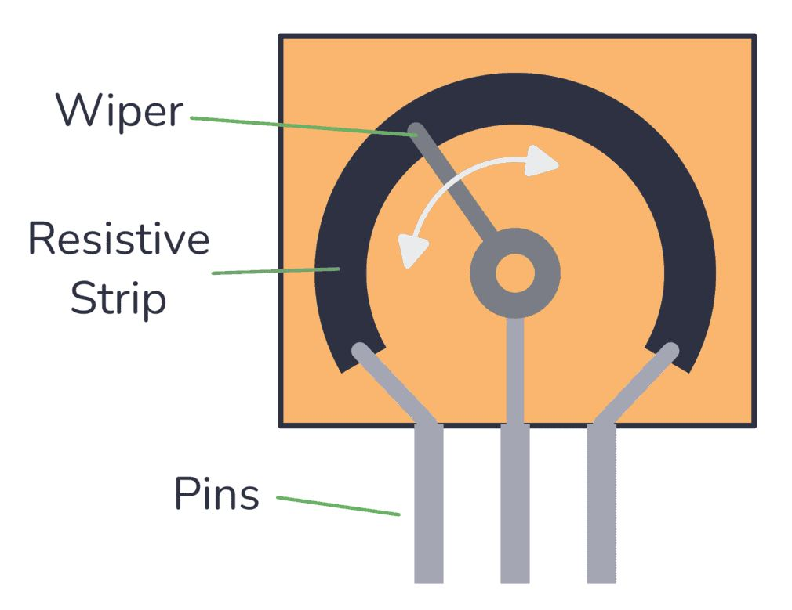
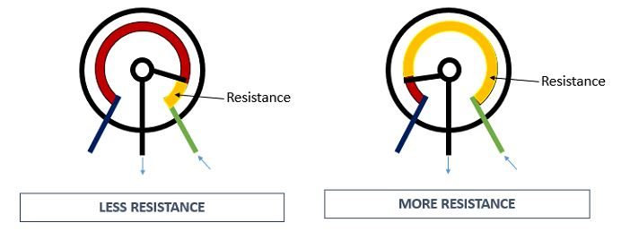
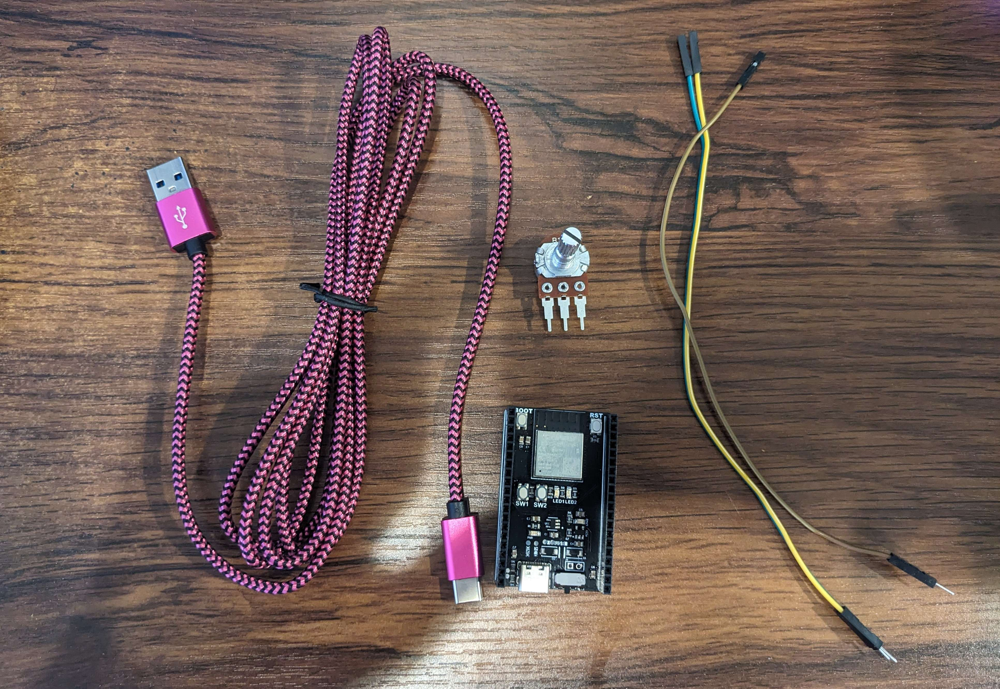

## Introduction/ Learning Objectives

- Using analog input allows for control values **beyond a simple 0 or 1**
- This may be especially useful if you have some application which needs such an input. Some examples may include:
  - Controlling the brightness of an LED
  - A game controller joystick
- By completing this tutorial, you will:
  -  Learn about how a potentiometer works 
  -  Learn how a potentiometer be connected to a microcontroller to generate continuous, non-binary inputs
  - You will also have an optional challenge where you directly apply a potentiometer as a lighting controller

### Background Information

A potentiometer is essentially a variable resistor, meaning it can ideally take on a resistance from zero up to the rating of the potentiometer. 

<small>\* In practice, the range can vary slightly. For example, the 10 kOhm potentiometer I will use in this demonstration ranges from 0.6 Ohm up to 11.05 kOhm.</small>

There are a few types of potentiometers (rotary, slide, etc). The way the resistance varies is generally by mechanically changing some feature of the potentiometer, affecting the electrical resistance. 

<small>\* Credit: https://www.build-electronic-circuits.com/potentiometer/</small>

In the case of a rotary potentiometer, 3 pins are generally present, being for the supply voltage (or V+), the signal output, and GND (or V-). Turning the knob changes the position of a "wiper", which connects to the middle signal pin. Since both supply and GND pins are connected via resistive material, changing the physical position of the wiper changes the distance and amount of material in between either pin and the signal pin. 

<small>\* Credit: https://randomnerdtutorials.com/electronics-basics-how-a-potentiometer-works/</small>

By changing the position of the wiper, we effectively change the resistance and voltage divider across the signal pin. As seen in the diagram above, the yellow section of the potentiometer is the electrical path. It changes in length depending on the potentiometer rotation, allowing the voltage reading across the middle pin to change. Since we can detect rotation of the rotary shaft with high precision, we can represent many values, not just 0 or 1.

## Getting Started

### Required Downloads and Installations

- [Arduino IDE](https://www.arduino.cc/en/software/)
  - Arduino IDE allows for the development and flashing of microcontroller code.
  - Be sure to install the correct version for your device's operating system

### Required Components

| Component Name | Quanitity |
| -------------- | --------- |
| ESP-32 S3 Dev Module      |      1    |
| USB-C cable (or other cable to connect to the ESP-32)   |      1    |
| Potentiometer (any resistance should work) |     1  |
| Male to Female dupont/ jumper wires        |     3  |
| Assembled lightshield (optional)           |     1  |

### Required Tools and Equipment

- Computer with Arduino IDE

## Part 01: Reading Analog values with an ESP-32

### Introductiom/ Learning Objectives

In this section we will cover:
- Preparing the ESP-32 to be flashed (if needed)
- Flashing the ESP-32
- Reading serial monitor output

### Background Information

In this section we will prepare the ESP-32 to run code (if needed) and use Arduino IDE
to flash the device to run our code. We will also wire up a potentiometer to the ESP-32
and view its status inside the Arduino IDE serial monitor.

### Components

- ESP-32 S3 Dev Module
- USB-C cable (or other cable to connect the ESP-32 to the computer)
- Potentiometer (any resistance should be fine)
- 3 Dupont/ Jumper wires

### Instructions

#### Wiring

To begin, we will first connect the potentiometer to the ESP-32. Connect a wire to each pin of the potentiometer. 

Then, paying attention to the wire ordering, connect the potentiometer wires to the ESP-32. One of the two outer pins should be connected to the 3.3V pin on the ESP, and the other should connect to a ground. In the image, the green wire connects to 3.3V supply, and the brown connects to ground. 

Connect the signal wire (yellow as pictured) to an IO port. In our case, we will connect it to IO21. 

#### Software Setup

Open Arduino IDE and ensure the ESP is plugged into the computer and powered off. You should see it appear in Arduino IDE as "ESP32S3 Dev Module".

<small>\* If you have never flashed the board before in Arduino IDE, turning the board on may not have it correctly show up. In order to have the board show up in the IDE, hold the switch labelled "BOOT" on the board down as you turn the board on, and keep it held down for a few seconds after the board powers on.</small>

<small>\* You may also see the board displayed as "ESP32 Family Device" or something similar. If this occurs, you will need to manually select the board by selecting "Tools->Board->esp32->ESP32S3 Dev Module" at the top of the IDE.

Once you see the board show up, you are ready to move on to the next step.

Teach the contents of this section

- Once arduino ide is installed and you can flash code, turn it off

(if board has already been flashed, skip to flashing the example code)
    - Else cover holding boot down, then powering, selecting esp32 s3, etc

- wire up potentiomter to 3.3V, gnd, and signal
- Choose the signal pin based on code, or just modify the number in the code based on what you choose
- Flash the code that AnalogReads the pin
- turn the knob and watch the values change

## Additional Resources

### Useful links

List any sources you used, documentation, helpful examples, similar projects etc.

## Part 02: Using the potentiometer as a light controller (optional challenge)

- requires light shield
- warning: this is a somewhat sketchy way of plugging in the lightshield
  - It should be fine to plug it in this way but do so at your own risk

Copy section format from Part 01
