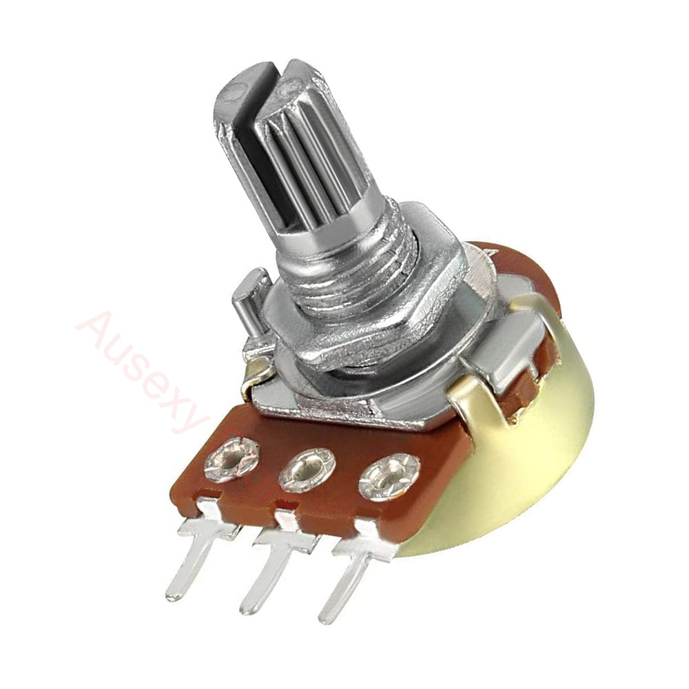

## Introduction

Write a short section on what the tutorial is aiming to accomplish.
What is the motivation behind the tutorial?
What do you want readers to gain from the tutorial?

- Using analog input allows for control values **beyond a simple 0 or 1**, like in binary
- Non binary data values can be mimicked by considering bits across time (Ultrasonic sensor pulse for example)
    - Drawback is that one may want _continuous_ variable length inputs, like in a game controller
- By completing this tutorial, you will:
  -  Learn about how a potentiometer works 
  -  Learn how a potentiometer be connected to a microcontroller to generate continuous, non-binary inputs
  - You will also have an optional challenge where you directly apply a potentiometer as a lighting controller

### Learning Objectives a

- Bullet list of skills/concepts to be covered

Any additional notes from the developers can be included here.

### Background Information

Describe your topic here. What does it do? Why do you use it?
Are there other similar things to use? What are the pros and cons?
Explain important concepts that are necessary to understand.
Include (and cite if needed) any visuals that will help the audience understand.

## Getting Started

For any software prerequisites, write a simple excerpt on each
technology the participant will be expecting to download and install.
Aim to demystify the technologies being used and explain any design
decisions that were taken. Walk through the installation processes
in detail. Be aware of any operating system differences.
For hardware prerequisites, list all the necessary components that
the participant will receive. A table showing component names and
quantities should suffice. Link any reference sheets or guides that
the participant may need.
The following are stylistic examples of possible prerequisites,
customize these for each workshop.

- Arduino IDE: Excerpt
- ESP-32
- USB-C cable (or whatever cable is used for connecting the ESP-32 to the computer)
- Potentiometer (any resistance should be fine)
- 3 Dupont/ Jumper wires
- Completed Lightshield (optional)
- -Lightshield for extra exercise

### Required Downloads and Installations

List any required downloads and installations here.
Make sure to include tutorials on how to install them.
You can either make your own tutorials or include a link to them.

- Arduino IDE- LINK HERE

### Required Components

List your required hardware components and the quantities here.

| Component Name | Quanitity |
| -------------- | --------- |
|                |           |
|                |           |

### Required Tools and Equipment

List any tools and equipment you need here.
(Ex, computer, soldering station, etc.)

## Part 01: Reading Analog values with an ESP-32

### Introduction

Briefly introduce what  you are teaching in this section.
- Will cover flashing the ESP 32 (boot mode if needed, working with arduino ide.)
- (if board has already been flashed, skip to flashing the example code)
    - Else cover holding boot down, then powering, selecting esp32 s3, etc

### Objective

- List the learning objectives of this section

### Background Information

Give a brief explanation of the technical skills learned/needed
in this challenge. There is no need to go into detail as a
separation document should be prepared to explain more in depth
about the technical skills

### Components

- List the components needed in this challenge

### Instructional

Teach the contents of this section

- Once arduino ide is installed and you can flash code, turn it off
- wire up potentiomter to 3.3V, gnd, and signal
- Choose the signal pin based on code, or just modify the number in the code based on what you choose
- Flash the code that AnalogReads the pin
- turn the knob and watch the values change

## Example

Show this process?

### Introduction

Introduce the example that you are showing here.

### Example

Present the example here. Include visuals to help better understanding

### Analysis

Explain how the example used your tutorial topic. Give in-depth analysis of each part and show your understanding of the tutorial topic

## Additional Resources

### Useful links

List any sources you used, documentation, helpful examples, similar projects etc.

## Part 02: Using the potentiometer as a light controller (optional challenge)

- requires light shield
- warning: this is a somewhat sketchy way of plugging in the lightshield
  - It should be fine to plug it in this way but do so at your own risk

Copy section format from Part 01
