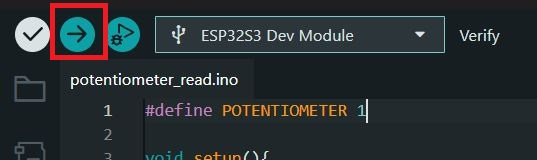
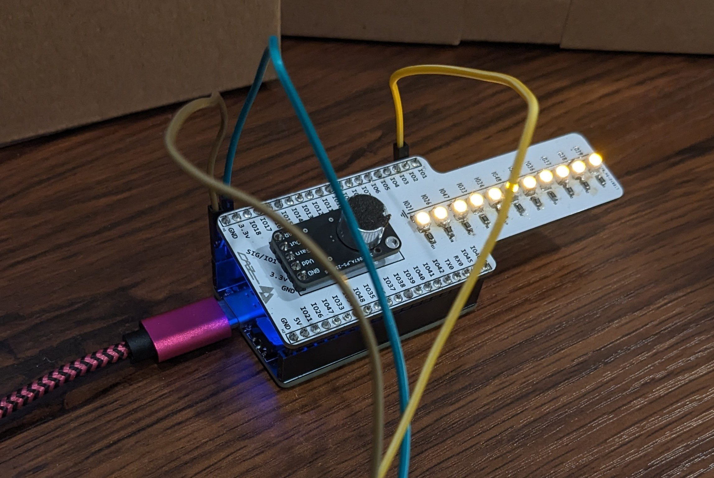

## Introduction/ Learning Objectives


- Using analog input allows for control values **beyond a simple 0 or 1**
- This may be especially useful if you have some application which needs such an input. Some examples may include:
  - Controlling the brightness of an LED
  - A game controller joystick
- By completing this tutorial, you will:
  -  Learn about how a potentiometer works 
  -  Learn how a potentiometer be connected to a microcontroller to generate continuous, non-binary inputs
  - You will also have an optional challenge where you directly apply a potentiometer as a lighting controller


### Background Information

A potentiometer is essentially a variable resistor, meaning it can ideally take on a resistance from zero up to the rating of the potentiometer. 

<small>\* In practice, the range can vary slightly. For example, the 10 kOhm potentiometer I will use in this demonstration ranges from 0.6 Ohm up to 11.05 kOhm.</small>

There are a few types of potentiometers (rotary, slide, etc). The way the resistance varies is generally by mechanically changing some feature of the potentiometer, affecting the electrical resistance. 


<small>\* Credit: https://www.build-electronic-circuits.com/potentiometer/</small>


In the case of a rotary potentiometer, 3 pins are generally present, being for the supply voltage (or V+), the signal output, and GND (or V-). Turning the knob changes the position of a "wiper", which connects to the middle signal pin. Since both supply and GND pins are connected via resistive material, changing the physical position of the wiper changes the distance and amount of material in between either pin and the signal pin. 


<small>\* Credit: https://randomnerdtutorials.com/electronics-basics-how-a-potentiometer-works/</small>


By changing the position of the wiper, we effectively change the resistance and voltage divider across the signal pin. As seen in the diagram above, the yellow section of the potentiometer is the electrical path. It changes in length depending on the potentiometer rotation, allowing the voltage reading across the middle pin to change. Since we can detect rotation of the rotary shaft with high precision, we can represent many values, not just 0 or 1.


## Getting Started


### Required Downloads and Installations

- [Arduino IDE](https://www.arduino.cc/en/software/)
  - Arduino IDE allows for the development and flashing of microcontroller code.
  - Be sure to install the correct version for your device's operating system

### Required Components


| Component Name | Quanitity |
| -------------- | --------- |
| ESP-32 S3 Dev Module      |      1    |
| USB-C cable (or other cable to connect to the ESP-32)   |      1    |
| Potentiometer (any resistance should work) |     1  |
| Male to Female dupont/ jumper wires        |     3  |
| Assembled lightshield (optional)           |     1  |


### Required Tools and Equipment

- Computer with Arduino IDE


## Part 01: Reading Analog values with an ESP-32

### Introduction/ Learning Objectives

In this section we will cover:
- Preparing the ESP-32 to be flashed (if needed)
- Flashing the ESP-32
- Reading serial monitor output

### Background Information

In this section we will prepare the ESP-32 to run code (if needed) and use Arduino IDE
to flash the device to run our code. We will also wire up a potentiometer to the ESP-32
and view its status inside the Arduino IDE serial monitor.

### Components

- ESP-32 S3 Dev Module
- USB-C cable (or other cable to connect the ESP-32 to the computer)
- Potentiometer (any resistance should be fine)
- 3 Dupont/ Jumper wires


### Instructions

#### Wiring


To begin, we will first connect the potentiometer to the ESP-32. Connect a wire to each pin of the potentiometer. 


Then, paying attention to the wire ordering, connect the potentiometer wires to the ESP-32. One of the two outer pins should be connected to the 3.3V pin on the ESP, and the other should connect to a ground. In the image, the green wire connects to 3.3V supply, and the brown connects to ground. 

Connect the signal wire (yellow as pictured) to an IO port. In our case, we will connect it to IO1 for analog input. 


#### Software Setup


Open Arduino IDE and ensure the ESP is plugged into the computer and powered on. You should see it appear in Arduino IDE as "ESP32S3 Dev Module".

<small>\* If you have never flashed the board before in Arduino IDE, the board may not correctly show up. In order to have the board show up in the IDE, hold the switch labelled "BOOT" on the board down as you turn the board on, and keep it held down for a few seconds after the board powers on.</small>


<small>\* You may also see the board displayed as "ESP32 Family Device" or something similar. If this occurs, you will need to manually select the board by selecting "Tools->Board->esp32->ESP32S3 Dev Module" at the top of the IDE.


Once you see the board show up correctly, you are ready to move on to the next step.


#### ESP-32 Programming

Open a new sketch in Arduino IDE and add the following code:


```

#define POTENTIOMETER 1
```

We first define the analog input pin the potentiometer signal line will connect to.


```
void setup(){
  Serial.begin(9600);
  pinMode(POTENTIOMETER, INPUT);
}

```
We can then set up the serial port connection with a baud rate of 9600, and set the potentiometer input pin to be an input.


```
void loop(){
  int position = analogRead(POTENTIOMETER);
  Serial.println(position);
  delay(100);
}
```


Finally, in our loop which runs continuously, we can read the analog input to represent the potentiometer's position. We can print this value to the serial output, and delay 100 miliseconds between cycles.




Once your sketch has these needed components, you should be able to flash the ESP. 


To view the output, go to "Tools-> Serial Monitor" and you can read the values printed out in the serial monitor below. Ensure the baud rate is set accordingly to 9600.

<small> In case you have issues with viewing output, you can also try to toggle "Tools-> Toggle USB CDC on Boot" to "Enabled". </small>


Now you can turn the potentiometer knob and watch the values change!


## Part 02: Using the potentiometer as a light controller (Optional Challenge)


### Introductiom/ Learning Objectives

In this section we will cover:
- Using a potentiometer to actively control another device for controlling LED's

### Background Information


In this section, we will use the potentiometer to control a lightshield module. This allows us to actually do more with the potentiometer beyond reading values.

### Components

- ESP-32 S3 Dev Module
- USB-C cable (or other cable to connect the ESP-32 to the computer)
- Potentiometer (any resistance should be fine)
- 3 Dupont/ Jumper wires
- Fully Assembled and functional lightshield

### Instructions


#### Physical Assembly

**WARNING: This method involves installing the lightshield in a manner which is not the most ideal. You may use additional wires to connect the lightshield pins to the ESP if desired. Proceed with caution and at your own risk to not damage any components/pins.**


Since the LED circuits on the lightshield use IO21 through IO39, we only need to plug in those pins. We can plug the lightshield in at an angle to still have access to the pins we used for the potentiometer in section 1.


#### New ESP Code

We can now write some new code to have the lightshield actually controlled by the input values of the potentiometer.


```

#define DATIN 1
//Leds are 21, 26, 47, 33, 34, 48, 35, 36, 37, 38, 39
int leds[11] = {21, 26, 47, 33, 34, 48, 35, 36, 37, 38, 39};

int minVal = 0;
int maxVal = 4095;    // Can determine this experimentally by turning potentiometer knob to maximum and minimum
```

The pin we use is the same, now just called "DATIN". We also define a list of pin numbers for the LEDs of the lightshield which we will use later. Finally, the minimum and maximum analog values of this steup are recorded. These can be derived experimentally in the previous section by simply turning the knob to both ends and recording the min and max values.


```


// Function to display leds based on the normalized value
void display(int in, int led_list[], int list_size, int min, int max){
    int num_leds_disp = in / ((max-min)/list_size);
    for(int i = 0; i< num_leds_disp; i++){
        digitalWrite(led_list[i], HIGH);
    }
}

```


Since we have an array of LEDs on our lightshield, we can set up the code to turn an LED on once the potentiometer reaches a certain threshold per each LED. This threshold can be evenly spaced in analog values by taking the range of the analog values (max-min), and dividing by the number of LEDs we have. Then we will simply turn all the required LEDs on.


```
void setup(){
  Serial.begin(9600);
  pinMode(DATIN, INPUT);
  for(int i =0; i<11; i++){
    int led = leds[i];
    pinMode(led, OUTPUT);
    digitalWrite(led, LOW);
  }
}

```

We initialize serial and the potentiometer input pin. We also must initialize all LEDs, which we can simply do in a loop since we have a list of all LED pin numbers in the order they appear on the lightshield.


```

void loop(){
  int position = analogRead(DATIN);
  Serial.println(position);
  for (int i=0;i<11;i++){
    digitalWrite(leds[i],LOW);
  }

  display(position, leds, 11, minVal, maxVal);
  delay(100);
}

```

In our loop we can do a few things. First we can take the position of the potentiometer and print it to serial. We then turn off all LEDs, as our function call will turn on only as many as are needed. If we didn't do this, the LEDs from the previous loop would all remain on even if the potentiometer value changes.

We then call our function to display the correct number of LEDs, giving the needed parameters, including the value 11 for our 11 LEDs on the lightshield.


#### Testing it out

Once you flash the code, you should be able to turn the potentiometer knob and watch the LEDs go up and down. The images below show different numbers of LEDs being turned on based on only rotating the potentiometer.




