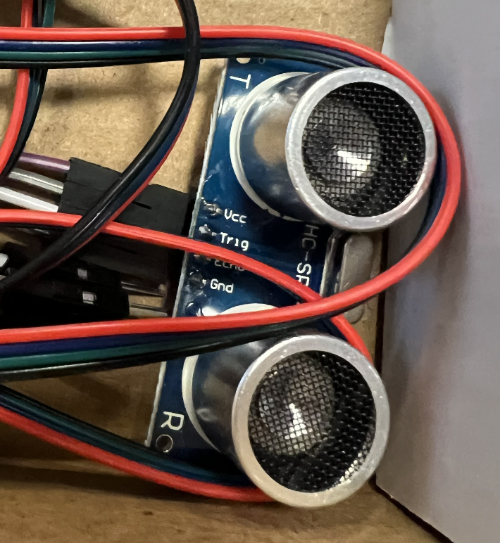

<h1>Ultrasonic Sensor Tutorial</h1>

## Introduction
This tutorial will go over how to use an **ultrasonic sensor** along side a **ESP32**

## Getting Started

### Components

- Ultrasonic Sensor
- ESP32
- Jumper Wires

### Instructional

<ul>
  <li>First We will connect the ultrasonic sensor to the ESP32</li>
  <li>Then we will add some code in arduino </li>
  <li>Then we will push the code to the ESP32 board</li>
  <li>Finally we will be able to measure distace from the sensor</li>
</ul>
