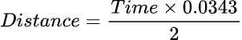

This tutorial will guide you through using an **ultrasonic sensor** with an **ESP32** Devboard. Ultrasonic sensors are used to measure distance using sound waves, and they are usually used for obstacle detection.

### Learning Objectives

- Explain the principle of an ultrasonic distance sensor
- How to connect a HC-SR04 ultrasonic sensor to an ESP32.
- Write and upload Arduino code to the ESP32 to read distance from the sensor.
- Display real-time distance readings using the Serial Monitor

### Background Information

Ultrasonic sensors are electronic devices that measure the distance to an object by using high-frequency sound waves. One of the most common sensors is the HC-SR04.

#### Intro to Echo:
  > An echo is a sound that is reflected off a surface and heard again after the original sound was first transmited. It happens when sound waves travel through the air, hit a surface, and bounce back to the listener.

#### Intro to Ultrasonic Sounds:
  > Ultrasonic sounds are sound waves with frequencies higher than 20 kHz and are above the threshold of human hearing.

#### Intro to HC-SR04

- **Consists of two transducers**: one acts as a **transmitter** that emits ultrasonic sound pulses, and the other acts as a **receiver** that listens for echoes.

- **The sensor has four pins**:
  - **VCC**: Power supply
  - **GND**: Ground
  - **TRIG**: Trigger input, which sends a signal to start the measurement
  - **ECHO**: Echo output, which goes HIGH for the duration it takes the ultrasonic sound wave to travel to the object and back.

- **To measure distance**: 
  1. The ESP32 sends a short HIGH pulse of at least 10 microseconds to the TRIG pin.
  2. This causes the HC-SR04 to emit an ultrasonic pulse at 40 kHz.
  3. The ECHO pin goes HIGH.
  4. If the sound pulse hits an object, it reflects back to the sensor.
  5. The ECHO pin goes LOW, after it hears the second wave. The period of time the pin was high, is equal to the round-trip time of the sound wave.
  6. By measuring this time in microseconds and applying the formula, we will get the total distance:
  
  

- **It can detect objects between 2 cm and 400 cm away**

## Getting Started

Make sure to have the Arduino IDE already downloaded, this software is avalible for both Windows and MacOS. In terms of hardware, all you will need is your ESP32, HC-SR04 ultrasonic sensor, and jumper wires.

### Required Downloads and Installations

[Arduino IDE](https://www.arduino.cc/en/software)

### Required Components

|       Component Name        | Quanitity |
| --------------------------- | --------- |
|          ESP32-S3           |     1     |
|  HC-SR04 ultrasonic sensor  |     1     |
|  Jumper Wires (Male-Female) |     4     |

### Required Tools and Equipment

- Computer, Arduino IDE, USB-C.

## Part 1: Setting Up the Arduino IDE to be Compatible with ESP32-S3 Board

### Introduction

In this section you will learn how to set up the environment in the Arduino IDE such that we can upload our own code without problems into the ESP32.

### Objective

- Learn how to select a board.
- Learn how to select a port.

### Background Information
We need to select the correct board and port in the Arduino IDE so it can compile the code with the right settings for the specific microcontroller we're using, and upload it through the correct USB connection to the device.

### Instructions

Open up a new sketch in Arduino IDE.

Connect your ESP32S3 Devboard using the USB-C cable and make sure it is powered ON.

At the top of the page there should be a white dropdown with the USB symbol on the left. Once we click on it, it will give us the option to select the board and port we want to use.


First we select the port, in this case "/dev/cu.usbmodem1101 Serial Port (USB)". Then we write on the search bar the name of our board, in this case "ESP32S3 Dev Module".


If all the steps were done correctly, when we upload the empty file using the right arrow at the top of the program, we should receive a message that says "Done uploading":


## Part 2: Code for ultrasonic sensor distance measurement

### Introduction
In this section we learn how to write the Arduino code such that we can measure distance using the HC-SR04 ultrasonic sensor and the ESP32-S3. 

### Objective
- Write code to read distance from the ultrasonic sensor.
- Learn how to declare and use input/output pins in Arduino.

### Background Information
The ESP32 has GPIO (General Purpose Input/Output) pins that can either send signals (output) or read signals (input). You can tell the ESP32 what a pin should do using the <code>pinMode()</code> function in Arduino. 

We use <code>digitalWrite(TRIG_PIN, HIGH)</code> to tell the sensor to send out a sound wave. After 10 microseconds, we set it to LOW again so the sensor stops sending.

### Instructions
First we need to define the pins for TRIG and ECHO of the ultrasonic sensor:
```c
const unsigned int trig = 26;
const unsigned int echo = 21;
```
We continue by declaring some variables that will be useful to store the duration between the signal being sent and the echo being received, as well as the calcualtion of the distance.
```c
long duration;
float distanceCm;
```
In the <code>void setup()</code> function, we do two things. The first is to start the Serial Monitor that will allow us to print distance values. The second is that we need set which pin will receive or send signals, in this case the pin for TRIG to send and ECHO to receive:
```c
void setup()
{
  // initialize the serial port:
  Serial.begin(9600);

  pinMode(trig, OUTPUT);
  pinMode(echo, INPUT);
}
```
The <code>void loop()</code> function runs continuously after <code>void setup()</code>, allowing the ESP32 to repeatedly check the ultrasonic sensor, calculate distance, and print the result.

Here we first set the TRIG signal low before sending a pulse, using <code>digitalWrite(TRIG_PIN, LOW)</code>. Then, we set it HIGH for 10 microseconds to trigger the ultrasonic pulse, using <code>digitalWrite(TRIG_PIN, HIGH)</code> and <code>delayMicroseconds(10)</code>. After that, we set it back to LOW.

The sensor sends out this ultrasonic pulse, and the program measures how long the ECHO pin stays HIGH with <code>pulseIn(ECHO_PIN, HIGH)</code>. This duration is used to calculate the distance, which is then shown on the Serial Monitor using <code>Serial.println()</code>.
```c
void loop() 
{
  // Make sure TRIG is LOW before sending a pulse
  digitalWrite(trig, LOW);
  delayMicroseconds(2);

  // Send a 10 microsecond HIGH pulse to trigger the sensor
  digitalWrite(trig, HIGH);
  delayMicroseconds(10); 

  // End the pulse
  digitalWrite(trig, LOW);

  // Measure the duration that the ECHO pin stays HIGH, this is the time it takes for the sound to travel to the object and back
  duration = pulseIn(echo, HIGH);

  // Calculate: distance = duration * Speed of sound / 2
  // Speed of sound = 343 m/s = 0.0343 cm/µs
  // Divide by 2 because the sound goes to the object and then back.
  distanceCm = duration * 0.0343 / 2;

  // Print the distance to the Serial Monitor in centimeters
  Serial.println(distanceCm);

  // Optional: wait a short time before the next reading
  delay(100);
}
```
Having that code saved in a sketch in Arduino IDE, we should be able to read distance between the ultrasonic sensor and an object.

## Part 3: Wiring the Circuit

### Introduction
In this section we learn how to connect and wire the HC-SR04 ultrasonic sensor to the ESP32-S3 using jumper wires. 

### Objective
- Understand what pins to use in the ESP32 Devboard.
- Connect HC-SR04 ultrasonic sensor to the board.

### Background Information
The ESP32 Devboard has 40 total pins:
- One 5V pin
- One 3.3V pin
- Two ground pin
- One RX0 pin
- One TX0 pin
- 34 IO pins


### Instructions

First, find four jumper wires with female to male termiantions.

Then, connect the pins of the ultrasonic sensor to the female part of the jumper wires.

Finally connect the male pins to the header pins of the breadboard as shown in the schematic below:


Your end result should look like something like this:


## Part 4: Check measurements using the terminal
Once you have finished all previous parts, we should be ready to try out the sensor and our code.

Having the port and board selected, the Devboard to be powered ON, and the code in the IDE, go ahead and upload the file into the board using the "Upload" at the top left corner.

If all the steps were followed correcly you should see a "Done uploading" message at the bottom right corner:


Then you can open the Serial Monitor using the most right symbol at the top or by going into tools and clicking Serial Monitor as seen below.


Finally in the Serial Monitor, make sure to select the baud that we used in our code, in this case 9600:


 **If all previous steps and part were followed correctly, you should be able to see the readings of the ultrasonic sensor in centimeters, displayed in a new line of the Serial Monitor.**

## Additional Resources

### Useful links
[HC-SR04 Ultrasonic Sensor Module User Guide](https://lastminuteengineers.com/arduino-sr04-ultrasonic-sensor-tutorial/)

[How HC-SR04 Ultrasonic Sensor Works & Interface It With Arduino](https://www.handsontec.com/dataspecs/HC-SR04-Ultrasonic.pdf)
