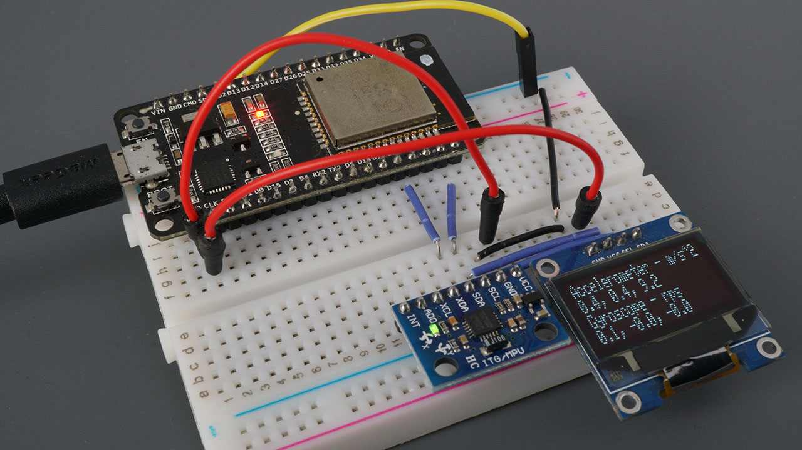
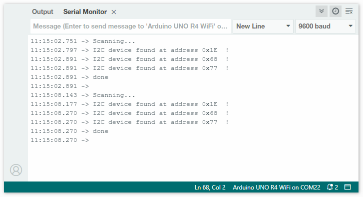

## Introduction
This tutorial is aiming to teach how to interface an accelerometer sensor with an ESP32 Dev Board to detect motion. The motivation behind this tutorial is to help measure forces in all directions which allow to detect shakes, tilts and falls. I want readers to understand how to detect any type of motion and understand how to link the accelerometer with the Dev Board and how they can work correspondingly.

### Learning Objectives
- Understanding the basic functionalities of a three-axis acclerometer
- Configure and ESP32 board to communicate with a sensor
- How to read data and interpret the sensor
- How to impliment motion detection (shaking, tilting and ext.)
- Alarm motion event using LED indicator/sound.

### Background Information

Accelerometers are useful in measuring accelration in m/s^2. The MPU-6050 is an effective sensor that can communicate with board using I^2C or SPI to offer a slution.
I am using an MPU-6050 because it offers a combination of a 3-axis accelerometer and a 3-axis gyroscope in one chip. It is a 16-bit ADC and offers high resolution. It can store a high amount of data and can be supported ESP32 libraries. However, the only drawback is it's high power usage. An ADXL345 is an alterantive that uses low power but only detects linear motion, unlike an PU-6050 which is more effective in all types of motions (ex.rotational). 

## Getting Started

Ideally, should have Arduino already installed and ready to go. Otherwise, use Visual studios. For the hardware, the main things you would need are the ESP32 Dev Board along with an MPU 6050 sensor. The other components that are easily accessible will be listed below under required components.

### Required Downloads and Installations
1. Arduino IDE
    - visit Arduino page
    - download latest version of Arduino IDE
    - Launch Arduino
2. ESP32 Board Support for Arduino
  -  https://youtu.be/HY8MFMrGo3k?si=LE2I5AAdRno9ZNeh
3. MPU6050 library download
  - https://youtu.be/I6cBs3yStf8?si=gQ7pF3agDsci_hiU

### Required Components

|    Component Name       |     Quanitity    |
| ----------------------- | ---------------- |
|ESP32 DevBoard           |         1        |
|MPU 6050 Accelerometer   |         1        |
|Jumper Wires             |         4        |
|USB-C                    |         1        |
|Breadboard               |         1        |

### Required Tools and Equipment

- Computer with USB-C port
- Breadboard
- Jumper Wires

## Part 01: Sensor Wiring and Communiaction

### Introduction

In this section you will learn how to wire the MPU 6050 sensor to the SP32 dev board to allow them to communicate.

### Objective

The main objective is to be able to connect to power and confirm the MPU-6050 address to prove successful connection.

### Background Information

Firstly, you would need to understand the ESP32 Dev board functionality in relation to Arduino. We will connect MPU 6050 with the board. We need to ensure volage compatibility, to ensure both devices are compatable to avoid damages. We need to know debugging to confirm that the address is of the MPU 6050  sucessfully stored. Lastly, wiring and lining pins up for pairing the devicesis important too.

### Components

- ESP32 Dev Board
- MPU 6050
- Jumper wires

### Instructional

1. Place components on breadboard (MPU-6050 and ESP32) so that they are alligned appropriately and GND pins allign with power rails.
2. Conmect ESP32 3V3 pin to MPU-6050 VCC pin
3. Connect ESP32 GND pin to MPU-6050 GND pin
4. Connect ESP32 SDA pin to MPU-6050 SDA pin
5. Connect ESP32 SCL pin to MPU-6050 SCL pin
6. Connect MPU-6050 pin to GND and set it's address
7. Upload I^2C sketch and verify that device is found using serial monitor

.jpg)

## Example

### Introduction

This is an example of how the I^2C scanner confirms that the MPU-6050 is connected and the sensor is communicating with the board effectively.

### Example

This is the expected output on the serial monitor showing that the device was successfully connected with the corrrect address.

### Analysis

Found I2C device at "address" tells the user that the MPU-6050 has been found and it's responding. Found device ensures that no errors have been found and the device is successfully connected.

To successfully complete that you must ensure:
1. Breadboard and Ground Rails are laid out correctly and they both share a common ground.
2. The ESP32 Dev Board and MPU 6050 sensor both run at the same voltage (3.3V) and VCC must feed both devices.
3. I2C will have 2 lines SDA and SCL, do not mistakepins and wriring or it will print out "device not found".
4. Success will print out "device found at 0x68" or something along those lines showing that the device was found at specific address.

## Additional Resources
- Arduino Guide: https://www.arduino.cc/en/Guide/
- MPU-6050 Datasheet: https://invensense.tdk.com/wp-content/uploads/2015/02/MPU-6000-Datasheet1.pdf

### Useful links
(https://www.youtube.com/watch?v=RiYnucfy_rs)