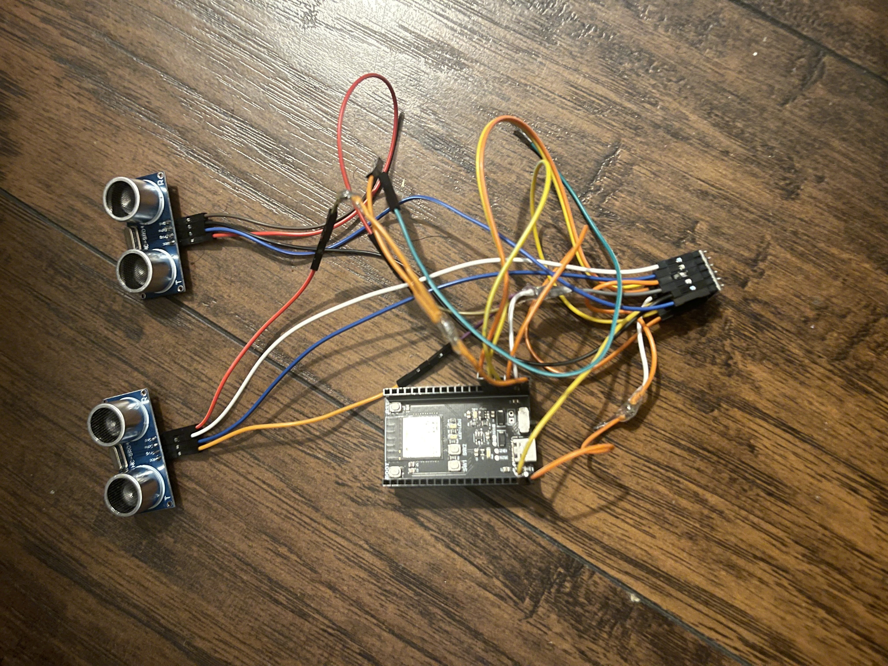

## Introduction

This tutorial walks you through building a real-time parking monitoring system using an ESP32 microcontroller and ultrasonic sensors. The system detects whether a parking spot is occupied and sends the information wirelessly using Bluetooth Low Energy (BLE) to a live web dashboard. The motivation behind this project is to help solve everyday parking frustration, particularly on busy campuses like UC San Diego, by providing accurate, live updates on space availability. By the end of this tutorial, readers will learn how to integrate sensors, BLE communication, and real-time web display with minimal cost and equipment.

### Learning Objectives

- Understand how ultrasonic sensors work for distance detection

- Set up BLE communication with the ESP32

- Send sensor data wirelessly to a browser interface

- Create a real-time web dashboard using HTML/CSS/JavaScript

- Interpret sensor signals to determine occupancy status

- Learn how to debug sensor communication with Serial Monitor

### Background Information

Parking detection systems are often expensive or inaccurate. Using simple ultrasonic sensors with ESP32 BLE gives us a flexible and low-cost solution. When a car enters or exits a spot, the sensor measures distance changes and determines if the space is occupied.

Similar technologies include IR sensors and camera-based systems. However:

- Ultrasonic sensors are easy to use and not affected by lighting.

- BLE (Bluetooth Low Energy) allows low-power wireless communication to a webpage.

## Getting Started

1. Arduino IDE

- [Download Link](https://www.arduino.cc/en/software)  
   - Add the ESP32 board using the Board Manager

2. CP210x USB to UART Bridge VCP Drivers (for ESP32-S3 communication)
  - [Download](https://www.silabs.com/developers/usb-to-uart-bridge-vcp-drivers)

- Download

3. **Google Chrome** (for Web Bluetooth API compatibility)

### Required Downloads and Installations

List any required downloads and installations here.
Make sure to include tutorials on how to install them.
You can either make your own tutorials or include a link to them.

### Required Components

List your required hardware components and the quantities here.

|      Component Name                    |  Quanitity   |
| -------------------------------------- | ------------ |
|     ESP32-S3 Dev Module                |      1       |
|     HC-SR04 Ultrasonic Sensor          |      2       |
|     Custom PCB                         |      1       |
|     Jumper wires                       |      10+     |
|     220Ω resistors                     |      10+     |
|     Logic Level  Shifter               |      1       |
|
|

### Required Tools and Equipment

- A Windows/macOS/Linux computer

- Arduino USB cable

- Optional: 3D-printed case

- Optional: Logic Level Shifter (if using 5V sensor)

- Soldering station (if permanent setup desired)

## Part 01: System Setup and Communication

### Introduction

In this part, we will walk through setting up the sensor, wiring it to the ESP32, and enabling BLE communication. We will also cover how to display sensor data in the Serial Monitor for debugging.

### Objective

- Wire ultrasonic sensors to the ESP32

- Use NewPing library to get accurate distance readings

- Configure BLE characteristics to send sensor data

- Verify output using the Serial Monitor

### Background Information

The HC-SR04 sensor works by sending an ultrasonic pulse and measuring the time it takes to bounce back. By calculating the duration, we get the distance.
The ESP32-S3 includes BLE support and allows wireless communication between hardware and browser via Web Bluetooth API.

### Components

- ESP32-S3 board

- 2x HC-SR04 sensors

- 2x LEDs (for status)

- Jumper wires, breadboard
  
- Logic Level Shifter

### Instructional

1. Wire the Trig and Echo pins of the HC-SR04 to your ESP32.

2. Define constants in code like #define TRIGPIN 33.

3. Use NewPing sonar(TRIGPIN, ECHOPIN, maxDistance);

4. Average readings over 1 second to smooth values.

5. Create BLE characteristics with UUIDs to send distance + status.

6. Use .notify() to send real-time data every 3 seconds.

## Example

int distance = sonar.ping_cm();
Serial.println(distance);

If distance < 30, then occupied = true.

BLE sends: 1,A,0,25 (SensorID, Type, Free/Occupied, Distance)

### Introduction

Introduce the example that you are showing here.

### Example

  <video width="80%" controls>
    <source src="Team10ArPhotos/IMG_1219.mp4" type="video/mp4">
    Your browser does not support the video tag.
  </video>

### Analysis

Explain how the example used your tutorial topic. Give in-depth analysis of each part and show your understanding of the tutorial topic

## Additional Resources

### Useful links

- [Random Nerd Tutorials: ESP32 BLE](https://randomnerdtutorials.com/esp32-web-bluetooth/)
- [Web Bluetooth API Docs](https://developer.mozilla.org/en-US/docs/Web/API/Web_Bluetooth_API)
- [NewPing Arduino Library](https://bitbucket.org/teckel12/arduino-new-ping/wiki/Home)
