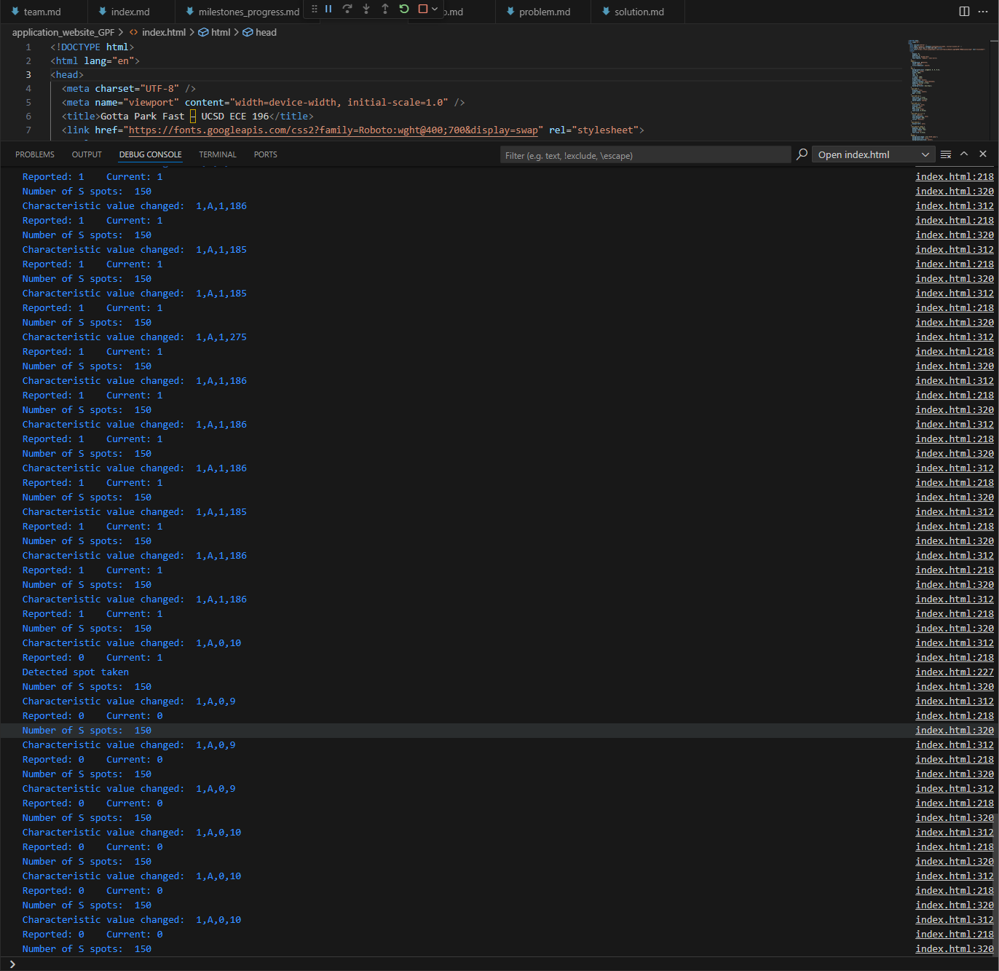

## Introduction

This tutorial walks you through building a real-time parking monitoring system using an ESP32 microcontroller and ultrasonic sensors. The system detects whether a parking spot is occupied and sends the information wirelessly using Bluetooth Low Energy (BLE) to a live web dashboard. The motivation behind this project is to help solve everyday parking frustration, particularly on busy campuses like UC San Diego, by providing accurate, live updates on space availability. By the end of this tutorial, readers will learn how to integrate sensors, BLE communication, and real-time web display with minimal cost and equipment.

### Learning Objectives

- Understand how ultrasonic sensors work for distance detection

- Set up BLE communication with the ESP32

- Send sensor data wirelessly to a browser interface

- Create a real-time web dashboard using HTML/CSS/JavaScript

- Interpret sensor signals to determine occupancy status

- Learn how to debug sensor communication with Serial Monitor

### Background Information

Parking detection systems are often expensive or inaccurate. Using simple ultrasonic sensors with ESP32 BLE gives us a flexible and low-cost solution. When a car enters or exits a spot, the sensor measures distance changes and determines if the space is occupied.

Similar technologies include IR sensors and camera-based systems. However:

- Ultrasonic sensors are easy to use and not affected by lighting.

- BLE (Bluetooth Low Energy) allows low-power wireless communication to a webpage.

## Getting Started

1. Arduino IDE

- [Download Link](https://www.arduino.cc/en/software)  
   - Add the ESP32 board using the Board Manager

2. CP210x USB to UART Bridge VCP Drivers (for ESP32-S3 communication)
  - [Download](https://www.silabs.com/developers/usb-to-uart-bridge-vcp-drivers)

3. **Google Chrome** (for Web Bluetooth API compatibility)

### Required Downloads and Installations

List any required downloads and installations here.
Make sure to include tutorials on how to install them.
You can either make your own tutorials or include a link to them.

### Required Components

List your required hardware components and the quantities here.

|      Component Name                    |  Quanitity   |
| -------------------------------------- | ------------ |
|     ESP32-S3 Dev Module                |      1       |
|     HC-SR04 Ultrasonic Sensor          |      2       |
|     Custom PCB                         |      1       |
|     Jumper wires                       |      10+     |
|     220Ω resistors                     |      10+     |
|     Logic Level  Shifter               |      1       |
---------------------------------------------------------

### Required Tools and Equipment

- A Windows/macOS/Linux computer

- Arduino USB cable

- Optional: 3D-printed case

- Optional: Logic Level Shifter (if using 5V sensor)

- Soldering station (if permanent setup desired)

## Part 01: System Setup and Communication

### Introduction

In this part, we will walk through setting up the sensor, wiring it to the ESP32, and enabling BLE communication. We will also cover how to display sensor data in the Serial Monitor for debugging.

### Objective

- Wire ultrasonic sensors to the ESP32

- Use NewPing library to get accurate distance readings

- Configure BLE characteristics to send sensor data

- Verify output using the Serial Monitor

### Background Information

The HC-SR04 sensor works by sending an ultrasonic pulse and measuring the time it takes to bounce back. By calculating the duration, we get the distance.
The ESP32-S3 includes BLE support and allows wireless communication between hardware and browser via Web Bluetooth API.

### Components

- ESP32-S3 board

- 2x HC-SR04 sensors

- 2x LEDs (for status)

- Jumper wires, breadboard
  
- Logic Level Shifter

### Instructional

1. Wire the Trig and Echo pins of the HC-SR04 to your ESP32.

2. Define constants in code like #define TRIGPIN 33.

3. Use NewPing sonar(TRIGPIN, ECHOPIN, maxDistance);

4. Average readings over 1 second to smooth values.

5. Create BLE characteristics with UUIDs to send distance + status.

6. Use .notify() to send real-time data every 3 seconds.

## Example

int distance = sonar.ping_cm();
Serial.println(distance);

If distance < 30, then occupied = true.

BLE sends: 1,A,0,25 (SensorID, Type, Free/Occupied, Distance)

## Introduction

In this tutorial, I will explain how my project, “Real-Time Parking Availability with ESP32,” works from start to finish. The main goal is to help others understand how to build a low-cost smart parking system using an ESP32 microcontroller and ultrasonic sensors.

Parking can be frustrating when drivers don’t know which spots are available. This project solves that by detecting whether a parking space is occupied and sending the result to a live website. When a car is present, the system shows that the spot is full; when it’s empty, it shows that the spot is available.

This Picture and the video will guide you through the full setup — from wiring the hardware and programming the ESP32 to updating the website in real time. By the end, you’ll be able to create your own smart parking system and display live status updates online.

### Example

📹 [Click here to watch the video on YouTube](https://youtu.be/Va69T9wQPG8)

### Analysis

The example provided demonstrates a real-time parking spot detection system using two ultrasonic sensors connected to an ESP32 microcontroller. This example is a practical implementation of the tutorial’s main topic—real-time parking availability monitoring with ESP32 and Bluetooth Low Energy (BLE).

Each part of the system contributes to the complete functionality in the following ways:

✅ Sensor Integration
Two ultrasonic sensors (HC-SR04 or JSN-SR04T) are used to detect the presence or absence of a car by measuring the distance from the sensor to the surface in front of it. If the measured distance is less than a defined threshold (e.g., 30 cm), it indicates that a car is parked in that spot.

Why two sensors? Using two sensors improves accuracy by reducing false positives (e.g., shadows, small obstacles).

Averaging method: Distance values are sampled over time and averaged, increasing the stability and reliability of detection.

✅ ESP32 Microcontroller
The ESP32 reads data from the sensors and handles Bluetooth communication. It also drives two LEDs that indicate spot status:

Green (Available)

Red (Occupied)

ESP32 is ideal for this project because it supports:

Real-time signal processing

Low-power operation

Native BLE capabilities

BLE Communication
The ESP32 advertises sensor data (distance, availability, mode) over Bluetooth using a custom BLE characteristic. A web frontend or mobile app can connect via BLE and receive updates in real time. The data format sent is:

<device_id>,<mode>,<availability>,<distance>

This format is lightweight and easily parsed on the frontend

Web Frontend Integration
On the frontend, the website listens for BLE broadcasts, parses the incoming values, and updates the user interface accordingly. For example:

Decreases the available spot count when a vehicle is detected.

Changes the spot color on a dashboard (e.g., green to red).

Updates individual slot statuses dynamically.

This full stack—from sensor to ESP32 to web UI—represents a complete IoT solution for smart parking.

In-Depth Understanding
The example captures several key real-world challenges:

Signal noise in sensors and how averaging mitigates it.

Bluetooth advertising and connection management.

Real-time synchronization between embedded hardware and a frontend.

User interface feedback and its importance in usability.

This makes the example an excellent demonstration of embedded systems, IoT communication, and user interface design, all wrapped in a meaningful real-world use case.

## Additional Resources

### Useful links

- [Random Nerd Tutorials: ESP32 BLE](https://randomnerdtutorials.com/esp32-web-bluetooth/)
- [Web Bluetooth API Docs](https://developer.mozilla.org/en-US/docs/Web/API/Web_Bluetooth_API)
- [NewPing Arduino Library](https://bitbucket.org/teckel12/arduino-new-ping/wiki/Home)
