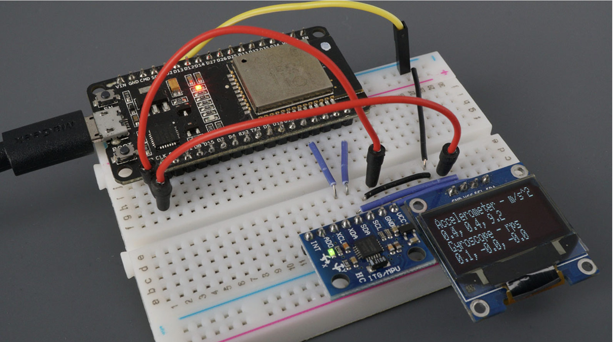

## Introduction

This tutorial will show how to light up LEDs connected to an ESP32 when abnormal motion is detected by an accelerometer.

### Learning Objectives

-  Understand how to read and interpret accelerometer data using CircuitPython.
- Detect sudden motion or acceleration beyond a threshold.
- Trigger LEDs to respond to abnormal movement.

### Background Information

- Accelerometers are sensors that measure acceleration forces. These forces may be static, like the constant force of gravity, or dynamic — caused by moving or vibrating the sensor.

- In this project, we will detect sudden changes in acceleration (abnormal motion) and respond by turning on LEDs.


## Materials Required
- ESP32 Envision DevBoard  
- MPU6050 (or any 3-axis accelerometer)  
- Breadboard and jumper wires  
- 1 or more LEDs

### Required Downloads and Installations

Before you begin, you'll need to install a few things to program the ESP32 and interact with the accelerometer:

---

#### 1. Install CircuitPython on Your ESP32 DevBoard  
Follow Adafruit’s guide here:  
[https://learn.adafruit.com/circuitpython-on-the-esp32-s2](https://learn.adafruit.com/circuitpython-on-the-esp32-s2)

Make sure you:
- Use a **Chromium-based browser** (like Chrome or Edge)
- Flash the `.uf2` firmware onto the board

---

#### 2. Install the CircuitPython Library Bundle  
You need libraries like `adafruit_mpu6050`.

- Download the bundle from:  
  [https://circuitpython.org/libraries](https://circuitpython.org/libraries)
- Unzip the bundle
- Copy the following into the `lib/` folder on your ESP32:
  - `adafruit_mpu6050.mpy`
  - `adafruit_bus_device` (folder)

---

#### 3. Install Visual Studio Code  
Download and install from:  
[https://code.visualstudio.com/](https://code.visualstudio.com/)

- Then install the **Python** and **Pymakr** extensions (optional but helpful).

---
#### Pros:
- Useful for fall detection and alert systems.
- Easy to implement with CircuitPython.
- Compatible with low-cost components.

#### Cons:
- Sensitive to orientation and noise.
- Requires tuning threshold values for each use case.

---

## Materials Required

| Component             | Quantity |
|-----------------------|----------|
| ESP32 DevBoard        | 1        |
| MPU6050 Accelerometer | 1        |
| LED                   | 1        |
| 220Ω Resistor         | 1        |
| Jumper Wires          | 5        |
| Breadboard            | 1        |

---
## Circuit Setup

1. Connect MPU6050:
   - VCC → 3.3V  
   - GND → GND  
   - SDA → GPIO21  
   - SCL → GPIO22  

2. Connect LED:
   - Anode (long leg) → GPIO5 (through 220Ω resistor)  
   - Cathode (short leg) → GND  

---


---

## Part 02: Writing the Code

### Introduction

This section provides the CircuitPython code for detecting abnormal motion using an MPU6050 accelerometer. When motion exceeds a certain threshold, the ESP32 triggers an LED. This is ideal for applications such as fall detection, impact sensing, or security systems.
---
### 🔧 How the Threshold Works

The `threshold` represents a **total acceleration level** that counts as "abnormal." You’ll likely want to experiment with this based on your use case.

- **Low threshold (e.g., 12–15)**: detects small movements — useful for subtle shocks or light bumps.
- **High threshold (e.g., 18–25)**: detects stronger or more sudden motions — ideal for fall detection or impact.

You can determine a good threshold by printing out the `total_accel` value during normal operation and observing how it spikes when abnormal motion happens (like shaking the board or dropping it slightly).
---

### Objective

- Generate a threshold-based motion detection system.
- Use acceleration data to trigger an output signal (LED).
- Demonstrate how to interface sensors and actuators using CircuitPython.

---

### Background Information

The MPU6050 sensor measures acceleration in three axes (X, Y, and Z). By summing the absolute values of all three components, we can estimate the overall "force" being experienced. If this total exceeds a preset value (the threshold), we consider that to be abnormal motion.

This method is effective for:
- Detecting sudden jolts or drops
- Monitoring impact in wearable devices
- Simplifying fall detection logic

---

### Instructional

**1. Import CircuitPython modules for controlling your board**

```python
import time
import board
import busio
import digitalio
from adafruit_mpu6050 import MPU6050

2. Initialize I2C and the accelerometer
i2c = busio.I2C(board.SCL, board.SDA)
mpu = MPU6050(i2c)

3. Set up the LED pin for output
led = digitalio.DigitalInOut(board.IO5)
led.direction = digitalio.Direction.OUTPUT

4. Define a threshold for abnormal motion
This value can be adjusted depending on how sensitive you want detection to be.
threshold = 18  # Adjust this based on your testing

5. Create the main loop to read acceleration and control the LED
while True:
    # Read acceleration in X, Y, Z (in m/s²)
    x, y, z = mpu.acceleration

    # Calculate the total acceleration magnitude
    total_accel = abs(x) + abs(y) + abs(z)

    # Print the value to help tune your threshold
    print("Total Acceleration:", total_accel)

    # Trigger LED if acceleration exceeds threshold
    if total_accel > threshold:
        led.value = True
    else:
        led.value = False

    # Wait a bit to reduce rapid fluctuations
    time.sleep(0.1)
    
6. Test and fine-tune your project

Observe acceleration output under normal and abnormal conditions.

Tune threshold to respond only to meaningful motion.

For more control, filter motion on just one axis (e.g., z) if vertical impact matters most.

python
Copy
Edit


