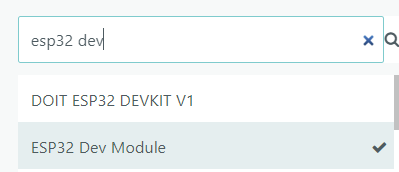

## Introduction

* This tutorial will teach you how to read acceleration values from MPU6050 interfaced with ESP32, and then send the read values to a webserver via HTTP request. 
* The motivation behind this tutorial is that we want to give a simple example of utilizing ESP32, an accelerometer(Or any other hardware of your wish), and a webserver to build a simple **IoT(Internet of Things)** application.
* The Users will gain from the following:
  1. How to wire the ESP32 with MPU6050
  2. How to read the acceleration value from MPU6050 by writing firmware.
  3. How to send an HTTP request with your acceleration values to a webserver.

### Learning Objectives
In this tutorial you will learn the basics of 
- Hardware building
- Firmware programming(Arduino)
- Connect the ESP32 to WiFi and Send HTTP request 

### Background Information

We will use an ESP32 devboard we built in our previous project, and a MPU6050 accelerometer(can be bought from Amazon). The goal of this tutorial is to get people started from building an IoT application. To do that, you should know how to do the basics in order to follow along, that includes:</br>

1. Knowing how to wire and breadboard the circuit from the given pinout instruction.
2. Understanding what a HTTP request is.

By following this tutorial, you will be able to replace the accelerometer to any other hardware of you wish, and use them to build different IoT applications. Other necessary information will be introduced in the later parts. 

## Getting Started


### Required Downloads and Installations

- You will need to install **Arduino IDE** first. It should work with any OS. </br>
[Download Arduino IDE](https://www.arduino.cc/en/software)


### Required Components

List pf the required hardware components and the quantities here.

| Component Name | Quanitity |
| -------------- | --------- |
| ESP32 Devboard               |    1       |
| MPU6050               |     1      |
| Wire              |     4      |
| Phone with hotspot               |     1      |
| Breadboard               |     1      |

### Required Tools and Equipment

You will need to have a computer and a USB-C cable to flash the firmware into your ESP32 devboard.

## Part 01: Breadboarding the ESP32 with MPU6050

### Introduction

In the first section of this tutorial, we will be first setting up the circuit for our ESP32 with MPU6050.

### Objective

- Circuit building
- Wiring MPU6050 to ESP32 devboard

### Background Information
In order for us to read the acceleration values from MPU6050 using an ESP32, we will need to use a communication protocol called I2C. To use this protocol, we will need 4 wires, SDA(data line), SCL(clock), GND(ground), and 3V3(power).
### Components
- ESP32 devboard, wire, MPU6050, devboard

### Instructional
Wire the circuit as the following diagram shown: </br>


We recommend you to setup the circuit in the following order:
1. Connect VCC to 3.3V
2. Connect GND to GND
3. Connect SCL to IO9
4. Connect SDA to IO8

## Part 02: Read Acceleration Values From MPU6050

### Introduction

In the second section of this tutorial, we will write the code for reading the acceleration values from MPU6050

### Objective

- Initialize MPU6050, install the neccesary library
- Read raw acceleration values from MPU6050 to ESP32

### Background Information
Arduino is good in the way that in contains many pre-written library, such as the one we will be using later in this section. We can just directly use the library instead of writing our own driver for I2C(Good way to learn too, reading datasheet is fun). We will be using I2C to communicate between MPU6050 and ESP32.

### Components
- ESP32 devboard, wire, MPU6050, devboard

### Instructional
Open your Arduino IDE, select the board "ESP32 Dev Module" </br>


Then inside the Arduino IDE, you will need to install the **MPU6050** library. </br>


After having the above setup, you can start writing the code. Arduino framework follows the setup and loop convention.
In the setup, you put your initialization code. In the loop, you put the logic where you want them to be repeated.
We will give an example of how to initialize MPU6050, and read the acceleration values for every 5 seconds.

```cpp
// library headers to include
#include "I2Cdev.h"
#include "MPU6050.h"

// global instance
MPU6050 mpu;

// initialize global variable
int16_t ax, ay, az;

void setup() {
  // initialize I2C and MPU6050
  Wire.begin();
  mpu.initialize();

  // wait till init success
  if (!mpu.testConnection()) {
    while (1);
  }
}

void loop() {
  // read raw data
  mpu.getMotion6(&ax, &ay, &az, nullptr, nullptr, nullptr);

  // print the data  
  Serial.print("Accel: ");
  Serial.print(ax); Serial.print("\t");
  Serial.print(ay); Serial.print("\t");
  Serial.print(az); Serial.print("\t");
  // delay 5s
  delay(5000); 
}

```
If things went well, you should be able to see the acceleration values in your serial monitor. If not, check your wiring connection, and check if you installed the wrong library or not(AdaFruit library doesn't work particularly well with general MPU6050).

## Part 03: Send Acceleration Values From ESP32 to a WebServer

### Introduction

In the third section of this tutorial, we will write the code for sending the acceleration values from ESP32 to a webserver

### Objective

- Initialize WiFi, and write the code for setting up a HTTP client
- Send the acceleration values we read earlier to a webserver

### Background Information
ESP32 has a built in WiFi module(and a PCB antenna on our Mini Devboard), where it allows us to easily connect to wifi, and then send http request to any webserver of you wish. To do that, we will need to include the Wifi and HTTPClient library headers, and setup the WiFi connection, then we're good to go.

### Components
- ESP32 devboard, wire, MPU6050, devboard

### Instructional
First, on the top, include these 2 headers: </br>
```cpp
#include <WiFi.h>
#include <HTTPClient.h>
```

And then, setup your WiFi credentials(use your phone hotspot, make sure to turn on "Maximize Compatibility" if you're using iphone).

```cpp
// WiFi credentials
const char* ssid = "Your SSID";
const char* password = "Your Password";
```
Then we can start writing the code for initializing the WiFi, and send http request to a server

```cpp
// library headers to include
#include "I2Cdev.h"
#include "MPU6050.h"
#include <HTTPClient.h>
#include <WiFi.h>

// global instance
MPU6050 mpu;

// initialize global variable
int16_t ax, ay, az;

// WiFi credentials
const char* ssid = "Your SSID";
const char* password = "Your Password";

// server endpoint (replace with your actual URL)
const char* serverBaseURL = "Your server endpoint";

void setup()
{
    // initialize I2C, MPU6050, and WiFi
    Serial.begin(115200);
    Wire.begin();
    mpu.initialize();
    WiFi.begin(ssid, password);

    // wait till WiFi to connect, should be quick
    Serial.print("Connecting to WiFi");
    while (WiFi.status() != WL_CONNECTED)
    {
        delay(500);
        Serial.print(".");
    }
    Serial.println("\nConnected to WiFi!");

    // wait till init success
    if (!mpu.testConnection())
    {
        while (1);
    }
}

void loop()
{
    // read raw data
    mpu.getMotion6(&ax, &ay, &az, nullptr, nullptr, nullptr);

    // print the data
    Serial.print("Accel: ");
    Serial.print(ax);
    Serial.print("\t");
    Serial.print(ay);
    Serial.print("\t");
    Serial.print(az);
    Serial.print("\t");

    if (WiFi.status() == WL_CONNECTED)
    {
        HTTPClient http;

        // build the URL with query parameters
        String url = String(serverBaseURL) + "?ax=" + ax + "&ay=" + ay + "&az=" + az;

        // begin sending the http get request
        http.begin(url);
        int httpCode = http.GET();

        // print the response if it's successful
        if (httpCode > 0)
        {
            Serial.printf("HTTP GET Code: %d\n", httpCode);
            String payload = http.getString();
            Serial.println("Server Response:");
            Serial.println(payload);
        }
        else
        {
            Serial.printf("HTTP GET failed, error: %s\n", http.errorToString(httpCode).c_str());
        }

        http.end();
    }
    else
    {
        Serial.println("WiFi not connected");
    }

    // delay 5s
    delay(5000);
}
```

The code above will send the http get request with your acceleration values to your designated webserver. You can also change it to a post request if you want.


## Example

### Introduction
The fully completed setup including hardware and software is shown as a summary below.
### Example
1. Wiring </br>

2. Code </br>

```cpp
// library headers to include
#include "I2Cdev.h"
#include "MPU6050.h"
#include <HTTPClient.h>
#include <WiFi.h>

// global instance
MPU6050 mpu;

// initialize global variable
int16_t ax, ay, az;

// WiFi credentials
const char* ssid = "Your SSID";
const char* password = "Your Password";

// server endpoint (replace with your actual URL)
const char* serverBaseURL = "Your server endpoint";

void setup()
{
    // initialize I2C, MPU6050, and WiFi
    Serial.begin(115200);
    Wire.begin();
    mpu.initialize();
    WiFi.begin(ssid, password);

    // wait till WiFi to connect, should be quick
    Serial.print("Connecting to WiFi");
    while (WiFi.status() != WL_CONNECTED)
    {
        delay(500);
        Serial.print(".");
    }
    Serial.println("\nConnected to WiFi!");

    // wait till init success
    if (!mpu.testConnection())
    {
        while (1);
    }
}

void loop()
{
    // read raw data
    mpu.getMotion6(&ax, &ay, &az, nullptr, nullptr, nullptr);

    // print the data
    Serial.print("Accel: ");
    Serial.print(ax);
    Serial.print("\t");
    Serial.print(ay);
    Serial.print("\t");
    Serial.print(az);
    Serial.print("\t");

    if (WiFi.status() == WL_CONNECTED)
    {
        HTTPClient http;

        // build the URL with query parameters
        String url = String(serverBaseURL) + "?ax=" + ax + "&ay=" + ay + "&az=" + az;

        // begin sending the http get request
        http.begin(url);
        int httpCode = http.GET();

        // print the response if it's successful
        if (httpCode > 0)
        {
            Serial.printf("HTTP GET Code: %d\n", httpCode);
            String payload = http.getString();
            Serial.println("Server Response:");
            Serial.println(payload);
        }
        else
        {
            Serial.printf("HTTP GET failed, error: %s\n", http.errorToString(httpCode).c_str());
        }

        http.end();
    }
    else
    {
        Serial.println("WiFi not connected");
    }

    // delay 5s
    delay(5000);
}
```
### Analysis
In this tutorial, we showed step by step how to setup a simple system where the ESP32 microcontroller will send the read acceleration values from MPU6050 to a webserver.

1. In Part 1: we showed the circuit and wiring setup for ESP32 and MPU6050
2. In Part 2: we showed how to read the acceleration values from MPU6050 to ESP32
3. In Part 3: we showed how to send the read acceleration values to a webserver

## Additional Resources
### Useful links
* [How to use WiFi in ESP32](https://randomnerdtutorials.com/esp32-useful-wi-fi-functions-arduino/)
