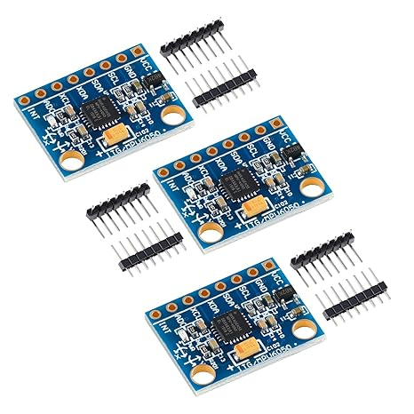
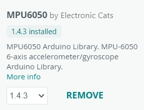
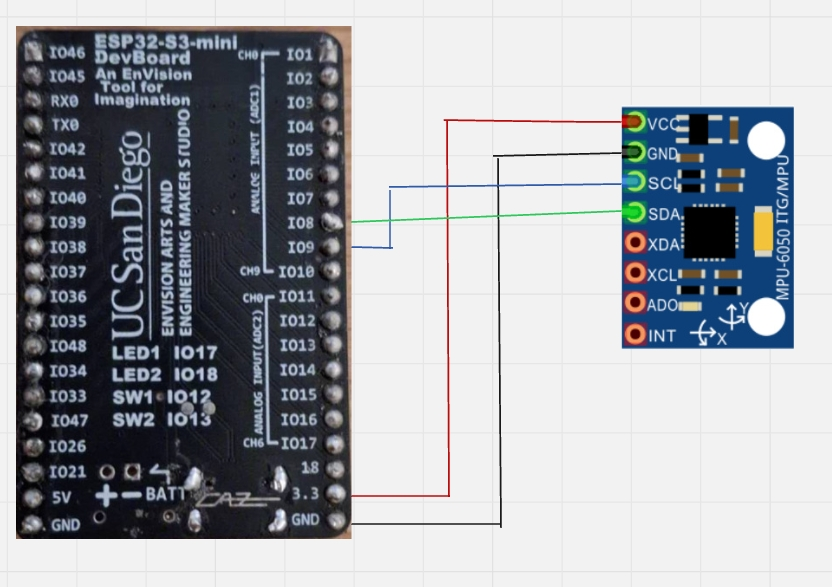

## Introduction

* This tutorial will teach you how to read acceleration values from MPU6050 interfaced with ESP32, and then send the read values to a webserver via HTTP request. 
* The motivation behind this tutorial is that we want to give a simple example of utilizing ESP32, an accelerometer(Or any other hardware of your wish), and a webserver to build a simple **IoT(Internet of Things)** application.
* The Users will gain from the following:
  1. How to wire the ESP32 with MPU6050
  2. How to read the acceleration value from MPU6050 by writing firmware.
  3. How to send an HTTP request with your acceleration values to a webserver.

### Learning Objectives
In this tutorial you will learn the basics of 
- Hardware building
- Firmware programming(Arduino)
- Connect the ESP32 to WiFi and Send HTTP request 

### Background Information

We will use an ESP32 devboard we built in our previous project, and a MPU6050 accelerometer(can be bought from Amazon). The goal of this tutorial is to get people started from building an IoT application. To do that, you should know how to do the basics in order to follow along, that includes: 

1. Knowing how to wire and breadboard the circuit from the given pinout instruction.
2. Understanding what a HTTP request is.

By following this tutorial, you will be able to replace the accelerometer to any other hardware of you wish, and use them to build different IoT applications. Other necessary information will be introduced in the later parts. 

## Getting Started

- You will need to install **Arduino IDE** first. It should work with any OS.  
[Download Arduino IDE](https://www.arduino.cc/en/software)
- Then inside the Arduino IDE, you will need to install the **MPU6050** library.  

### Required Downloads and Installations

List any required downloads and installations here.
Make sure to include tutorials on how to install them.
You can either make your own tutorials or include a link to them.

### Required Components

List pf the required hardware components and the quantities here.

| Component Name | Quanitity |
| -------------- | --------- |
| ESP32 Devboard               |    1       |
| MPU6050               |     1      |
| Wire              |     4      |
| Phone with hotspot               |     1      |
| Breadboard               |     1      |

### Required Tools and Equipment

You will need to have a computer and a USB-C cable to flash the firmware into your ESP32 devboard.

## Part 01: Breadboarding the ESP32 with MPU6050

### Introduction

In the first section of this tutorial, we will be first setting up the circuit for our ESP32 with MPU6050.

### Objective

- Circuit building
- Wiring MPU6050 to ESP32 devboard

### Background Information
In order for us to read the acceleration values from MPU6050 using an ESP32, we will need to use a communication protocol called I2C. To use this protocol, we will need 4 wires, SDA(data line), SCL(clock), GND(ground), and 3V3(power).
### Components
- ESP32 devboard, wire, MPU6050, devboard

### Instructional
Wire the circuit as the following diagram shown:  

We recommend you to setup the circuit in the following order:
1. Connect VCC to 3.3V
2. Connect GND to GND
3. Connect SCL to IO9
4. Connect SDA to IO8

## Example

### Introduction

Introduce the example that you are showing here.

### Example

Present the example here. Include visuals to help better understanding

### Analysis

Explain how the example used your tutorial topic. Give in-depth analysis of each part and show your understanding of the tutorial topic

## Additional Resources

### Useful links

List any sources you used, documentation, helpful examples, similar projects etc.
