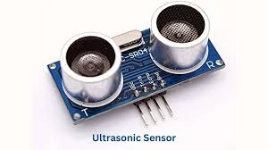
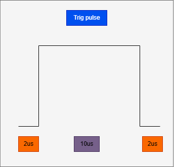
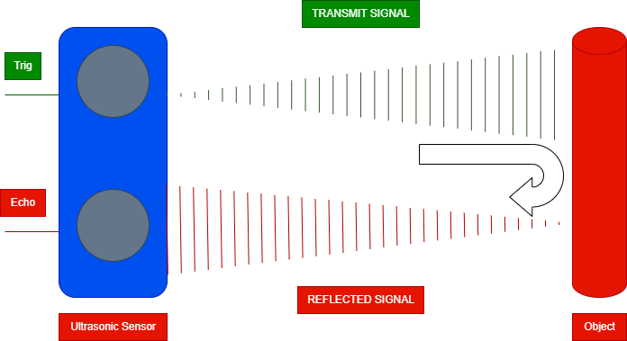
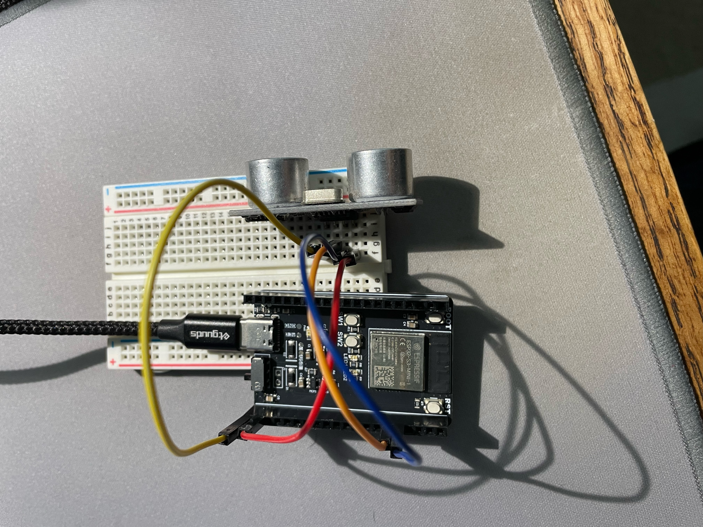

## Introduction

In this tutorial you will learn how to use an ESP32 with an ultrasonic sensor to measure distance. It’s a simple project to get started with sensors and microcontrollers and how to interface them with code. You’ll learn how to connect the parts, write the code, and read real-time distance data on your computer.

### Learning Objectives

- Circuit building
- Arduino IDE
- Writing to the serial monitor


### Background Information

In this tutorial, you will be using and ultrasonic sensor to detect the distance of an object in front of it. This distance will be printed on the Arduino serial monitor.

**Pros**
- Easy to use and interface with microcontroller with simple code
- Cheap module to get distance data

**Cons**
- Lack accuracy
- Directional measurement, only in front of the transimitter and receiver
- Requires external +5V power source 
- Limited range of distances ~35cm 

**Operation**
It works by sending a 40kHz signal from the transmitter, which is controlled via the trig pin. This pulse will begin the transmitter.



Then it would travel through the air and into the reciever pin which will convert the time it takes between transmit to receive and send to the echo pin. In order to get a value we can understand, we must use a  conversion constant, speed of sound in air: 342m/s, used to determine the actual distance from the value read on the echo pin.


## Getting Started

- Arudino IDE: This will be used to program the ESP32. This software will work for both Windows, Linux, and Mac machines.


### Required Downloads and Installations

- Any Arduino IDE version: [Arduino IDE](https://www.arduino.cc/en/software/)
- Go to board manager on the far left tab and type "esp32" and click install (by Espressif Systems)
- Connect the ESP32 via USB C cable and turn on the device
- Under tools>Board: select "ESP32S3 Dev Module" 
- Ensure "USB CDC On Boot" is enabled (Will not update and run the ESP32 upon upload)


### Required Components

List your required hardware components and the quantities here.

| Component Name | Quanitity |
| -------------- | --------- |
| ESP32               |  1         |
| Breadboard               |  1         |
| Jumper cables               |  4         |
| HC-SR04 Ultrasonic Sensor              |  1         |


### Required Tools and Equipment
- Computer
- USB C cable


## Part 1: Circuit Building

### Introduction

We will be building the circuit for the HC-SR04 ultrasonic sensor and the wiring for the ESP32

### Objective

- Wire ultrasonic sensor to the ESP32 dev board

### Background Information

The HC-SR04 has 4 pins we need to connect
- **VCC**: +5V on ESP32 
- **TRIG**: A GPIO pin used to send pulse for transmit
- **ECHO**: A GPIO pin used to read the pulse from the receiver
- **GND**: Ground connection from the ESP32

### Components

- ESP32 Dev module
- HC-SR04 Ultrasonic Sensor
- 4 jumper cables
- Bread board

### Pin out and instrunctions
Connect these pins from the ESP32 to the HC-SR04 ultrasonic sensor
| HC-SR04 Pin | ESP32 Pin |
| -------------- | --------- |
| VCC               |  5V         |
| TRIG               |  42         |
| ECHO               |  41         |
| GND              |  GND         |

## Example

### Introduction
Here is an example of the wiring process described above

### Example

Example wiring photo

| Jumper Wire Color | Purpose |
| -------------- | --------- |
| RED               |  5V         |
| BLUE               |  TRIG         |
| ORANGE               |  ECHO         |
| YELLOW              |  GND         |


## Part 2: Software

### Introduction

We will be creating the code in Arudino IDE to use the ultrasonic sensor and read data onto the serial monitor.

### Objective

- Send a pulse on the trig pin to enable transmit
- Read the echo pin to see the time duration between transmit and receive
- Convert the time to distance using speed of sound

### Background Information
In this section, we will learn how to send a pulse and using the digital write function for Arduino. Then we will learn how to read that data using a function PulseIn and how to convert delay into a measureable distance.

### Components
- USB C cable
- Wired up ESP32 and ultrasonic sensor
- Computer with a display

### Instructionals
1. Define pins for trig and echo
```C++
const unsigned int trigPin = 42;
const unsigned int echoPin = 41;
```
2. Define constant speed of sound for future conversion. The units are in cm/s converted from 342 m/s definition.
```C++
#define SOUND_SPEED 0.034
```
3. Global variables 
```C++
long duration;
float distanceCm;
```

4. Set-up block:

``` C++
void setup() {
  Serial.begin(9600); // Starts the serial communication
  pinMode(trigPin, OUTPUT); // Sets the trigPin as an Output
  pinMode(echoPin, INPUT); // Sets the echoPin as an Input
}
```

5. Loop block
``` C++
void loop() {
  //Begin: TRIG PIN PULSE
  digitalWrite(trigPin, LOW); // Clears the trigPin by setting it to low
  delayMicroseconds(2); //Wait 2us to ensure trig pin is set to low
  // Sets the trigPin on HIGH for 10 micro seconds
  digitalWrite(trigPin, HIGH);
  delayMicroseconds(10);
  digitalWrite(trigPin, LOW);
  //End


  // Reads the echoPin, returns the sound wave travel time in microseconds
  duration = pulseIn(echoPin, HIGH);
  
  // Calculate the distance
  distanceCm = duration * SOUND_SPEED/2;

  // Prints the distance in the Serial Monitor
  Serial.print("Distance (cm): ");
  Serial.println(distanceCm);
  //read a distance every second
  delay(1000);
}
```
Now upload the code to the ESP32 and open the serial monitor. Wave your hand in front of the ultrasonic sensor and watch the values change.The figure below shows the final output in the serial monitor after uploading the code to the ESP32.


## Additional Resources

### Useful links

List any sources you used, documentation, helpful examples, similar projects etc.
