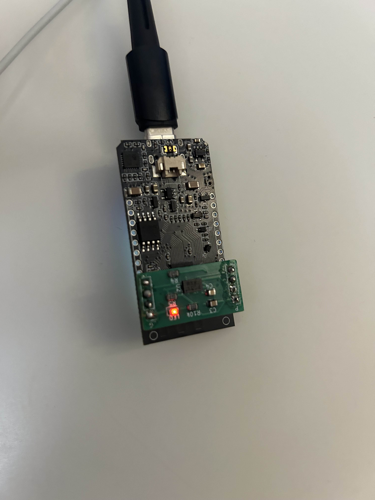

## Introduction

This tutorial will teach you how to build a **live leaderboard** and get your ESP32's led to flash once you've updated it! By the end of this tutorial you will:

1. Build a simple web page that displays people's standings in real - time.
2. Program an ESP32 to submit new scores and **flash an on-board LED** each time the POST succeeds.
   
### Learning Objectives

- Web development(dealing with result requests)
- ESP32, how to update leaderboard
- Toggle LED flash when leaderboard is updated
  

### Background Information

This leaderboard can keep track of the scores of you and your friends. 

A leaderboard is essentially a **key/value database** (user → points) exposed via a REST interface.  
We’ll implement two endpoints:

| Action | HTTP Verb | Path      | Body / Params             | Purpose                    |
|--------|-----------|-----------|---------------------------|----------------------------|
| Read   | `GET`     | `/scores` | –                         | Return full standings      |
| Write  | `POST`    | `/scores` | `{ "user": "...", "pts": n }` | Add or update a user score |

## Getting Started

Three pieces are required:
1. **Computer** to host the API and front-end capable of running python and Arduino IDE
2. **ESP32** with an LED either on-board or external
3. **Network** this tutorial was tested with mobile hotspot

### Required Downloads and Installations  

| Tool / Library              | Purpose                         | Install Guide |
|-----------------------------|---------------------------------|---------------|
| **Python ≥ 3.10**           | Run FastAPI server              | <https://python.org> |
| **FastAPI & Uvicorn**       | REST framework / ASGI host      | `pip install fastapi uvicorn` |
| **Arduino IDE (or VS Code + PlatformIO)** | Flash ESP32 | <https://arduino.cc/en/software> |

### Required Components  

| Component Name            | Quantity |
|---------------------------|----------|
| ESP32 DevKit (S2/S3/C3)   | 1 |
| USB cable (data-capable)  | 1 |
| Breadboard LED (optional) | 1 |
| 220 Ω resistor (if external LED) | 1 |
| Jumper wires              | 2–3 |

## Part 01: Name

### Introduction

Briefly introduce what  you are teaching in this section.
Ghislain Demeester

### Objective

- List the learning objectives of this section

### Background Information

Give a brief explanation of the technical skills learned/needed
in this challenge. There is no need to go into detail as a
separation document should be prepared to explain more in depth
about the technical skills

### Components

- List the components needed in this challenge

### Instructional

Teach the contents of this section

## Example

### Introduction

Introduce the example that you are showing here.

### Example

Present the example here. Include visuals to help better understanding

### Analysis

Explain how the example used your tutorial topic. Give in-depth analysis of each part and show your understanding of the tutorial topic

## Additional Resources

### Useful links

List any sources you used, documentation, helpful examples, similar projects etc.
