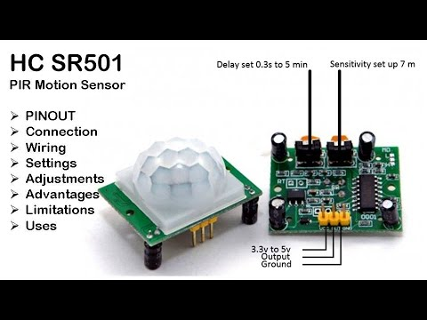

## Introduction

This tutorial shows you how to interface an ESP32 development board with a PIR (Passive Infrared) motion sensor to detect human or animal movement within its field of view. You’ll learn to wire the components, install the necessary software, and write firmware that reads the sensor’s digital output. By the end, you’ll be able to build simple presence-sensing projects—security alarms, automatic lights, or data-loggers—that react to motion.

### Learning Objectives

- Understand how a PIR motion sensor detects infrared changes

- Install ESP32 board support in the Arduino IDE (or PlatformIO)

- Wire the PIR sensor to the ESP32 safely, observing voltage and ground references

- Write, upload, and debug Arduino-style code that reads a digital input

- Calibrate sensor sensitivity and retrigger time for reliable detection

### Background Information

A PIR motion sensor, such as the HC-SR501 module, contains a pyroelectric element that generates a tiny voltage when it “sees” a change in infrared radiation. When the element’s output crosses a threshold, an onboard comparator drives the OUT pin HIGH for a user-adjustable period.

- Why use a PIR? Low cost, low power (µA standby), simple digital interface.

- Alternatives: Ultrasonic HC-SR04 (sonar-based, reflects sound), RCWL-0516 microwave radar (works through thin walls).

Pros & Cons:

- Pros: No moving parts, wide detection range (~3–7 m), adjustable sensitivity/delay.

- Cons: Blind to stationary heat sources, long warm-up time (~60 s), susceptible to rapid temperature shifts.

## Getting Started

### Required Downloads and Installations

1. Arduino IDE (Windows/macOS/Linux):
   - Download from https://www.arduino.cc/en/software
   - Install the driver if prompted.
2. ESP32 Board Support for Arduino IDE:
    - Open File → Preferences
    - In Additional Boards Manager URLs, add: https://raw.githubusercontent.com/espressif/arduino-esp32/gh-pages/package_esp32_index.json
    - Open Tools → Board → Boards Manager, search “ESP32” and install “esp32 by Espressif Systems.”

### Required Components

| Component Name | Quanitity |
| -------------- | --------- |
|ESP32 Dev Board | 1 |
| PIR Motion Sensor Module (HC-SR501) | 1 |
| Breadboard | 1 |
| Male-to-Female Jumper Wires | 6 |
| USB-C (or USB-A) to USB-C Cable | 1 | 

### Required Tools and Equipment

- Computer (Windows/macOS/Linux)

- USB cable compatible with your ESP32

- Breadboard

- Jumper wires

## Part 01: Wiring the PIR Motion Sensor

### Introduction

In this section, you’ll learn how to power the PIR sensor and connect its output pin to the ESP32’s GPIO, ensuring correct logic-level compatibility.

### Objective

- Power the PIR at the correct voltage

- Connect the signal pin to an ESP32 digital input

- Verify wiring with a simple continuity or voltage test

### Background Information

PIR modules typically run on 5 V, but the HC-SR501 will also work at 3.3 V. The ESP32’s GPIO pins are not 5 V tolerant, so powering the PIR at 3.3 V avoids level-shifting hardware.

### Components

- 1 × ESP32 Dev Board

- 1 × HC-SR501 PIR Sensor

- 3 × jumper wires (VCC, GND, OUT)

### Instructional

Teach the contents of this section

## Example

### Introduction

Introduce the example that you are showing here.

### Example

Present the example here. Include visuals to help better understanding

### Analysis

Explain how the example used your tutorial topic. Give in-depth analysis of each part and show your understanding of the tutorial topic

## Additional Resources

### Useful links

List any sources you used, documentation, helpful examples, similar projects etc.