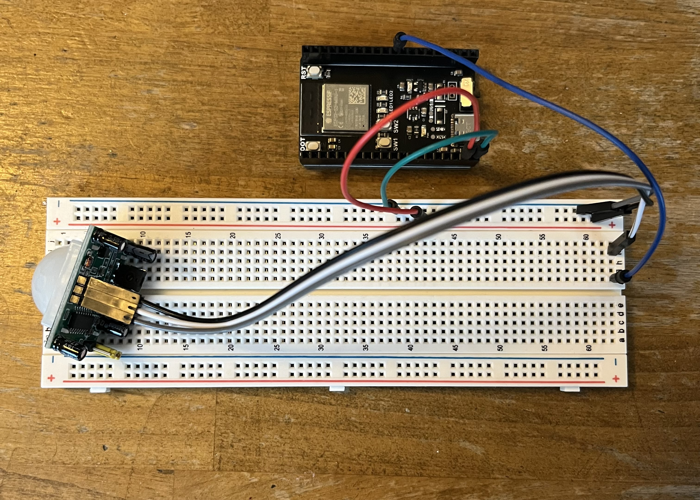
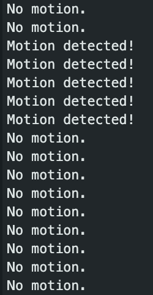

## Introduction

This tutorial shows you how to interface an ESP32 development board with a PIR (Passive Infrared) motion sensor to detect movement within its field of view. You’ll learn to wire the components and write firmware that reads the sensor’s digital output. By the end, you’ll be able to build simple presence-sensing projects—security alarms, automatic lights, or data-loggers—that react to motion.

### Learning Objectives

- Understand how a PIR motion sensor detects infrared changes
- Install ESP32 board support in the Arduino IDE (or PlatformIO)
- Wire the PIR sensor to the ESP32 safely
- Write, upload, and debug Arduino-style code that reads a digital input

### Background Information

A PIR motion sensor, such as the HC-SR501 module, contains a pyroelectric element that generates a tiny voltage when it “sees” a change in infrared radiation. When the element’s output crosses a threshold, an onboard comparator drives the OUT pin HIGH for a user-adjustable period.

- Why use a PIR? Low cost, low power, simple digital interface.
- Alternatives: Ultrasonic HC-SR04 (sonar-based, reflects sound), RCWL-0516 microwave radar.

Pros & Cons:

- Pros: No moving parts, wide detection range (~3–7 m), adjustable sensitivity/delay.
- Cons: Blind to stationary heat sources, long warm-up time (~60 s), susceptible to rapid temperature shifts.

## Getting Started

### Required Downloads and Installations

1. Arduino IDE (Windows/macOS/Linux):
   - Download from https://www.arduino.cc/en/software
   - Install the driver if prompted.
2. ESP32 Board Support for Arduino IDE:
    - Open File → Preferences
    - In Additional Boards Manager URLs, add: https://raw.githubusercontent.com/espressif/arduino-esp32/gh-pages/package_esp32_index.json
    - Open Tools → Board → Boards Manager, search “ESP32” and install “esp32 by Espressif Systems.”

### Required Components

| Component Name | Quanitity |
| -------------- | --------- |
|ESP32 Dev Board | 1 |
| PIR Motion Sensor Module (HC-SR501) | 1 |
| Breadboard (Optional) | 1 |
| Female-to-Male Jumper Wires | 3 |
| Male-to-Male Jumper Wires (Optional) | 3 |
| USB-C (or USB-A) to USB-C Cable | 1 | 

### Required Tools and Equipment

- Computer (Windows/macOS/Linux)
- USB cable compatible with your ESP32

## Part 1: Wiring the PIR Motion Sensor

### Introduction

In this section, you’ll learn how to power the PIR sensor and connect its output pin to the ESP32’s GPIO, ensuring correct logic-level compatibility.

### Objective

- Power the PIR at the correct voltage
- Connect the signal pin to an ESP32 digital input
- Verify wiring with a simple continuity or voltage test

### Background Information

PIR modules typically run on 5 V, but the HC-SR501 will also work at 3.3 V.

### Components

- 1 × ESP32 Dev Board
- 1 × HC-SR501 PIR Sensor
- 3 × Female to Male jumper wires (VCC, GND, OUT)
- 1 x Breadboard (Optional)
- 3 x Male to Male jumper wires (Optional)

### Instructional

Refer to your sensors specifications to determine which pin is VCC, GND, and OUT.
- Power
  - Connect PIR VCC → ESP32 3V3 
  - Connect PIR GND → ESP32 GND
- Signal
  - Connect PIR OUT → ESP32 GPIO 36 (or any free digital pin)

## Example


I used a breadboard but the wires from the PIR sensor can also be directly connected to the DevBoard.


## Part 2: Writing the Code Step by Step

### Introduction

Now that your hardware is correctly wired, this section walks you through creating, compiling, and uploading an Arduino-style sketch to the ESP32. We’ll explain each line of code in detail so that you understand how to configure the PIR input, read its digital state, and drive an LED (or other output) in response to motion.

### Objective
- Understand the Arduino interface.
- Declare and initialize pin constants and I/O modes  
- Implement the 60 s warm-up delay for the PIR module  
- Continuously read the PIR’s digital output  
- Drive an LED (optional) or simply print status to Serial

### Background Information

This section focuses on coding in the Arduino IDE. The language is very similar to C or C++. If you have any background knowledge in those languages, you will recognize the code and its formatting. If you don’t have experience in C/C++, don’t worry, I'll will be breaking down the code into very manageable chunks.

### Components

- 1 × ESP32 Dev Board (already wired)  
- 1 × Computer with Arduino IDE  

### Instructional

#### Step 1 – Create a New Sketch and Declare Pins

1. **Open a New Sketch**:  
   - **File → New**.  

2. **At the Top of the Sketch, Enter the Pin Definitions**:  
   ```cpp
   const int pirPin = 36;     // Connect PIR OUT → GPIO 36
   const int ledPin = 17;     // (Optional) Connect an LED → GPIO 17
   int motionState    = LOW;  // To track motion
   ```

#### Step 2 – Write setup() to Configure I/O and Warm Up the PIR

1. **Initialize Serial (for Debugging)**:  
   ```cpp
   void setup() {
   Serial.begin(115200);
   ```
   - This opens a Serial connection at 115200 baud so we can print “Motion detected!” or “No motion.” to the Serial Monitor.

2. **Set pinMode for pirPin and ledPin**:  
   ```cpp
   pinMode(pirPin, INPUT_PULLDOWN);
   pinMode(ledPin, OUTPUT);
   digitalWrite(ledPin, LOW);
   ```
   - `INPUT_PULLDOWN` ensures GPIO 14 sits at 0 V when PIR OUT is off.
   - We set the LED pin to `OUTPUT` and drive it `LOW` initially (LED off).
3. **Warm Up the PIR (60 Seconds)**:  
   ```cpp
   delay(60000);  // Wait 60 s for the PIR to stabilize before reading
   ```
   - **Why 60s?** Most HC-SR501 modules need about a minute to let the comparator’s reference settle. During this time, the output can remain `HIGH` or oscillate. Only after ~60 s will the PIR accurately hold `LOW` when there is no motion.

4. **The complete `setup()` now looks like**:  
   ```cpp
   void setup() {
      Serial.begin(115200);
      pinMode(pirPin, INPUT_PULLDOWN);
      pinMode(ledPin, OUTPUT);
      digitalWrite(ledPin, LOW);
      delay(60000);    // PIR warm-up (≈60 s)
   }
   ```
  
#### Step 3 – Write `loop()` to Read Motion and Drive LED

1. **Read PIR Output**:  
   ```cpp
   motionState = digitalRead(pirPin);
   ```
   - `pirPin` is configured as a digital input (`INPUT_PULLDOWN` in `setup()`), so this returns `HIGH` (1) when motion is detected, or `LOW` (0) when there is no motion.

2. **If Motion Is Detected**:  
   ```cpp
   if (motionState == HIGH) {
      Serial.println("Motion detected!");
      digitalWrite(ledPin, HIGH);
   }
   ```
   - When `motionState` is `HIGH`, the code:
     - Prints “Motion detected!” to the Serial Monitor.
     - Drives `ledPin` to `HIGH`, which turns the LED on.

3. **If No Motion**:  
   ```cpp
   else {
      Serial.println("No motion.");
      digitalWrite(ledPin, LOW);
   }
   ```
   - When `motionState` is `LOW`, the code:
     - Prints “No motion.” to the Serial Monitor.
     - Drives `ledPin` to `LOW`, which turns the LED off.

4. **Pause Before Next Read**:
   ```cpp
   delay(500);
   ```
   - Waits for 500 ms before repeating.

5. **The complete `loop()` now looks like**: 
   ```cpp
   void loop() {
   motionState = digitalRead(pirPin);
   if (motionState == HIGH) {
      Serial.println("Motion detected!");
      digitalWrite(ledPin, HIGH);
   } else {
      Serial.println("No motion.");
      digitalWrite(ledPin, LOW);
   }
   delay(500);
   }
   ```
## Example



### Analysis

The loop function continuously polls the PIR sensor and drives an LED based on its digital output. First, `digitalRead(pirPin)` samples the PIR’s output pin (which is held LOW by an internal pull‐down when idle) to detect whether motion has been sensed. When the sensor output goes HIGH, the code prints “Motion detected!” to the Serial Monitor and sets `ledPin` HIGH to turn on the LED. Conversely, when the output is LOW, it prints “No motion.” and turns the LED off. By adding `delay(500)` between readings, we ensure that any motion lasting at least half a second is caught reliably. This approach highlights core concepts—digital input reading, conditional branching, and digital output driving—while the Serial prints offer real‐time feedback for debugging.

## Additional Resources

### Useful links

[A Similar Tutorial](https://randomnerdtutorials.com/esp32-pir-motion-sensor-interrupts-timers/)

[A Simple Video](https://www.youtube.com/watch?v=5NtyRtVkf7w)