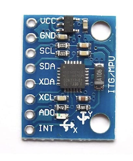

## Introduction

In this tutorial, we will teach how to connect and use the MPU-6050 motion sensor with the ESP32 Dev Board. The sensor gives real-time data about acceleration and rotation, which is useful in many cool projects like balancing robots or motion tracking. 

In addition, we made this tutorial because the MPU-6050 is a low-cost but powerful sensor, we also used this sensor in our own project, which is an anti-theft device for e-scooters. So, we wanted to share what we learned and help other students understand how to get motion data from sensors and use it in their own projects.

By the end of this tutorial, you will know how to:

- Wire the MPU-6050 sensor to the ESP32 Dev Board

- Use **Arduino** to communicate between the sensor and microcontroller

- Get live acceleration and rotation values from the sensor using simple code

### Learning Objectives

- Understand how to connect the MPU-6050 sensor to the ESP32 Dev Board
- Learn how to use the Arduino IDE to upload and run code on the ESP32
- Use provided Arduino code to read motion data (acceleration and gyroscope) from the sensor


### Background Information

The MPU-6050 is a motion-tracking sensor that combines a 3-axis accelerometer and a 3-axis gyroscope into one small chip. The MPU-6050 measures acceleration over the X, Y an Z axis in real time. 


### 📌 MPU-6050 Pinout


Here’s the pinout for the **MPU-6050 sensor module (GY-521 breakout)**. These pins connect to the ESP32 to allow communication and power.

| **Pin** | **Purpose**                | **Connect to ESP32** |
|---------|----------------------------|-----------------------|
| `VCC`     | Power (3.3V or 5V input)   | 3.3V                  |
| `GND`     | Ground                     | GND                   |
| `SCL`     | I²C Clock                  | GPIO 22 (default I²C clock on ESP32)               |
| `SDA`     | I²C Data                   | GPIO 21 (default I²C data on ESP32)               |

**Optional Pins:**

- `INT`: Interrupt output (not used here)  
- `AD0`: Change I²C address (default is 0x68)  
- `XDA`, `XCL`: For extra sensors (ignore for now)


## Getting Started

### Required Downloads and Installations

You’ll need to install the following tools to program and communicate with the ESP32:
- **Arduino IDE**  
  The Arduino IDE is the platform we’ll use to write and upload code to the ESP32.  
  [Download Arduino IDE](https://www.arduino.cc/en/software)

- **ESP32 Board Package**  
  Add ESP32 support in Arduino IDE. Follow this guide:  
  [ESP32 Setup Instructions](https://docs.espressif.com/projects/arduino-esp32/en/latest/installing.html)

- **MPU-6050 Library**  
  In the Arduino IDE, go to `Tools > Manage Libraries`, then search for and install:  
  `MPU6050` by Electronic Cats (or equivalent).

### Required Components

List your required hardware components and the quantities here.

| **Component Name**       | **Quantity** |
|--------------------------|--------------|
| ESP32 Dev Board          | 1            |
| MPU-6050 (GY-521 Module) | 1            |
| Jumper Wires (Male-Male) | 4            |
| Breadboard *(optional)*  | 1            |

### Required Tools and Equipment

- Computer (Windows, macOS, or Linux)  
- Arduino IDE  
- USB cable (Micro-USB or USB-C depending on your ESP32)  
- Internet connection (for installing tools and libraries)

## Part 01: Setting Up the Circuit – MPU-6050 + ESP32

### Introduction

In this section, we will teach you how to connect the MPU-6050 motion sensor to your ESP32 Dev Board.

### Objective

- Learn how to wire the MPU-6050 sensor to the ESP32 Dev Board
- Understand the use of I²C communication for sensor data transfer
- Prepare the hardware for reading real-time motion data

### Background Information

The MPU-6050 is a 6-axis IMU sensor that combines a 3-axis accelerometer and a 3-axis gyroscope. It uses I²C to send data to the ESP32. I²C only requires two data lines: **SDA (data)** and **SCL (clock)**, making wiring simple and efficient.


### Components

| **Component**          | **Quantity** |
|------------------------|--------------|
| ESP32 Dev Board        | 1            |
| MPU-6050 (GY-521)      | 1            |
| Jumper Wires (Male-Male)| 4           |
| Breadboard             | 1            |

### Instructional

Teach the contents of this section

## Example

### Introduction

Connect the MPU-6050 sensor to the ESP32 using the following steps:

- Connect the **VCC** pin on the MPU-6050 to the **3.3V** pin on the ESP32 Dev Board.
- Connect the **GND** pin on the MPU-6050 to a **GND** pin on the ESP32.
- Connect the **SCL** pin on the MPU-6050 to **GPIO 22** on the ESP32 (I²C Clock).
- Connect the **SDA** pin on the MPU-6050 to **GPIO 21** on the ESP32 (I²C Data).

Make sure your wires are firmly inserted into the breadboard and that you're using the correct pins on the ESP32.

---

### Wiring Image Example


## Part 02: Writing the Code

### Introduction  
This section provides the Arduino code to read motion data from the MPU-6050 sensor, which captures real-time acceleration and rotation values.

---

### Objective  
- Initialize communication between the ESP32 and MPU-6050  
- Read raw sensor data from the accelerometer and gyroscope  
- Display motion data using the Serial Monitor

---

### Background Information  
The MPU-6050 uses I²C protocol, which lets the ESP32 communicate with it over just two wires (SDA and SCL). The sensor outputs raw values for 3-axis acceleration and 3-axis gyroscope data. These values help track movement or rotation in a physical object.

---

### Components  
- ESP32 Dev Board  
- MPU-6050 (GY-521)  
- Computer with Arduino IDE  
- Jumper wires

---

### Instructional

#### 1. **Select the Board and Port**
- Go to Tools > Board, and select: `DOIT ESP32 DEVKIT V1`
- Go to Tools > Port, and select the port that appears when your ESP32 is plugged in (e.g., `/dev/cu.usbserial-XXXX` on macOS or `COM3`, `COM4`, etc. on Windows)

#### 2. **Install Required Libraries**
Install the following libraries via the **Library Manager** in Arduino IDE:
- `MPU6050` by Electronic Cats
  


#### 3. **Write or Paste the Code**
Paste the following code into your Arduino sketch:

```cpp
#include "I2Cdev.h"
#include "MPU6050.h"

MPU6050 mpu;
int16_t ax, ay, az;
int16_t gx, gy, gz;

void setup() {
  Wire.begin(); 
  Serial.begin(38400);

  Serial.println("Initializing MPU...");
  mpu.initialize();

  Serial.println("Testing MPU6050 connection...");
  if (!mpu.testConnection()) {
    Serial.println("MPU6050 connection failed");
    while (true);
  } else {
    Serial.println("MPU6050 connection successful");
  }

  // Optional: Set offsets (can improve accuracy)
  mpu.setXAccelOffset(0);
  mpu.setYAccelOffset(0);
  mpu.setZAccelOffset(0);
  mpu.setXGyroOffset(0);
  mpu.setYGyroOffset(0);
  mpu.setZGyroOffset(0);
}

void loop() {
  mpu.getMotion6(&ax, &ay, &az, &gx, &gy, &gz);

  Serial.print("a/g:\t");
  Serial.print(ax); Serial.print("\t");
  Serial.print(ay); Serial.print("\t");
  Serial.print(az); Serial.print("\t");
  Serial.print(gx); Serial.print("\t");
  Serial.print(gy); Serial.println("\t" + String(gz));

  delay(1000);
}
```

#### 4. **Upload the Code**

- Click the **Upload (→)** button at the top left of the Arduino IDE window to compile and upload the code to your ESP32 board.

- Then, open the **Serial Monitor** by clicking the magnifying glass icon in the top right corner of the Arduino IDE.

- In the Serial Monitor window, make sure to set the **baud rate to 38400** (this must match the value in your `Serial.begin(38400);` line in the code).

- If everything is working correctly, you should see live acceleration and gyroscope data printing in the Serial Monitor, like this:


### Analysis

In this tutorial, we showed how to hook up the MPU-6050 motion sensor to the ESP32 and get it working.

In **Part 01**, we connected just four wires (VCC, GND, SCL, SDA) to set up the sensor using I²C.

In **Part 02**, we installed the right libraries and used Arduino code to read acceleration and gyro data. We could see the values change live in the Serial Monitor when we moved the sensor around.

This proves the ESP32 and sensor were talking correctly, and we were able to track motion in real time, just like we used it in our anti-theft scooter project!

## Additional Resources

### Useful links

- [ESP32 with MPU-6050 Accelerometer and Gyroscope – Arduino Example](https://randomnerdtutorials.com/esp32-mpu-6050-accelerometer-gyroscope-arduino/)  
  A detailed guide with visuals and code examples for using the MPU-6050 with ESP32.