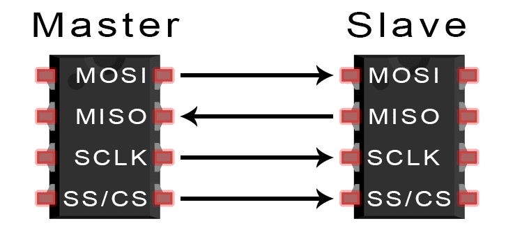
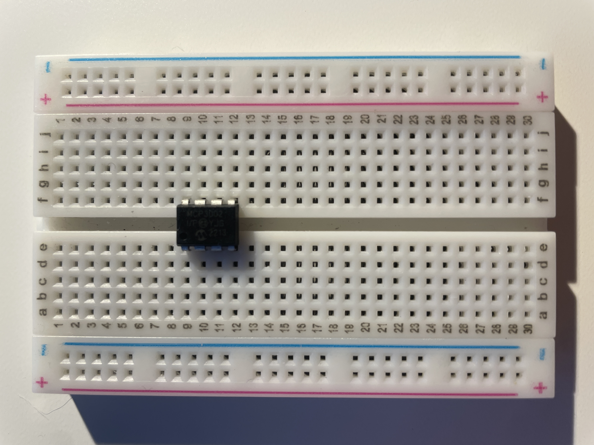
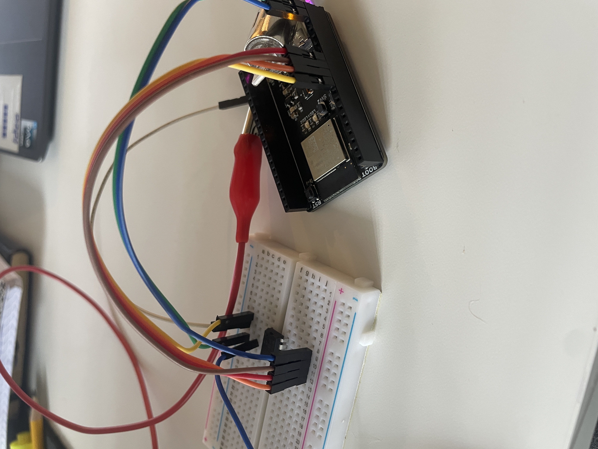
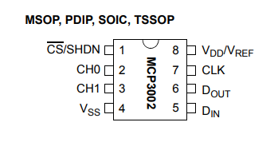
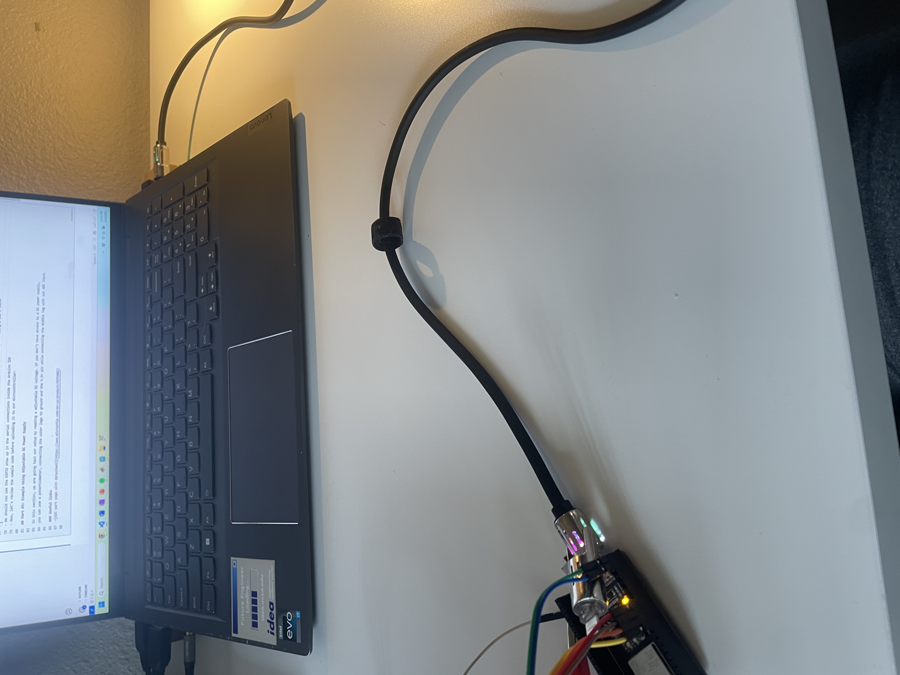
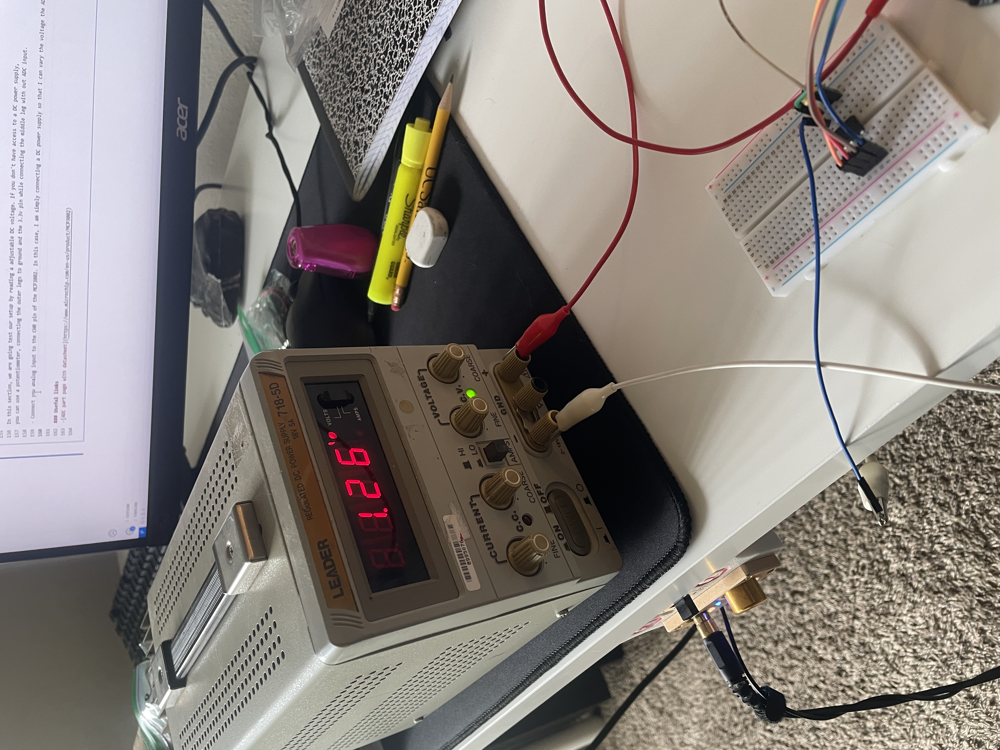

# **ESP32 SPI ADC Tutorial**

### 2025-05-19

### By: Luke Wittemann
___



## Introduction

In this tutorial, we will be learning to use an analog to digital 
converter, or ADC, which communicates to our ESP32 using the SPI 
serial interface. While many microcontrollers have built-in ADC's 
for analogRead() functionality, they are often limited in temporal
or voltaic resolution. By using an external ADC, you can select a 
much more high performing component for more demanding appplications
such as audio signal processing. 

### Learning Objectives

- How to wire up the ADC: what to connnect where
- Code to interface with the ADC over SPI serial communication

### Background Information

ADC's are a part of many microcontroller based devices and are a main way for your microcontroller
to interface with the world. Whether reading from a sensor, transducer, or simple voltage source, updated 
and accurate readings are crucial to the success of an implementation. 

## Getting Started

This is a fairly simple tutorial with only a few required hardware and software components. You will need a computer with 
Arduino IDE installed, a ESP32 based microcontroller, a MCP 3002 ADC, and a breadboard with some wire to connect everything
together. *Other microcontrollers can be used, but the pins needed for SPI comminucation will likely be different.* This information 
is commonly available due the prevalance of SPI as a method of serial communication. *Other ADC's can also be used, but the pinout
and supply voltage requirements will likely vary.* Here, a main reason the MCP 3002 ADC is used is because it can be powered using
 the ESP32's 3.3v pin and hence an external DC power supply is not required. 

### Required Downloads and Installations

- Arduino IDE

### Required Components


| Component Name   | Quanitity |
| --------------   | --------- |
|      ESP 32      |      1    |
|Microchip MCP3002 |      1    |

### Required Tools and Equipment

Computer, breadboard, jumper wires

## Part 01: Wiring and Physical Set-Up

In this section, we are connect the ADC to our ESP32 such that we can program and test it. 

- Plug the ADC chip, the **MCP3002**, into a breadboard.



- Following the pinout on the ADC's datasheet, connect VDD to the ESP32's 3.3v supply and VSS to ground. Connect
    CLK(SCK), DOUT(MISO), DIN(MOSI), and CS(SS) to pins IO12, IO13, IO11, and IO10 respectively. These pins can also be altered 
    to any digital pins if the default pins are in use by editing the pin selections at the top of the test script.

  



- Connect your analog input to CH0. This chip can also be used as two inputs or as a single differential
    input with CH0 or CH1 being the negative connection. *That being said, it is usually a good idea to buffer* 
    *this input with a transistor or operational amplifier*. 


## Part 02: Code and Programming

In this section, we are going to program our ESP32 with the provided test code. 

- Now that our circuit is built, we can begin programming by connecting the ESP32 to our computer using a USB-C cable



- To connect to the board, we need to make sure we have the board installed to our Arduino IDE. Go to the board manager
    and install esp32 by Espressif Systems. 
- Once the board package is installed, in Tools->Board, select ESP32S3 Dev Module
- We should now see the ESP32 show up in the serial connections inside the Arduino IDE


- Now, let's review the sample code before compiling it and uploading it to our microcontroller:
```cpp
    // include basic SPI library
    #include <SPI.h>

    // define SPI communication pins
    #define PIN_CS   10
    #define PIN_MISO 13
    #define PIN_MOSI 11
    #define PIN_SCK  12

    // instantiate ADC object
    SPIClass SPI_ADC(FSPI);  // Use FSPI bus for ESP32-S3

    void setup() {
    // initialize serial moniter
    Serial.begin(115200);

    // initialize SPI connection
    SPI_ADC.begin(PIN_SCK, PIN_MISO, PIN_MOSI, PIN_CS);

    // set chip select as output and start with pin high
    pinMode(PIN_CS, OUTPUT);
    digitalWrite(PIN_CS, HIGH);

    }

    void loop() {
    // read from our ADC
    uint16_t ADCreading = readADC();

    // print the value
    Serial.print("ADC reading: ");
    Serial.print(ADCreading);
    Serial.println("");

    // short delay
    delay(500);

    }

    // Function to read from our ADC over SPI
    uint16_t readADC() {
    // command to tell the ADC which mode to operate in
    uint8_t command = 0b11010000;  // Start bit, single-ended CH0

    // put chip select pin low which tells the ADC we are about to read from it
    digitalWrite(PIN_CS, LOW);

    // begin the SPI transaction
    SPI_ADC.beginTransaction(SPISettings(1000000, MSBFIRST, SPI_MODE0));

    // read our 10 bit value from the ADC in the form of two 8 bit(1 byte) transmissions
    uint8_t highByte = SPI_ADC.transfer(command);
    uint8_t lowByte = SPI_ADC.transfer(0x00);

    // end the SPI transaction
    SPI_ADC.endTransaction();

    // put the chip select pin high which tells the ADC that we are done reading from it
    digitalWrite(PIN_CS, HIGH);

    // combine the two 8 bit transmissions into a single 16 bit result
    uint16_t value = ((highByte & 0x03) << 8) | lowByte;  // 10-bit result

    // return our 16 bit (only 10 bits are used) value
    return value;
    }
```

## Part 03: Example Using Adjustable DC Power Supply

In this section, we are going test our setup by reading a adjustable DC voltage. If you don't have access to a DC power supply, 
you can use a potentiometer, connecting the outer legs to ground and the 3.3v pin while connecting the middle leg with our ADC input. 

- Connect your analog input to the CH0 pin of the MCP3002. In this case, I am simply connecting a DC power supply so that I can vary the voltage the ADC reads
- As you adjust the voltage at the CH0 pin, either with a voltage divider and potentiometer, a adjustable DC power supply, or another analog voltage source like a sensor, you should see the serial moniter reading change. *Note: if your serial moniter reads 0, make sure Tools->USB CSD on Boot is enabled.* Since the ADC is 10 bits, you should see an value between 0 and 1023. In my case, 1023 represented 1.65v, which is half of the Vref or 3.3v. 

 

 

## Conclusion

Congratulations, you have started your embedded journey! With the ability to read accurate values from an analog voltage source, you can do all sorts of projects such 
as light or sound detectors with the proper transducers. This ability will allow your microcontroller based projects to continually interact and react to the environment around them. 

### Useful links
-[ADC part page with datasheet](https://www.microchip.com/en-us/product/MCP3002)
